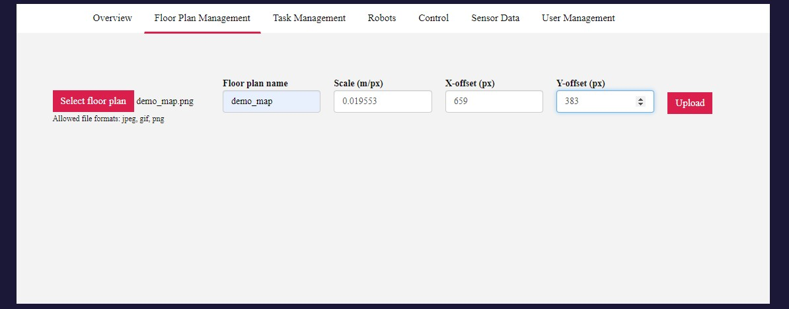
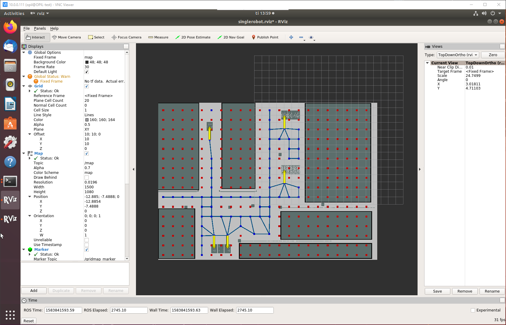

# OPIL Server Installation

**NOTE:** *The information in this guide may be outdated as OPIL undergoes development. Please refer to the documentation of OPIL modules for the latest information.*

In this section you will install and configure the OPIL Server using an example layout provided on this page by following a step-by-step guide. At the end of this guide you will have a working OPIL Server setup. Finally, you will reset the configuration and then you can configure the OPIL Server with your own layout.

It is possible to change the configuration (e.g. ports and filenames) with the capabilities described in [Docker compose file version 3 reference](https://docs.docker.com/compose/compose-file/). However, during this guide we will not address any configuration that is not absolutely required.

Please follow these steps for installing the OPIL server:

## Table of Contents

<!-- [TOC] -->

- [Check prerequisites](#check-prerequisites)
- [Verify docker environment](#verify-docker-environment)
- [Prepare a docker-compose.yml file](#prepare-a-docker-composeyml-file)
- [Prepare the layout](#prepare-the-layout)
- [Prepare VC simulation](#prepare-vc-simulation)
- [Prepare OPIL Central SP](#prepare-opil-central-sensing-perception-sp)
- [Prepare OPIL HMI](#prepare-opil-human-machine-interface-hmi)
- [Prepare OPIL TP](#prepare-opil-task-planner-tp)
- [Review the docker-compose.yml file](#review-the-docker-composeyml-file)
- [Start the OPIL Server modules](#start-the-opil-server-modules)
- [Start the VC simulation](#start-the-vc-simulation)
- [Start the OPIL TP](#start-the-opil-tp)
- [Setting up a simple task](#setting-up-a-simple-task)
- [Initiation with HMI button](#initiation-with-hmi-button)
- [Stopping and removing containers](#stopping-and-removing-containers)

## Check prerequisites

- Computer with Linux-based operating system with docker and docker-compose installed.
- You know the IP-address of your system. Write it down as you will need  it later in this guide. This will be referred to as `<ip-address>` from now on.
- The following PNG image: [demo_map.png](files/demo_map.png)
- You must be familiar with Linux-based operating systems on a basic level to execute commands and edit files.
- You have read the [introduction](../../start/index.md) and [deployment](../../start/deployment.md) pages and are familiar with the basic concepts of OPIL and the purpose of each OPIL module.
- If you wish to test your installation with a simulated layout and robots, a computer with Windows operating system with Visual Components installed.

## Verify docker environment

In this step, you will verify that your `docker` environment is running and that it is not out of date. If you know that you do not have a `docker` environment set up, start with the "Troubleshooting and updating" section below. Please note that both `docker` and `docker-compose` are required to follow this guide.

First, check the `docker` version by executing command:

```bash
> docker -v
Docker version 19.03.1, build 74b1e89
```

Then, check the `docker-compose` version by executing command:

```bash
> docker-compose -v
docker-compose version 1.24.1, build 4667896b
```

The minimum required versions are listed in the table below but it's always a good idea to use the latest version available.

| Docker tool | Minimum version | This guide is tested with |
| --- | --- | --- |
| docker | 17.12.0+ | 18.09.6 |
| docker-compose | 1.18.0+ | 1.24.0 |

### Troubleshooting and updating the docker environment

If you did not have `docker` environment set up or either of the commands resulted in an out-of-date version, in some error, or other unexpected result see the following links respectively.

For `docker` related instructions, see [docker installation guide](https://docs.docker.com/install/).  
For `docker-compose` related instructions, see [docker-compose installation guide](https://docs.docker.com/compose/install/).

Finally, repeat the step described above to verify that your installation was successful.

## Prepare a docker-compose.yml file

In this step, you will prepare a new `docker-compose.yml` file that will be completed one step at a time during this guide.

First, create a new directory where you want all of your OPIL docker-related files to be placed. Then navigate to the newly created directory as `docker-compose` commands will always look for the `docker-compose.yml` file in the active directory.

Next, create the `docker-compose.yml` file. Please note that the filename must exactly match the given name. Copy the following content to the beginning of the file:

```yaml
version: "3.1"

services:
    ### Database for context broker ###
    mongo:
        image: mongo:3.6
        command: --nojournal

    ### Proxy for Context Broker ###
    ngsiproxy:
        image: fiware/ngsiproxy:1.2
        ports:
            - 3000:3000

    ### Context Broker ###
    orion:
        image: fiware/orion:2.3.0
        depends_on:
            - mongo
            - ngsiproxy
        ports:
            - 1026:1026
        command:
            -dbhost mongo -corsOrigin __ALL -inReqPayloadMaxSize 2097152
```

This will configure the middleware of OPIL, including its three components: MongoDB, NGSI Proxy and Orion Context Broker.

Please make sure that the ports **3000** and **1026** are not already in use. Making changes to the port configuration here will cause errors with other modules that cannot be fixed by configuration in the current version of OPIL.

Orion Context Broker uses the parameter ***inReqPayloadMaxSize*** to let users decide the maximum allowed size of incoming request payloads, which is available from the latest release tag 2.3.0. The number of 2097152 Bytes (2MB) is sufficient for the factory floorplans of size 65 m x 35 m.

## Prepare the layout

In this step you will determine the configuration regarding the factory layout. In this guide you will be using the `demo_map.png` image as the layout. You should have already downloaded this file at the beginning of this guide but if you haven't done so yet you can download it [here](files/demo_map.png).

Please note that during this guide you must use the original image file to preserve the original resolution.

### The layout


The layout has three main areas:

| Area name | Description |
| --- | --- |
| Production area | This area continuously produces products that are collected on the single pallet within the area. This pallet is then transported to the warehouse area for storage. |
| Warehouse area | This area is used to receive and store products from the production and packaging areas. Also, pallets are periodically transported from this area to the packaging area. |
| Packaging area | In this area ready products are packaged and finally packaged products are transported back to warehouse area for storage. |


### Determining the zero point and scale

In order to align the factory floor installations with the planned layout it is necessary to define a zero point for the layout. This will be the origin for all measurements for installations and annotations. The zero point should be selected so that:

1. It is a fixed point of a fixed structure on the factory floor
1. It is accurately aligned with layout and the physical factory floor
1. It is easy to measure distances from this point to other meaningful positions, e.g. pallet locations.

> For example, selecting a corner of the layout image is not a suitable zero point since in most cases it is outside the building or somewhere in the middle of the floor. Selecting a point like this makes it impossible to accurately align the layout with the factory floor inside OPIL.

In this guide we have selected a corner of one of the columns in the middle of the layout as our zero point. See picture below.  


Next you need to determine the following values for configuring all OPIL Server modules:

- Scale in meters/pixel
- Zero point coordinate in pixels
- Zero point coordinate in meters

First you will define the **scale in meters/pixel**. To do this you must first know a distance of any two points in the layout. Since the resolution is the same for both X- and Y-axes it is necessary to measure only one axis. To minimize the possible error from the resolution and measurement you should select the longest easily measurable distance.

In this layout you have a grid with a resolution of 1 meter that helps you to easily determine two points and the distance between. In the picture below, the red line is exactly **28 meters**. Then you need to measure the same line in pixels, this can be easily done using an image editing software (e.g. GIMP). The line in this case is **1432 pixels** long. Finally we can calculate that the scale of the layout is:

```
28 meters / 1432 pixels = 0.019553 m / px
```


The next step is to determine the **zero point coordinate in pixels**. Measure the number of pixels from the **bottom left-hand corner** of the image to the zero point. With the layout in this guide you will get the following measurements:

```
X = 659 px
Y = 383 px
```

Finally you can determine the **zero point coordinate in meters** by combining the two previous results:

```
X = 0,019553 * 659 px = 12.8854
Y = 0,019553 * 383 px = 7.4888
```

Make sure to store your measurements and calculations as you are going to use them in the next steps. It is also possible that you may have to slightly adjust some values by 1 pixel or so for a perfect alignment. This will be checked later in this guide.

### Annotations

Annotations are labeled positions of importance in the layout. Such labeled positions could be pick-up and drop-off locations, charging stations or pallet stacks. The annotations you will be working with in this guide, all pallet locations and one charging station, are marked in the following image:


During this step, you should record the position and orientation of each labeled position for future use. The orientation is called `theta` in the configuration file. The orientation defines the approach direction, so that an approaching AGV has its heading towards the annotation as follows:

- Right = 0
- Up = 90
- Left = 180
- Down = 270

Or as in the image below:


Now for the position of each annotation you need to measure the center point of each pallet location in the layout. The exact point may be different depending on the hardware used and RAN configuration. The measurement is done in meters relative to the zero point. Measurements for each labeled position in this layout are as follows:

```ini
[prod]
point_x = -6.00
point_y = 10.50
theta = 90

[wh_1]
point_x = -5.40
point_y = -6.00
theta = 270

[wh_2]
point_x = -4.50
point_y = -6.00
theta = 270

[wh_3]
point_x = -3.60
point_y = -6.00
theta = 270

[pack_1_1]
point_x = 4.05
point_y = 4.65
theta = 90

[pack_1_3]
point_x = 5.75
point_y = 4.65
theta = 90

[pack_2_1]
point_x = 4.05
point_y = 12.00
theta = 90

[pack_2_3]
point_x = 5.75
point_y = 12.00
theta = 90

[chrg_0]
point_x = 0.00
point_y = -4.00
theta = 270
```

Now you have determined the necessary information regarding the layout you are using in this guide and next you can start configuring the OPIL modules.

### Reducing the layout

In this step we will mark some areas to be inaccessible to the AGV. We know the AGV will never need to enter some areas, and these can be blocked out of the layout to improve performance. Moreover, we don't want an AGV to enter the workstation areas or go between the warehouse racks. It is enough to simply mark the unwanted areas in the PNG file with a dark colour. Download the reduced layout file here: [demo_map_reduced.png](img/demo_map_reduced.png) and copy it to the same directory where you created `docker-compose.yml`.

## Prepare OPIL Central Sensing & Perception (SP)

### Prepare demo_map.yaml

In the root directory where you created `docker-compose.yml`, create a new file called `demo_map.yaml`. This file will include the configuration of the map scale and zero-point as well as a few additional parameters.

```yaml
#demo_map.yaml
image: map.png
resolution: 0.0196
origin: [-12.8854, -7.4888, 0.0]
negate: 0
occupied_thresh: 0.65
free_thresh: 0.196
```

Note: The value in the `image` field is `map.png`, regardless of our PNG file being named `demo_map_reduced.png`. This is intended, so please do not change this.

For now, there is no need to adjust any of these parameters. Configuration possibilities regarding this file are explained in the [SP documentation](../SP/opil_local_sp_install.md).

### Prepare annotations.ini

Create a new file in the root directory called `annotations.ini`.

This file will include the annotations or labeled positions you have defined earlier. In addition to the previously defined positions and orientations you also need to define the approach distance.

The distance defines the final movement to the position and it is always a straight line that is not affected by the motion path planning. In this guide you will use a distance of 1.8 meters for all positions as the forklift has forks that need to be aligned to the pallet before moving under the pallet. For further details, see  [SP documentation](../SP/opil_local_sp_install.md).

Using the position data defined earlier you can now add content to the `annotations.ini`:

```ini
#annotations.ini

[prod]
point_x = -6.00
point_y = 10.50
theta = 90
distance = 1.8

[wh_1]
point_x = -5.40
point_y = -6.00
theta = 270
distance = 1.8

#[wh_2]
#point_x = -4.50
#point_y = -6.00
#theta = 270
#distance = 1.8

[wh_3]
point_x = -3.60
point_y = -6.00
theta = 270
distance = 1.8

[pack_1_1]
point_x = 4.05
point_y = 4.65
theta = 90
distance = 1.8

[pack_1_3]
point_x = 5.75
point_y = 4.65
theta = 90
distance = 1.8

[pack_2_1]
point_x = 4.05
point_y = 12.00
theta = 90
distance = 1.8

[pack_2_3]
point_x = 5.75
point_y = 12.00
theta = 90
distance = 1.8

[chrg_0]
point_x = 0.00
point_y = -4.00
theta = 270
distance = 1.0

```

Due to a limitation in OPIL v3, the distance between two annotations cannot be shorter than the `cell_size` setting in `topology.launch`. For this reason, we have to comment out the point `[wh_2]`, which is too close to the nearby annotations.

### Prepare topology.launch

Create a new file in the root directory called `topology.launch` and copy-paste the following content into the file.

```xml
<launch>
<node name="map_server" pkg="map_server" type="map_server" args="$(find maptogridmap)/launch/map.yaml" respawn="false" >
<param name="frame_id" value="/map" />
</node>
<node name="rviz" pkg="rviz" type="rviz" args="-d $(find maptogridmap)/singlerobot.rviz" />
<node name="map2gm" pkg="maptogridmap" type="map2gm" output="screen">
        <param name="cell_size" type="double" value="1.45" />
        <param name="annotation_file" textfile="$(find maptogridmap)/launch/annotations.ini" />
</node>
    <!-- Run FIROS -->
    <node name="firos" pkg="firos" type="core.py" />
</launch>
```

For now you don't need to edit this file. Configuration possibilities regarding this file are explained in the  [SP documentation](../SP/opil_server_sp_install.md).

### Append docker-compose.yml

Finally, add the following content to the end of the `docker-compose.yml` file:

``` yaml
    ### S&P ###
    sp:
        image: docker.ramp.eu/opil/opil.sw.sp.central:3.1.1
        volumes:
            - /tmp/.X11-unix:/tmp/.X11-unix:rw
            - ./annotations.ini:/annotations.ini:ro
            - ./demo_map.yaml:/map.yaml:ro
            - ./demo_map_reduced.png:/map.png:ro
            - ./topology.launch:/topology.launch:ro
        environment:
            - FIWAREHOST=orion
            - HOST=sp
            - DISPLAY=$DISPLAY
        ports: 
            - "39002:39002"
```

## Prepare OPIL Human-Machine Interface (HMI)

In this step you will configure the OPIL HMI module by appending the `docker-compose.yml` file with the following content. Replace `<ip-address>` in the `ocb_host` and `ngsi_proxy_host` fields with the one you wrote down in the prerequisites of this guide.

```yaml
    ### Database for HMI ###
    mongodb:
        image: mongo:3.6
        volumes:
        - ./mongo/data:/data/db
    ### HMI web app ###
    hmi:
        image: docker.ramp.eu/opil/opil.sw.hmi:3.0.18-beta
        volumes:
            - ./public/uploads:/usr/src/app/public/uploads
        environment:
            - inituser=admin
            - initpw=admin
            - ocb_host=<ip-address>
            - ocb_port=1026
            - ngsi_proxy_host=<ip-address>
            - ngsi_proxy_port=3000
        ports:
            - "80:8081"
        depends_on:
            - mongodb
            - orion
        command: bash -c './wait-for mongodb:27017 -- node server.js'

```

For now, you don't need to change any of the other configuration but please make sure that the port 80 is not already in use. If the port is in use, you can alternatively change the port number **80** to any free port you wish to use. Do not edit the right side of the port configuration.

## Prepare OPIL Task Planner (TP)

Five different configurations are needed for TP. Create the following empty files beside the above created `docker-compose.yml`.

- `firos_config.json`
- `firos_robots.json`
- `firos_whitelist.json`
- `mod_sw_tp.launch`
- `ts_fiware_config.ini`

### firos_config.json

The `firos_config.json` describes the local and remote connection to the Context Broker. Copy this content to `firos_config.json`, replacing `<ip-address>` with the one you wrote down in the beginning of this guide.

```json
{
  "environment": "docker",

  "docker": {
    "server": {
        "port"      : 10102
    },
    "contextbroker": {
        "address"   : "<ip-address>",
        "port"      : 1026,
        "subscription": {
          "throttling": 0,
          "subscription_length": 300,
          "subscription_refresh_delay": 0.5
        }
    },
    "endpoint": {
      "address": "<ip-address>",
      "port": 39001
    },
    "log_level": "INFO"
  }
}
```

### firos_robots.json

This configuration describes which information is published from the Context Broker into the Task Planner's ROS-instance, and vice-versa.

Copy this content to `firos_robots.json`:

```json
{
    "map": {
        "topics": {
            "graph": {
                "msg": "maptogridmap.msg.Graph",
                "type": "publisher"
            }
        }
    },
    "robot_opil_v2": {
        "topics": {
            "current_motion": {
                "msg": "mars_agent_physical_robot_msgs.msg.Motion",
                "type": "publisher"
            },
            "robot_description": {
                "msg": "mars_agent_physical_robot_msgs.msg.RobotAgentProperties",
                "type": "publisher"
            },
            "cancel_order": {
                "msg": "mars_agent_physical_robot_msgs.msg.CancelTask",
                "type": "subscriber"
            },
            "motion_assignment": {
                "msg": "mars_agent_physical_robot_msgs.msg.MotionAssignment",
                "type": "subscriber"
            },
            "action_assignment": {
                "msg": "mars_agent_physical_robot_msgs.msg.ActionAssignment",
                "type": "subscriber"
            }
        }
    }
}
```

TP needs to subscribe to the topic of `/map/graph` which is provided by SP to generate the graph for the routing. The following topics are subscribed from RAN:

```
- /robot_opil_v2/current_motion
- /robot_opil_v2/robot_description
```

The control assignments for RAN are published to the following topics:

```
- /robot_opil_v2/motion_assignment
- /robot_opil_v2/action_assignment
- /robot_opil_v2/cancel_order
```

If you add more robots to the system you have to add the topics with the namespace here. For a detailed description see [TP documentation](../TP/opil_server_tp_install.md).

### firos_whitelist.json

The file `whitelist.json` is needed to subscribe to the topics described in `robots.json`. All topics from `robots.json` must be listed here.

Copy this content to `firos_whitelist.json`:

```json
{
    "map": {
        "publisher": [
            "graph"
        ],
        "subscriber": []
    },
    "robot_opil_v2": {
        "publisher": [
            "current_motion",
            "robot_description"
        ],
        "subscriber": [
            "cancel_order",
            "motion_assignment",
            "action_assignment"
        ]
    }
}
```

### Configuration of MTP

The MTP consist of three different modules: Topology, Router and Logical Agents.
Copy the following content to `mod_sw_tp.launch`:

```xml
<launch>

  <node pkg="tf2_ros" type="static_transform_publisher" name="link1_broadcaster" args="0 0 0 0 0 0 1 world map" />

  <!-- ****** Yellow Pages ***** -->
  <include file="$(find mars_yellow_pages)/launch/mars_yellow_pages.launch" />  

  <!--  ****** Topology *****  -->
  <include file="$(find mars_topology_launcher)/launch/mars_topology_launcher_generic.launch">
    <arg name="log_level" value="info" />
    <arg name="topo_file_type" value="opil_sp" />
    <arg name="mars_vertex_footprint_radius" value="0.72" />
    <arg name="topology_launch_mode" default="container"/>
  </include>

  <!-- ****** Router ***** -->
  <include file="$(find mars_routing_base)/launch/mars_routing_base.launch" />

  <!-- ****** Logical Agent (robot_0) ***** -->
  <include file="$(find mars_agent_logical_agv)/launch/mars_agent_logical_agv.launch">
    <arg name="physical_robot_namespace" value=""/>
    <arg name="node_name" value="ran_00000000000000000000000000000001" />
    <arg name="robot_name" value="robot_opil_v2" />
    <arg name="physical_agent_id" value="00000000-0000-0000-0000-000000000001" />
    <arg name="physical_agent_description" value="robot_0" />
    <arg name="current_topology_entity_id" value="b54cb258-3da0-5dc8-bf9c-9de4bc228664" />
    <!-- Parking spot: chrg_0 -->
    <arg name="parking_allowed" default="true" />
    <arg name="parking_spot_entity_id" default="b54cb258-3da0-5dc8-bf9c-9de4bc228664" />
    <arg name="parking_spot_entity_type" default="10" />

  </include>

  <!-- ****** Firos ***** -->
  <node name="firos" pkg="firos" type="core.py"/>

  <node type="rviz" name="rviz" pkg="rviz" args="-d $(find mod_sw_tp)/rviz/config.rviz" />

</launch>
```

You will find a more detailed description of the launch file and the parameters in [TP documentation](../TP/opil_server_tp_install.md).

### Configuration of TS

Copy the following content to `ts_fiware_config.ini`, replacing `<ip-address>` with the one you wrote down in the beginning of this guide:

```ini
[flask]
host = 0.0.0.0

[taskplanner]
host = ts
PORT = 2906

[contextbroker]
host = <ip-address>
port = 1026

[robots]
ids = ran_00000000000000000000000000000001
# Capabilities can be self defined in TL under Location -> Type
types = SmallLoadCarrier
# Names of the robots
names = robot_opil_v2
```

### Append docker-compose.yml

Finally, add the following content to the end of the `docker-compose.yml` file:

``` yaml
### TP ###
ts:
    image: docker.ramp.eu/opil/opil.sw.tp.ts:3.1.6
    depends_on:
    - mtp
    - orion
    environment:
    - PYTHONUNBUFFERED=1
    - "ROS_MASTER_URI=http://mtp:11311"
    volumes:
    - ./ts_fiware_config.ini:/catkin_ws/src/tasksupervisor/fiware_config.ini
    ports:
    - "2906:2906"  

mtp:
    image: docker.ramp.eu/opil/opil.sw.tp.mtp:3.1.1
    depends_on:
    - orion
    environment:
    - "ROS_MASTER_URI=http://localhost:11311"
    - DISPLAY=$DISPLAY
    ports:
    - "11311:11311"
    - "39001:39001"
    volumes:
    - ./firos_robots.json:/catkin_ws/src/firos/config/robots.json
    - ./firos_whitelist.json:/catkin_ws/src/firos/config/whitelist.json
    - ./firos_config.json:/catkin_ws/src/firos/config/config.json
    - ./mod_sw_tp.launch:/catkin_ws/src/mod_sw_tp/launch/mod_sw_tp.launch
    - /tmp/.X11-unix:/tmp/.X11-unix:rw
```

## Review the docker-compose.yml file

Review the content of your `docker-compose.yml` file and make sure it matches with the following content:

``` yaml
version: "3.1"

services:
    ### Database for Context Broker ###
    mongo:
        image: mongo:3.6
        command: --nojournal

    ### Proxy for Context Broker ###
    ngsiproxy:
        image: fiware/ngsiproxy:1.2
        ports:
            - 3000:3000

    ### Context Broker ###
    orion:
        image: fiware/orion:2.3.0
        depends_on:
            - mongo
            - ngsiproxy
        ports:
            - 1026:1026
        command:
            -dbhost mongo -corsOrigin __ALL -inReqPayloadMaxSize 2097152

    ### S&P ###
    sp:
        image: docker.ramp.eu/opil/opil.sw.sp.central:3.1.1
        volumes:
            - /tmp/.X11-unix:/tmp/.X11-unix:rw
            - ./annotations.ini:/annotations.ini:ro
            - ./demo_map.yaml:/map.yaml:ro
            - ./demo_map_reduced.png:/map.png:ro
            - ./topology.launch:/topology.launch:ro
        environment:
            - FIWAREHOST=orion
            - HOST=sp
            - DISPLAY=$DISPLAY
        ports: 
            - "39002:39002"

    ### Database for HMI ###
    mongodb:
        image: mongo:3.6
        volumes:
        - ./mongo/data:/data/db

    ### HMI web app ###
    hmi:
        image: docker.ramp.eu/opil/opil.sw.hmi:3.0.18-beta
        volumes:
            - ./public/uploads:/usr/src/app/public/uploads
        environment:
            - inituser=admin
            - initpw=admin
            - ocb_host=<ip-address>
            - ocb_port=1026
            - ngsi_proxy_host=<ip-address>
            - ngsi_proxy_port=3000
        ports:
            - "80:8081"
        depends_on:
            - mongodb
            - orion
        command: bash -c './wait-for mongodb:27017 -- node server.js'

    ### TP ###
    ts:
        image: docker.ramp.eu/opil/opil.sw.tp.ts:3.1.6
        depends_on:
        - mtp
        - orion
        environment:
        - PYTHONUNBUFFERED=1
        - "ROS_MASTER_URI=http://mtp:11311"
        volumes:
        - ./ts_fiware_config.ini:/catkin_ws/src/taskplanner/fiware_config.ini
        ports:
        - "2906:2906"  

    mtp:
        image: docker.ramp.eu/opil/opil.sw.tp.mtp:3.1.1
        depends_on:
        - orion
        environment:
        - "ROS_MASTER_URI=http://localhost:11311"
        - DISPLAY=$DISPLAY
        ports:
        - "11311:11311"
        - "39001:39001"
        volumes:
        - ./firos_robots.json:/catkin_ws/src/firos/config/robots.json
        - ./firos_whitelist.json:/catkin_ws/src/firos/config/whitelist.json
        - ./firos_config.json:/catkin_ws/src/firos/config/config.json
        - ./mod_sw_tp.launch:/catkin_ws/src/mod_sw_tp/launch/mod_sw_tp.launch
        - /tmp/.X11-unix:/tmp/.X11-unix:rw

```

## Prepare VC simulation

The Visual Components simulation is a virtual replacement for the physical components in the OPIL system: robots and sensors. In this optional step you will configure a simulation connected to OPIL, so you can test your setup before deploying any hardware.

Download this simulation layout file: [demo_factory.vcmx](files/demo_factory.vcmx) and open it in Visual Components. The simulation looks like this:


The layout is preconfigured with an AGV and a RAN Router component which connects the AGV to OPIL.

Click on the RAN Router component in the bottom of the simulation window. In the Component Properties panel, select the Connections tab:


 Enter the `<ip-address>` that you wrote down in the beginning of this guide into the **OCB IP** field. Enter the IP address of the Windows computer where VC is running into the **Host IP** field. You can use the *Test connection* button to check the OCB connection is OK.

## Start the OPIL Server modules

In this step you will start-up the docker containers you have configured during this guide. The start-up will be done in steps, mostly module-by-module, and you will verify the status and basic functionality of the started module(s) between each step.

>It is recommended to run all `docker` and `docker-compose` commands prefaced with `sudo` to avoid errors caused by privileges. However, depending on your OS and user settings this might not be required. If you want to avoid typing `sudo` before every `docker` command, follow [these steps](https://docs.docker.com/install/linux/linux-postinstall/).

### Start the OPIL middleware

```
> docker-compose up -d orion
...
Starting docker_ngsiproxy_1 ... done
Starting docker_mongo_1     ... done
Starting docker_orion_1     ... done
```

Checking the container status

```
> docker-compose ps
       Name                     Command               State           Ports
------------------------------------------------------------------------------------
docker_mongo_1       docker-entrypoint.sh --noj ...   Up      27017/tcp
docker_ngsiproxy_1   /bin/sh -c ngsi-proxy            Up      0.0.0.0:3000->3000/tcp
docker_orion_1       /usr/bin/contextBroker -fg ...   Up      0.0.0.0:1026->1026/tcp
```

Next verify that the connection to the services is working.
Open in a web browser `http://<ip-address>:1026/v2/entities`. This should load a **blank** html page with empty brackets .

```
[]
```

Open in a web browser `http://<ip-address>:3000`. This should load a **blank** html page with the text

```
Cannot GET /
```

### Start the OPIL HMI

```
> docker-compose up -d hmi
...
Starting docker_mongodb_1   ... done
Starting docker_hmi_1       ... done
```

```
> docker-compose ps
       Name                     Command               State           Ports
------------------------------------------------------------------------------------
docker_mongo_1       docker-entrypoint.sh --noj ...   Up      27017/tcp
docker_ngsiproxy_1   /bin/sh -c ngsi-proxy            Up      0.0.0.0:3000->3000/tcp
docker_orion_1       /usr/bin/contextBroker -fg ...   Up      0.0.0.0:1026->1026/tcp
docker_hmi_1         docker-entrypoint.sh bash  ...   Up      0.0.0.0:80->8081/tcp
docker_mongodb_1     docker-entrypoint.sh mongod      Up      27017/tcp
```

Next step is to configure the HMI. This is done from a web browser by navigating to the HMIs address `http://localhost` or `http://<ip-address>`. A login page should load:


Now log in with the default credentials: username = `admin` and password = `admin`.

Wait for the HMI to reload and check that you do NOT see the following error. If you get this error go back to [Start OPIL middleware](#start-the-opil-middleware) section and make sure the middleware is running and functional.


If you do not see the error, everything is working as expected and you can move on forward.

Next you will add the previously prepared layout as a visualization in the HMI. To do that, first click on the "Floor Plan Management" tab. You should see this form:


Click the Browse button, and find the `demo_map.png` file you downloaded in the beginning of this guide. This image is only for visualization, so you can use the original image. Next, give a name for the layout and fill out the scale and offset values that were already calculated for the layout:



Then click the Upload button, and the layout should appear in the HMI:


Now the HMI is configured and you can move forward.


### Start the OPIL SP

First execute the following command the enable the OPIL SP to use the display:

```
> xhost local:root
```

And then start the OPIL SP module:

```
> docker-compose up sp
...
Starting docker_sp_1 ... done
...
(many lines of configuration data)
...
sp_1         |   annotations[0]: 
sp_1         |     x: -6
sp_1         |     y: 10.5
sp_1         |     theta: 90
sp_1         |     distance: 1.8
sp_1         |     name: prod
sp_1         |     uuid: 481b333a-1762-5434-bae7-9fb337701ef9
sp_1         |   annotations[1]: 
sp_1         |     x: -5.4
sp_1         |     y: -6
sp_1         |     theta: 270
sp_1         |     distance: 1.8
sp_1         |     name: wh_1
sp_1         |     uuid: d0b1e572-a338-570b-97ba-8ed8b1a2e4f0
sp_1         |   annotations[2]: 
sp_1         |     x: -4.5
sp_1         |     y: -6
sp_1         |     theta: 270
sp_1         |     distance: 1.8
sp_1         |     name: wh_2
sp_1         |     uuid: f5d5d1d9-c8d2-5ff7-97af-8d1234eda8f8
sp_1         |   annotations[3]: 
sp_1         |     x: -3.6
sp_1         |     y: -6
sp_1         |     theta: 270
sp_1         |     distance: 1.8
sp_1         |     name: wh_3
sp_1         |     uuid: 348d975d-3bdd-5ccc-9871-da0cdd110f06
```

Also, a new window called RViz should open. Here are the most important commands you will need:

- Zoom: Mouse scroll
- Move: Hold Shift-key and drag with mouse

Move and zoom the view until you see the layout fully in the screen. The window and the layout should look like this:


Next, verify the following things:

- Scale and zero point: The gray grid that extends outside your demo layout should have its origin, i.e. bottom-left-hand corner at the intended zero point. If it does not match, you have an error in either the scale/resolution or zero-point coordinate in the `demo_map.yaml` file.
- Annotations: Look at the yellow arrows in the layout and make sure that they are correctly positioned and orientated at intended labeled positions. If the annotations do not match, you have an error in the `annotations.ini` file.
- OCB connection: Make a HTTP GET by using a web browser or some other tool to `http://<ip-address>:1026/v2/entities` and check that you have a new entity called `map`. Please note that due to the size of that entity the GET request to OCB might take longer than before.

Other things to consider if you are following this guide and using a different layout:

- If there are missing, too few or too many blue passages in the layout, try adjusting the `cell_size` in the `topology.launch` file or the `occupied_thresh` or `free_thresh` in the `demo_map.yaml` file. For more details, see [SP documentation](../SP/opil_local_sp_install.md).

Finally, shutdown the SP by inputting Ctrl+C on the terminal window that is attached to the SP container. Now you can start the SP in detached mode:

```
> docker-compose up -d sp
Starting docker_sp_1 ... done

> docker-compose ps
       Name                     Command               State           Ports
------------------------------------------------------------------------------------
docker_hmi_1         docker-entrypoint.sh bash  ...   Up      0.0.0.0:80->8081/tcp  
docker_mongo_1       docker-entrypoint.sh --noj ...   Up      27017/tcp
docker_mongodb_1     docker-entrypoint.sh mongod      Up      27017/tcp
docker_ngsiproxy_1   /bin/sh -c ngsi-proxy            Up      0.0.0.0:3000->3000/tcp
docker_orion_1       /usr/bin/contextBroker -fg ...   Up      0.0.0.0:1026->1026/tcp
docker_sp_1          /ros_entrypoint.sh bash          Up
```

### Start the OPIL TP

```
> docker-compose up -d ts
Starting docker_mtp_1 ... done
Starting docker_ts_1 ... done

> docker-compose ps
       Name                     Command               State           Ports
---------------------------------------------------------------------------------------
docker_hmi_1         docker-entrypoint.sh bash  ...   Up      0.0.0.0:80->8081/tcp  
docker_mongo_1       docker-entrypoint.sh --noj ...   Up      27017/tcp
docker_mongodb_1     docker-entrypoint.sh mongod      Up      27017/tcp
docker_mtp_1         /ros_entrypoint.sh /bin/sh ...   Up      0.0.0.0:11311->11311/tcp,
                                                              0.0.0.0:39001->39001/tcp
docker_ngsiproxy_1   /bin/sh -c ngsi-proxy            Up      0.0.0.0:3000->3000/tcp
docker_orion_1       /usr/bin/contextBroker -fg ...   Up      0.0.0.0:1026->1026/tcp
docker_sp_1          /ros_entrypoint.sh bash          Up
docker_ts_1          /ros_entrypoint.sh /bin/sh ...   Up      0.0.0.0:2906->2906/tcp

```

A new RViz window should open, and TP should start building a topology. Move and zoom the view until you see it in the screen. The final result should look like this:


## Start the VC simulation

If you have prepared the VC simulation, first select the RAN Router component and click the *Test connection* button to verify the connection to OPIL. If the connection is OK, click the *Initialize OCB* button. You should see the following output:

> Context Broker entity robot_opil_v2 initialized

You might see the message:

> Entity doesn't exist. Failed to delete robot_opil_v2 entitity with response code 404

on the first inititalization, this is normal, as the router tries to delete the old entity before initialization.
Press the *Play* button to start the simulation. The output should resemble this:
> Created subscription to location: /v2/subscriptions/5f0f13f1bc079d4847b07b01
>
> Created subscription to location: /v2/subscriptions/5f0f13f1bc079d4847b07b02
>
> Created subscription to location: /v2/subscriptions/5f0f13f1bc079d4847b07b03

The robot should now appear in the "Overview" tab of HMI:


## Setting up a simple task

Transportation tasks are defined in a simple scripting language called Logistic Task Language (LoTLan). A full description of the language can be found in the [TP documentation](../../develop/TP/opil_tp_how_it_works.md).

In the HMI, click on the "Task Management" tab. Copy and paste the following task language into the *Task specification* field and click "Send material flow".

```
Location prod
    name = "prod"
    type = "SmallLoadCarrier"
end

Location wh_1
    name = "wh_1"
    type = "SmallLoadCarrier"
end

Event triggerGetNewMaterial
    name = "startTaskButton1"
    type = "Boolean"
end

Event agvLoadedAtStorage1
    name = "loadedButton1"
    type = "Boolean"
end

Event agvUnloadedAtProd
    name = "unloadedProd"
    type = "Boolean"
end

TransportOrderStep loadStorage1
    Location wh_1
    FinishedBy agvLoadedAtStorage1 == True 
end

TransportOrderStep unloadWorkstation1
    Location prod
    FinishedBy agvUnloadedAtProd == True
end

task SupplyTaskFromStorage1ToWorkstation1
    TriggeredBy triggerGetNewMaterial == True
    Transport
    from loadStorage1
    to unloadWorkstation1
end

```

This specification configures a task to transport materials from `[wh_1]` in the warehouse area to the workstation `[prod]` in the production area. The task will start when a button called `startTaskButton1` is pressed. We will create this button in the HMI. The loading and unloading of the AGV wil be confirmed manually, also with HMI buttons. These events could also be triggered by physical buttons or other sensors connected to OPIL with [SAN](../SAN/opil_desc_san.md).

The new specification should appear under "Sent material flows" and a new transport order should be activated:


## Initiation with HMI button

Click on the HMI tab "Control". Create a new button with the name and id as `startTaskButton1`. Create two more buttons: `loadedButton1` and `unloadedProd`.

Click the newly created `startTaskButton1`. This triggers the task `SupplyTaskFromStorage1ToWorkstation1` to start. In the "Task Management" tab you should see a transport order with the task info "*MovingToPickupDestination*". The AGV should start moving in the VC simulation.

If the AGV does not move, there may be a connection problem with VC RAN subscriptions. Note the first subscription ID created by VC RAN earlier, and open the subscription in a web browser. In our example, the address would be `http://<ip-address>:1026/v2/subscriptions/5f0f13f1bc079d4847b07b01`.
The following JSON response would indicate that OCB failed to send data back to VC RAN:

```json
{
  "id": "5f0f13f1bc079d4847b07b01",
  "description": "subsription to attribute motion_assignment",
  "status": "failed",
  "subject": {
    "entities": [
      {
        "id": "robot_opil_v2",
        "type": "ROBOT"
      }
    ],
    "condition": {
      "attrs": [
        "motion_assignment"
      ]
    }
  },
  "notification": {
    "timesSent": 12,
    "lastNotification": "2020-07-15T14:26:57.00Z",
    "attrs": [
      "motion_assignment"
    ],
    "onlyChangedAttrs": false,
    "attrsFormat": "normalized",
    "http": {
      "url": "http://10.0.0.13:8080/"
    },
    "lastFailure": "2020-07-15T14:26:59.00Z",
    "lastFailureReason": "Couldn't connect to server"
  }
}
```

Check the Host IP setting in VC, and the network connection between OCB and the computer running Visual Components. As you can see from the "url" value, VC RAN uses port **8080** to receive notifications from OCB.

## Stopping and removing containers

Stopping containers:

```sh
> docker-compose stop
```

Stops all running containers without removing them. They can be started again with `docker-compose start`.

Stopping and removing containers:

```sh
> docker-compose down
```

Stops containers and removes containers, networks, volumes, and images created by `docker-compose up`.

## Next steps

Congratulations! You now have a working OPIL Server setup. Here are some suggestions for what you can do next:

- Create a new task specification to transport products from `[wh_3]` to the packaging station `[pack_1_1]`. [Example](files/guide_taskspec2.txt)
- Configure your own layout. Follow the steps in [Prepare the layout](#prepare-the-layout) and see [SP documentation](../SP/opil_local_sp_install.md) for more info.
- Connect a physical button or sensor to OPIL with [SAN](../SAN/opil_desc_san.md).
- Connect your AGV to OPIL with [RAN](../RAN/opil_desc_ran.md).
