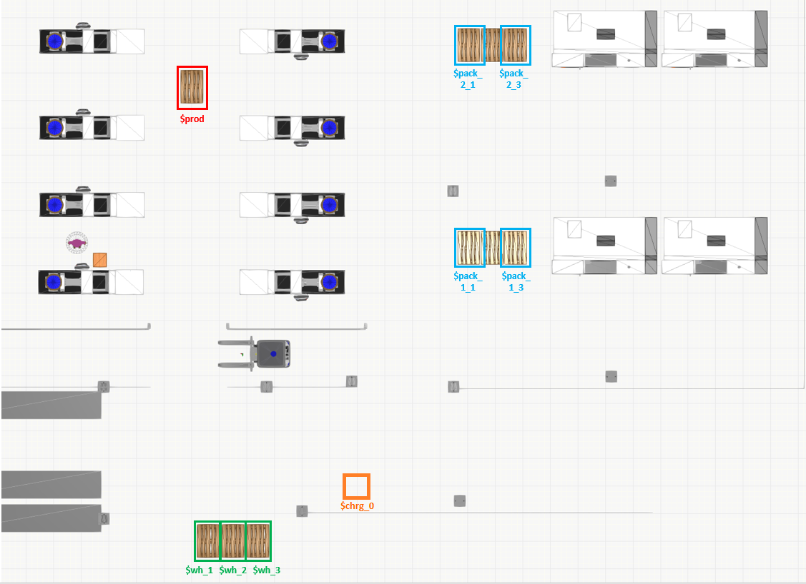
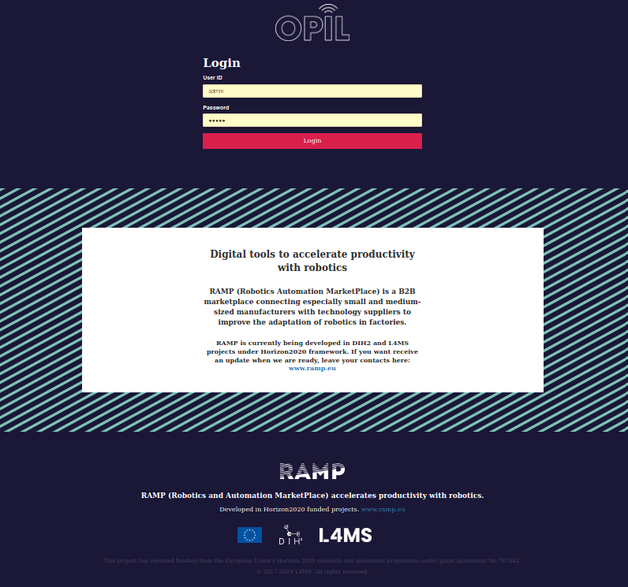

# OPIL Server Installation

**IMPORTANT NOTE: THIS DOCUMENT IS STILL UNDER CONSTRUCTION AND THUS IS MISSING CONTENT AND MAY HAVE ERRORS !!!**

## Your first installation

In this section you will install and configure the OPIL Server using an example layout provided on this page by following a step-by-step guide. At the end of this guide you will have a working OPIL Server setup. Finally, you will reset the configuration and then you can configure the OPIL Server with your own layout.

## Prerequisites for this guide

- Computer with Linux-based operating with docker and docker-compose installed.
- You know the IP-address of your system. Write it down as you will need  it later in this guide. This will be referred as `<ip-address>` from now on.
- The following PNG image: [demo_map.png](files/demo_map.png)
- You are familiar with Linux-based operating systems on basic level to execute commands and edit files
- You have read the [introduction](../../start/index.md) and [deployment](../../start/deployment.md) pages and are familiar with the basic concepts of OPIL and the purpose of each OPIL module.

## Overview

During this guide you will complete the following steps:

1. Verify `docker` environment
2. Prepare a docker-compose.yml file
3. Prepare the layout
4. Prepare VC simulation (TBA by Fernando)
5. Prepare OPIL HMI
6. Prepare OPIL Central SP
7. **TBA !!!** (Prepare OPIL TP)8
8. Review the docker-compose.yml file
9. Start the OPIL Server modules
10. 
11. Setting up a simple task
12. Initiation with HMI button
13. 
14. 
15. Stopping and removing containers

### Notes

- This guide is a simple step-by-step guide for setting up the OPIL Server. It is possible to change the configuration (e.g. ports and filenames) with the capabilities described in [Docker compose file version 3 reference](https://docs.docker.com/compose/compose-file/). However, during this guide we will not address any configuration that is not absolutely required.

## Verify docker environment

In this step, you will verify that your `docker` environment is running and that it is not out of date. If you know that you do not have a `docker` environment set up, start with the "Updating and troubleshooting" section below. Please note that both `docker` and `docker-compose` are required to follow this guide.
>It is recommended to run all `docker` and `docker-compose` commands with `sudo` to avoid errors caused by privileges. However, depending on your OS and user settings this might not be required.

First, check the `docker` version by executing command:

```bash
> docker -v
Docker version 19.03.1, build 74b1e89
```

Then, check the `docker-compose` version by executing command:

```bash
> docker-compose -v
docker-compose version 1.24.1, build 4667896b
```

The minimum required versions are listed in the table below but it's always a good idea to use the most latest version available.
| | Minimum version | This guide is tested with |
| --- | --- | --- |
| docker | TBA | 18.09.6 |
| docker-compose | 1.13.1+ | 1.24.0 |

### Troubleshooting and updating the docker environment

If you did not have `docker` environment set up or either of the commands resulted in an out-of-date version or in some error or other unexpected result see the following links respectively.

For `docker` related instructions, see [docker installation guide](https://docs.docker.com/install/).  
For `docker-compose` related instructions, see [docker-compose installation guide](https://docs.docker.com/compose/install/).

Finally, repeat the step described above to verify that your installation was successful.

## Prepare a docker-compose.yml file

In this step, you will prepare a new `docker-compose.yml` file that will be completed one step at a time during this guide.

First, create a new directory where you want all of your OPIL docker-related files to be placed. Then navigate to the newly created directory as `docker-compose` commands will always look for the `docker-compose.yml` file in the active directory.

Next, create the `docker-compose.yml` file. Please note that the filename must exactly match the given name. Copy the following content to the beginning of the file:

```yaml
version: "3.1"

services:
    ### Database for context broker ###
    mongo:
        #restart: always
        image: mongo:3.4
        command: --nojournal

    ### Proxy for Context Broker ###
    ngsiproxy:
        #restart: always
        image: fiware/ngsiproxy:latest
        ports:
            - 3000:3000

    ### Context Broker ###
    orion:
        #restart: always
        image: fiware/orion
        depends_on:
            - mongo
            - ngsiproxy
        ports:
            - 1026:1026
        command:
            -dbhost mongo -corsOrigin __ALL
```

This will configure the middleware of OPIL, including its three components: MongoDB, NGSI Proxy and Orion Context Broker.

Please make sure that the ports **3000** and **1026** are not already in use. Making changes to the port configuration here will cause errors with other modules that cannot be fixed by configuration in the current version of OPIL.

## Prepare the layout

In this step you will determine the configuration regarding the factory layout. In this guide you will be using the `demo_map.png` image as the layout. You should have already downloaded this file at the beginning of this guide but if you haven't done so yet you can download it [here](files/demo_map.png).

Please note that during this guide you must use the original image file to preserve the original resolution.

### The layout


### The layout has three main areas:


| Area name | Description |
| --- | --- |
| Production area | This area continuously produces products that are collected on the single pallet within the area. This pallet is then transported to the warehouse area for storage. |
| Warehouse area | This area is used to receive and store products from the production and packaging areas. Also, pallets are periodically transported from this area to the packaging area. |
| Packaging area | In this area ready products and packaged and finally packaged products area transported back to warehouse area for storage. |

### Determining the zero point and scale

In order to align the factory floor installations with the planned layout it is necessary to define a zero point for the layout. This will be the origin for all measurements for installations and annotations. The zero point should be selected so that:

1. It is a fixed point of a fixed structure on the factory floor
1. It is accurately aligned with layout and the physical factory floor
1. It is easy to measure distances from this point to other meaningful positions, e.g. pallet locations.

> For example, selecting a corner of the layout image is not a suitable zero point since in most cases it is outside the building or somewhere in the middle of the floor. Selecting a point like this makes it impossible to accurately align the layout with the factory floor inside OPIL.

In this guide we have selected a corner of one of the columns in the middle of the layout as our zero point. See picture below.  


Next you need to determine the following values for configuring all OPIL Server modules:

- Scale in meters/pixel
- Zero point coordinate in pixels
- Zero point coordinate in meters

First you will define the **scale in meters/pixel**. To do this you must first know a distance of any two points in the layout. Since the resolution is the same for both X- and Y-axes it is necessary to measure only one axis. To minimize the possible error from the resolution and measurement you should select the longest easily measurable distance.

In this layout you have a grid with a resolution of 1 meter that helps you to easily determine two points and the distance between. In the picture below, the red line is exactly **28 meters**. Then you need to measure the same line in pixels, this can be easily done using an image editing software (e.g. GIMP). The line in this case is **1432 pixels** long. Finally we can calculate that the scale of the layout is:

```
28 meters / 1432 pixels = 0.019553 m / px
```


The next step is to determine the **zero point coordinate in pixels**. Measure the number of pixels from the **bottom left-hand corner** of the image to the zero point. With the layout in this guide you will get the following measurements:

```
X = 659 px
Y = 383 px
```

Finally you can determine the **zero point coordinate in meters** by combining the two previous results:

```
X = 0,019553 * 659 px = 12.8854
Y = 0,019553 * 383 px = 7.4888
```

Make sure to store your measurements and calculations as you are going to use them in the next steps. It is also possible that you may have to slightly adjust some values by 1 pixel or so for a perfect alignment. This will be checked later in this guide.

### Annotations

Annotations are labeled positions of importance in the layout. Such labeled positions could be pick-up and drop-off locations, charging stations or pallet stacks. The annotations you will be working with in this guide are all pallet locations and are marked in the following image:


During this step, you should record the position and orientation of each labeled position for future use. The orientation is called `theta` in the configuration file. The orientation also defines the approach direction and is defined as follows:

- Left = 0
- Up = 90
- Right = 180
- Down = 270

**TBA: Explanatory image!!!**

Now for the position of each annotation you need to measure the center point of each pallet location in the layout. The exact point may be different depending on the hardware used and RAN configuration. The measurement is done in meters relative to the zero point. Measurements for each labeled position in this layout are as follows:

```ini
[prod]
point_x = -6.00
point_y = 10.50
theta = 90

[wh_1]
point_x = -5.40
point_y = -6.00
theta = 270

[wh_2]
point_x = -4.50
point_y = -6.00
theta = 270

[wh_3]
point_x = -3.60
point_y = -6.00
theta = 270

[pack_1_1]
point_x = 4.05
point_y = 4.65
theta = 90

[pack_1_3]
point_x = 5.75
point_y = 4.65
theta = 90

[pack_2_1]
point_x = 4.05
point_y = 12.00
theta = 90

[pack_2_3]
point_x = 5.75
point_y = 12.00
theta = 90
```

Now you have determined the necessary information regarding the layout you are using in this guide and next you can start configuring the OPIL modules.

## Prepare OPIL Central SP

### Prepare demo_map.yaml

Create a new file in the root directory called `demo_map.yaml`. This file will include the configuration of the map scale and zero-point as well as a few additional parameters.

```yaml
#demo_map.yaml
image: map.png
resolution: 0.0196
origin: [-12.8854, -7.4888, 0.0]
negate: 0
occupied_thresh: 0.65
free_thresh: 0.196
```

Note: The value in the `image` field is `map.png`, regardless of our PNG file being named `demo_map.png`. This is intended, so please do not change this.

For now, there is no need to adjust any of these parameters. Configuration possibilities regarding this file are explained in the [SP documentation](../SP/opil_server_sp_gettingStarted.md).

### Prepare annotations.ini

Create a new file in the root directory called `annotations.ini`.

This file will include the annotations or labeled positions you have defined earlier. In addition to the previously defined positions and orientations you also need to define the approach distance.

The distance defines the final movement to the position and it is always a straight line that is not affected by the motion path planning. In this guide you will use a distance of 1.8 meters for all positions as the forklift has forks that need to be aligned to the pallet before moving under the pallet. For further details, see  [SP documentation](../SP/opil_server_sp_gettingStarted.md).

Using the position data defined earlier you can now add content to the `annotations.ini`:

```ini
#annotations.ini

[prod]
point_x = -6.00
point_y = 10.50
theta = 90
distance = 1.8

[wh_1]
point_x = -5.40
point_y = -6.00
theta = 270
distance = 1.8

[wh_2]
point_x = -4.50
point_y = -6.00
theta = 270
distance = 1.8

[wh_3]
point_x = -3.60
point_y = -6.00
theta = 270
distance = 1.8

[pack_1_1]
point_x = 4.05
point_y = 4.65
theta = 90
distance = 1.8

[pack_1_3]
point_x = 5.75
point_y = 4.65
theta = 90
distance = 1.8

[pack_2_1]
point_x = 4.05
point_y = 12.00
theta = 90
distance = 1.8

[pack_2_3]
point_x = 5.75
point_y = 12.00
theta = 90
distance = 1.8
```

### Prepare topology.launch

Create new file in the root directory called `topology.launch` and copy-paste the following content into the file.

```xml
<launch>
<node name="map_server" pkg="map_server" type="map_server" args="$(find maptogridmap)/launch/map.yaml" respawn="false" >
<param name="frame_id" value="/map" />
</node>
<node name="rviz" pkg="rviz" type="rviz" args="-d $(find maptogridmap)/singlerobot.rviz" />
<node name="map2gm" pkg="maptogridmap" type="map2gm" output="screen">
        <param name="cell_size" type="double" value="1.0" />
        <param name="annotation_file" textfile="$(find maptogridmap)/launch/annotations.ini" />
</node>
    <!-- Run FIROS -->
    <node name="firos" pkg="firos" type="core.py" />
</launch>
```

For now you don't need to edit this file. Configuration possibilities regarding this file are explained in the  [SP documentation](../SP/opil_server_sp_gettingStarted.md).

### Append docker-compose.yml

Finally, add the following content to the end of the `docker-compose.yml` file:

``` yaml
    ### S&P ###
    sp:
        #restart: always
        image: l4ms/opil.sw.sp.central:latest
        volumes:
            - /tmp/.X11-unix:/tmp/.X11-unix:rw
            - ./annotations.ini:/annotations.ini:ro
            - ./demo_map.yaml:/map.yaml:ro
            - ./demo_map.png:/map.png:ro
            - ./topology.launch:/topology.launch:ro
        environment:
            - FIWAREHOST=orion
            - HOST=sp
            - NETINTERFACE=eth0
            - DISPLAY=$DISPLAY
```

## Prepare OPIL HMI

In this step you will configure the OPIL HMI module by appending the `docker-compose.yml` file with the following content. Replace `<ip-address>` in the `ocb_host` and `ngsi_proxy_host` fields with the one you wrote down in the prerequisites of this guide.

```yaml
    ### Database for HMI ###
    mongodb:
        image: mongo:3.6
        #restart: always
        volumes:
        - ./mongo/data:/data/db
    ### HMI web app ###
    hmi:
        image: l4ms/opil.sw.hmi:latest
        #restart: always
        volumes:
            - ./public/uploads:/usr/src/app/public/uploads
        environment:
            - inituser=admin
            - initpw=admin
            - ocb_host=<ip-address>
            - ocb_port=1026
            - ngsi_proxy_host=<ip-address>
            - ngsi_proxy_port=3000
        ports:
            - "80:8081"
        depends_on:
            - mongodb
            - orion
        command: bash -c './wait-for mongodb:27017 -- node server.js'

```

For now, you don't need to change any of the other configuration but please make sure that the port 80 is not already in use. If the port is in use, you can alternatively change the port number **80** to any free port you wish to use. Do not edit the right side of the port configuration.

## Prepare OPIL TP

TBA ( Module still under development ? )

## Review the docker-compose.yml file

Review the content of your `docker-compose.yml` file and make sure it matches with the following content:

``` yaml
version: "3.1"

services:

services:
    ### Database for Context Broker ###
    mongo:
        #restart: always
        image: mongo:3.4
        command: --nojournal

    ### Proxy for Context Broker ###
    ngsiproxy:
        #restart: always
        image: fiware/ngsiproxy:latest
        ports:
            - 3000:3000

    ### Context Broker ###
    orion:
        #restart: always
        image: fiware/orion
        depends_on:
            - mongo
            - ngsiproxy
        ports:
            - 1026:1026
        command:
            -dbhost mongo -corsOrigin __ALL

    ### S&P ###
    sp:
        #restart: always
        image: l4ms/opil.sw.sp.central:latest
        volumes:
            - /tmp/.X11-unix:/tmp/.X11-unix:rw
            - ./annotations.ini:/annotations.ini:ro
            - ./demo_map.yaml:/map.yaml:ro
            - ./demo_map.png:/map.png:ro
            - ./topology.launch:/topology.launch:ro
        environment:
            - FIWAREHOST=orion
            - HOST=sp
            - NETINTERFACE=eth0
            - DISPLAY=$DISPLAY

    ### Database for HMI ###
    mongodb:
        image: mongo:3.6
        #restart: always
        volumes:
        - ./mongo/data:/data/db

    ### HMI web app ###
    hmi:
        image: l4ms/opil.sw.hmi:latest
        #restart: always
        volumes:
            - ./public/uploads:/usr/src/app/public/uploads
        environment:
            - inituser=admin
            - initpw=admin
            - ocb_host=<ip-address>
            - ocb_port=1026
            - ngsi_proxy_host=<ip-address>
            - ngsi_proxy_port=3000
        ports:
            - "80:8081"
        depends_on:
            - mongodb
            - orion
        command: bash -c './wait-for mongodb:27017 -- node server.js'


    #TP
    # tp:
        # image: l4ms/opil.sw.tp:latest
        # depends_on:
            # - orion
        # ports:
            # - 2906:2906
        # volumes:
            # - ./fiware_config.ini:/app/taskplanner/fiware_config.ini

```

## Start the OPIL Server modules

In this step you will start-up the docker containers you have configured during this guide. The start-up will be done in steps, mostly module-by-module, and you will verify the status and basic functionality of the started module(s) between each step.

### Start the OPIL middleware

```
> docker-compose up -d orion
...
Starting docker_ngsiproxy_1 ... done
Starting docker_mongo_1     ... done
Starting docker_orion_1     ... done
```

Checking the container status

```
> docker-compose ps
       Name                     Command               State           Ports
------------------------------------------------------------------------------------
docker_mongo_1       docker-entrypoint.sh --noj ...   Up      27017/tcp
docker_ngsiproxy_1   /bin/sh -c ngsi-proxy            Up      0.0.0.0:3000->3000/tcp
docker_orion_1       /usr/bin/contextBroker -fg ...   Up      0.0.0.0:1026->1026/tcp
```

Next verify that the connection to the services is working.
Open in a web browser `http://<ip-address>:1026/v2/entities`. This should load a **blank** html page with empty brackets .

```
[]
```

Open in a web browser `http://<ip-address>:3000`. This load a **blank** html page with the text

```
Cannot GET /
```

### Start the OPIL HMI

```
> docker-compose up -d hmi
...
Starting docker_mongodb_1   ... done
Starting docker_hmi_1       ... done
```

```
> docker-compose ps
       Name                     Command               State           Ports
------------------------------------------------------------------------------------
docker_mongo_1       docker-entrypoint.sh --noj ...   Up      27017/tcp
docker_ngsiproxy_1   /bin/sh -c ngsi-proxy            Up      0.0.0.0:3000->3000/tcp
docker_orion_1       /usr/bin/contextBroker -fg ...   Up      0.0.0.0:1026->1026/tcp
docker_hmi_1         docker-entrypoint.sh bash  ...   Up      0.0.0.0:80->8081/tcp
docker_mongodb_1     docker-entrypoint.sh mongod      Up      27017/tcp
```

Next step is to configure the HMI. This is done from a web browser by navigating to the HMIs address `http://localhost` or `http://<ip-address>`. A login page should load:



Now log in with the default credentials: username = `admin` and password = `admin`.

Wait for the HMI to reload and check that you do NOT see the following error. If you get this error go back to "Start OPIL middleware" section and make sure the middleware is running and functional.


If you do not see the error, everything is working as expected and you can move on forward.

**TBA: Missing Floor plan management instructions**

### Start the OPIL SP

First execute the following command the enable the OPIL SP to use the display:

```
> xhost local:root
```

And then start the OPIL SP module:

```
> docker-compose up --build sp
...
Starting docker_sp_1 ... done
...
(many lines of configuration data)
...
sp_1         | name[]
sp_1         |   name[0]: prod
sp_1         |   name[1]: wh-1
sp_1         |   name[2]: wh-2
sp_1         |   name[3]: wh-3
sp_1         |   name[4]: pack-1-1
sp_1         |   name[5]: pack-1-3
sp_1         |   name[6]: pack-2-1
sp_1         |   name[7]: pack-2-3
sp_1         | uuid[]
sp_1         |
```

Also, a new window called RViz should open. Here are the most important commands you will need:

- Zoom: Mouse scroll
- Move: Hold Shift-key and drag with mouse

Move and zoom the view until you see the layout fully in the screen. The window and the layout should look like this:


Next, verify the following things:

- Scale and zero point: The gray grid that extends outside your demo layout should have its origin, i.e. bottom-left-hand corner at the intended zero point. If it does not match, you have an error in either the scale/resolution or zero-point coordinate in the `demo_map.yaml` file.
- Annotations: Look at the yellow arrows in the layout and make sure that they are correctly positioned and orientated at intended labeled positions. If the annotations do not match, you have an error in the `annotations.ini` file.
- OCB connection: Make a HTTP GET by using a web browser or some other tool to `http://<ip-address>/v2/entities` and check that you have a new entity called `map`. Please note that due to the size of that entity the GET request to OCB might take longer than before.

Other things to consider if you are following this guide and using a different layout:

- If there are missing, too few or too many blue passages in the layout, try adjusting the `cell_size` in the `topology.launch` file or the `occupied_thresh` or `free_thresh` in the `demo_map.yaml` file. For more details, see [SP documentation](../SP/opil_server_sp_gettingStarted.md).

Finally, shutdown the SP by inputting Ctrl+C on the terminal window that is attached to the SP container. Now you can start the SP in detached mode:

```
> docker-compose up -d --build sp
Starting docker_sp_1 ... done

> docker-compose ps
       Name                     Command               State           Ports
------------------------------------------------------------------------------------
docker_hmi_1         docker-entrypoint.sh bash  ...   Up      0.0.0.0:80->8081/tcp  
docker_mongo_1       docker-entrypoint.sh --noj ...   Up      27017/tcp
docker_mongodb_1     docker-entrypoint.sh mongod      Up      27017/tcp
docker_ngsiproxy_1   /bin/sh -c ngsi-proxy            Up      0.0.0.0:3000->3000/tcp
docker_orion_1       /usr/bin/contextBroker -fg ...   Up      0.0.0.0:1026->1026/tcp
docker_sp_1          /ros_entrypoint.sh bash          Up
```

### Enable `restart:always`

TBA

To be continued...
