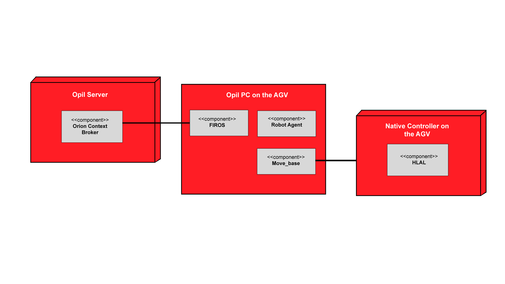

# Introduction Robot Agent Node (RAN)
This is the Robot Agent Node (RAN) documentation. 

Here you will find the information required for installing and configuring the RAN.

## Overview RAN

The RAN (Robot Agent Node) sits between OPIL and the Robot Hardware. It provides two main functionalities: it manages robot navigation, based on ROS, and works as an interface between the robot hardware and the OPIL Cyber Physical Middleware, based FIWARE Orion Context Broker. In order to accomplish the second functionality, the RAN "translates" and adapts FIWARE entities into something understandable by ROS, i.e., messages and services, and vice versa. In doing so, it accomplishes the goal set for the Communication/Messaging sub-module described by the OPIL Reference Architecture in the main document to which this annex refers to.

In its first embodiment the RAN translation is performed by using FIROS. The FIROS component on the RAN integrates the FIWARE NGSI Context Management Interfaces with the ROS-speaking robots. Non-ROS speaking robots are interfaced via a ROS node which uses an ad-hoc protocol defined by the OPIL consortium, i.e., by ASTI. All communications inside the RAN are handled via ROS messages and services.

For navigation, messages concerning the target positions to be reached are sent to the robot. These targets are provided by the OPIL Task Planner and are delivered to the local execution layer, i.e., a local trajectory planner, inside the RAN. In particular, Task Planner messages provide target points to the RAN, one point for each message. The RAN plans its trajectory to reach the point. 

The Task Planner in the meanwhile can send a new message to guide the robot through a series of points – called waypoints. Once the final target – or goal – is reached the Robot stops and awaits for new messages that defines which action it has to perform. As for destinations, actions are sent by the Task Planner and describe which action the robot has to perform once it reaches its destination.  By sending sequences of points to reach (motions) and actions it is possible to define tasks for the robot.

To perform an effective navigation, in addition to the sequence of points, the RAN should receive the MAP description and its own POSITIONING, within the MAP reference system, through Orion Context Broker. OCB also receives periodical notifications about the robot status (including robot status, battery level, current target point, etc…) from the RAN.

## RAN structure

   
   
   This schema shows how the RAN connects OPIL with the Hardware (AGV/Robot)
   
   
   
   This schema details how the RAN and its subcomponents are implemented in the infrastructure

## RAN Prerequisites

RAN is provided in 2 different versions:

- Docker

- Source code

Both versions provide the same functionalities and the way to use them are the same, but each version has different prerequisite.

## General prerequisite

In order to execute the RAN module, the HW requirements for the machine are the ones needed for a ROS installation:

• 1 GHz processor

• 1.5 GB RAM

• Network adapter

### Context Broker

A FIWARE Orion Context Broker server has to run - probably on a different machine. There are various ways to have this OCB, some can be found [here](https://fiware-orion.readthedocs.io/en/master/admin/install/index.html) or [here](https://hub.docker.com/r/fiware/orion/)

## Docker

In order to execute the Docker version, Docker has to be installed on your system. You can find a guide to the installation at the following [link](https://docs.docker.com/install/)

There are no particuliar requirements concerning OS with this version, but we still recommend using an Ubuntu distribution (at least 16.04)

## Source code

In order to enable the RAN to work, the machine must run an Ubuntu distribution (we recommend 16.04)

Moreover, the following softwares have to be installed:

### ROS

ROS can be installed following [this guide](http://wiki.ros.org/ROS/Installation).

There are various dependencies with ROS packages that have to be installed. You should be able to install all required packages with the following commands:

	sudo apt-get install ros-kinetic-desktop-full
	
	sudo apt-get install ros-kinetic-navigation
	
	sudo apt-get install ros-kinetic-industrial-msgs
	
You should create a simple workplace, following [this tutorial](http://wiki.ros.org/catkin/Tutorials/create_a_workspace).

### FIROS

It is possible to get FIROS following a guide availabe at [this link](https://github.com/Ikergune/firos).

#### Configuration

Proper RAN-connector operativity depends on the correct configuration of its SW components. As stated in the component description, one of RAN’s functionalities is connecting the OPIL Middleware and the Hardware, so ROS packages and FIWARE Orion Context Broker. These connections are managed through FIROS. Each ROS module that wants to be connected to OCB must have FIROS, installed and properly configured, running on it.

FIROS configuration is managed by 4 files. Inside the FIROS folder, there is a config folder where we can see several .json files. The most important are config.json, whitelist.json and robots.json. The information about them can be found in the FIROS Readme file on a GitHub.

In the FIROS config/config.json file modify the following fields:

- server.address : set it to your local host

- contextbroker.address : set it to the address of the machine running FIWARE

- interface: set it to your network adapter name.

Edit the aforesaid parameters of the FIROS config folders, then copy the files inside into the config folder hosted in the FIROS directory in your ROS workspace.

#### config.json

In this file you need to specify the network configuration. Under the server name, make sure to include IP address of the machine where the FIROS will be running. Under the Context Broker server, you must specify the IP of the machine running the Context Broker. Under the interface name you shall specify the one that your network is using (check the Connection Information). In case of having machines in different networks, you have to redirect the port on your router and do necessary optimization there.

#### robots.json

In this file you need to specify the robots to which FIROS will be connected and the topics used by that robot to which FIROS will listen. In defining the roles of the robots, keep in mind that FIROS environment is FIWARE centric. This means that a robot that publishes on FIWARE has a “subscriber” role, while one listening to FIWARE has a “publisher” role.

#### whitelist.json

Here you have to just write the same information that you have written in robots.json files.

