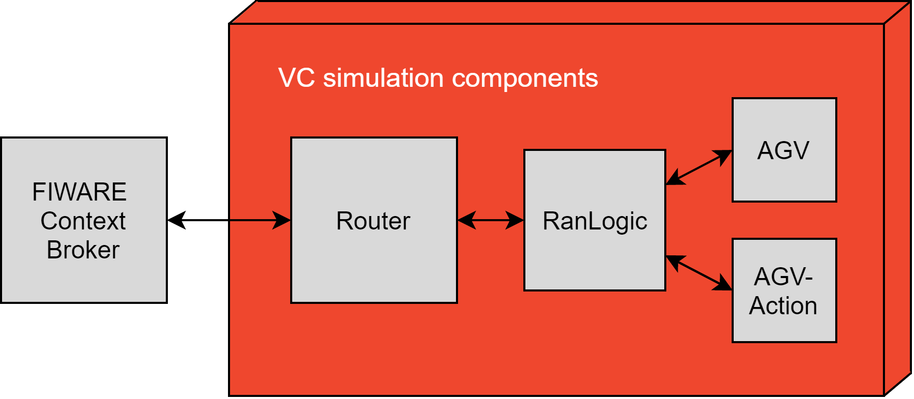

# Introduction Visual Components -Robot Agent Nod (VC RAN)

The VC-RAN (Visual Components Robot Agent Node) is the OPIL IoT Nodes layer module devoted to the control of the virtual robots. VC-RAN provides two main functionalities: it manages virtual robot navigation inside Visual Components simulation software and works as an interface between the virtual robots and the FIWARE Orion Context Broker of the OPIL Cyber Physical Middleware layer.

## Overview VC RAN

Figure 1 presents the structure of VC-RAN. VC-Router handles communication between the FIWARE Context Broker (FCB) and VC-RanLogic components. Messages are transmitted using signals and interfaces in the simulation layout. For every AGV there is one VC-RanLogic and one VC-AgvAction component. From the FCB-messages received and delivered by the VC-Router, VC-RanLogic filters those that contain the robot id of the AGV. VC-RanLogic stores the data (motion and action assignments) to data structures based on the task id and receive time and handles the data delivery to the AGV (motion assignments) and VC-AgvAction components (action assignments). VC-RanLogic also maintains data structures for completed and cancelled tasks as well as for task variables such as current and last motion and action.

VC-RanLogic sends description message every minute to VC-Router, which delivers the message as is to FCB. RobotState message is sent by the AGV every second to VC-RanLogic that then sends RAN-state message to VC-Router. VC-RanLogic likewise sends assignment status message to VC-Router every second. VC-Router delivers both RAN-state and assignment status messages to FCB. AGV and VC-AgvAction components send a message after every completed assignment to VC-RanLogic, which the VC-RanLogic uses to update its data structures, task variables and state.

Figure 1. Structure of VC-RAN.

## VC-Ran Logic

### Task handling

Tasks are executed in the order they are received. When a motion or action assignment with a particular task id is first received, it is inserted into a data structure together with timestamp. Collectively, they form the task queue. Timestamps for the last motion assignment and action assignment are also stored in the same data structure.

Received tasks are executed in the order of ascending timestamp value. Robot motion planning and execution begins once all the motion assignments with the same current task's id are received. This ensures that all the required messages have been received. All the motion assignments belonging to the same current task are sent at the same time to the AGV. After all the motion assignments are completed, action assignments belonging to the current task are sent to the VC-AgvAction component one at a time. The task is completed when all the action assignments have been carried out.

If all the assignments (motion or action) belonging to the same task are not received within specified timeout limit, the task is cancelled and removed from task queue. Likewise, if cancel task command is received, task is cancelled in the same manner. If a task is cancelled mid-execution, the current motion or action assignment execution is continued, but the following assignments are cancelled.

### State machine

VC-RanLogic is always in one of the finite states specified in Figure 2. Starting state is state-waiting, which changes to state-task after new task is received. When all the motion assignments belonging to the current task have been received, the state changes to state-motion and VC-RanLogic will send the motion assignment sequence to the AGV. After all the motion assignments have been completed and the action assignments belonging to current task received, state changes to state-action. In this state, VC-RanLogic sends action assignments one by one to the VC-AgvAction component until all the assignments are completed and VC-RanLogic returns to state-waiting. If the current task is cancelled, the state changes to state-waiting.

Figure 2. VC-RanLogic state machine.
