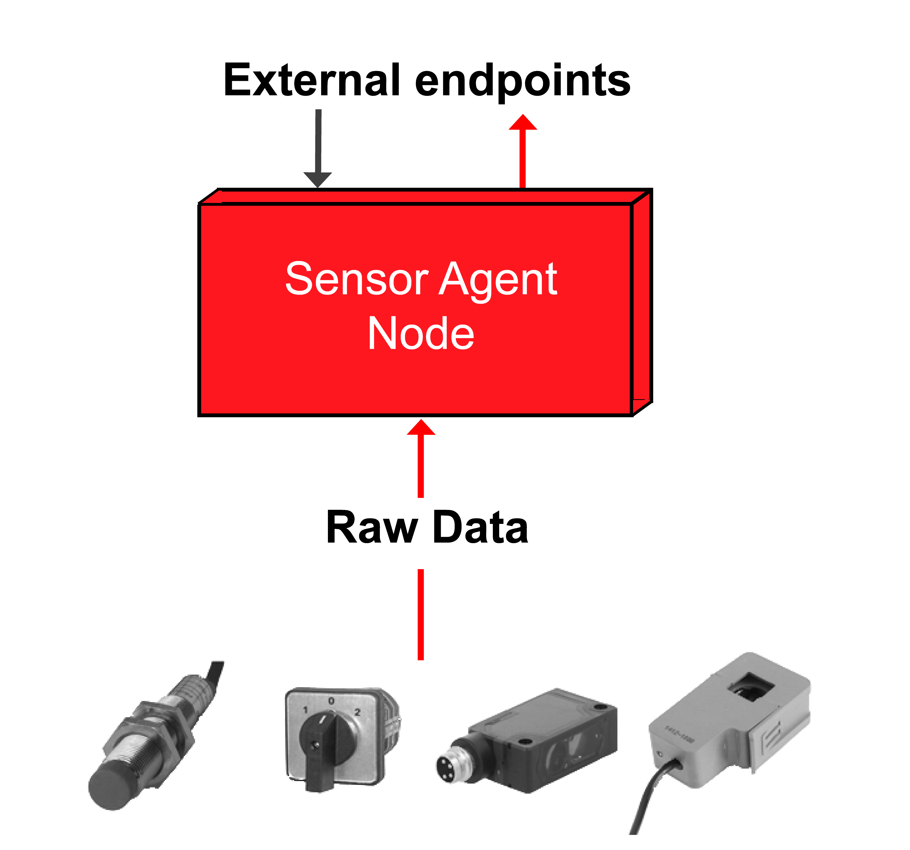

# Home

## Introduction

Welcome to the Sensor Agent Node documentation.

Here you will find all information required to set-up, confire and run this node.

### What is SAN?

Sensor Agent Node (SAN) is one of modules in IoT layer defined by [OPIL](http://project.l4ms.eu/OPIL-Documentation) architecture. SAN is responsible for connecting various sensors with OPIL and providing context data about them to [Orion Context Broker](https://fiware-orion.readthedocs.io/en/master).

*Figure 1: Simplified working principle of SAN*

*Figure 2: Sequence diagram with Raspberry Pi as an example*

### Current version features:

* Plug'n'play for digital sensors
* Simplified configuration
* Interface with Human Machine Interface
* Three configurable modes for submitting the data: event-driven, time-series, fixed-interval
* Supports Revolution Pi and Raspberry Pi devices

### Where should you start? 

In order to start working with SAN, please assess the documentation in the following order:

1) Getting Started
2) Installation & Administration 
3) User & Programmers Manual

