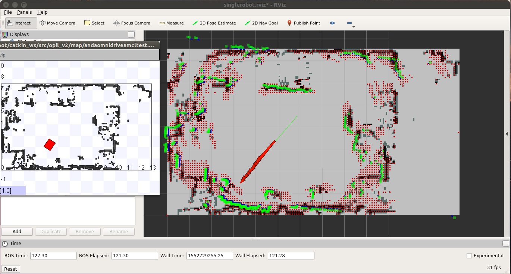
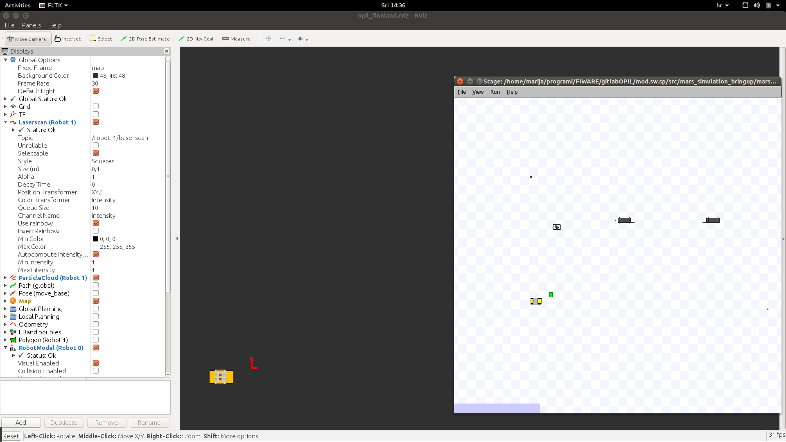
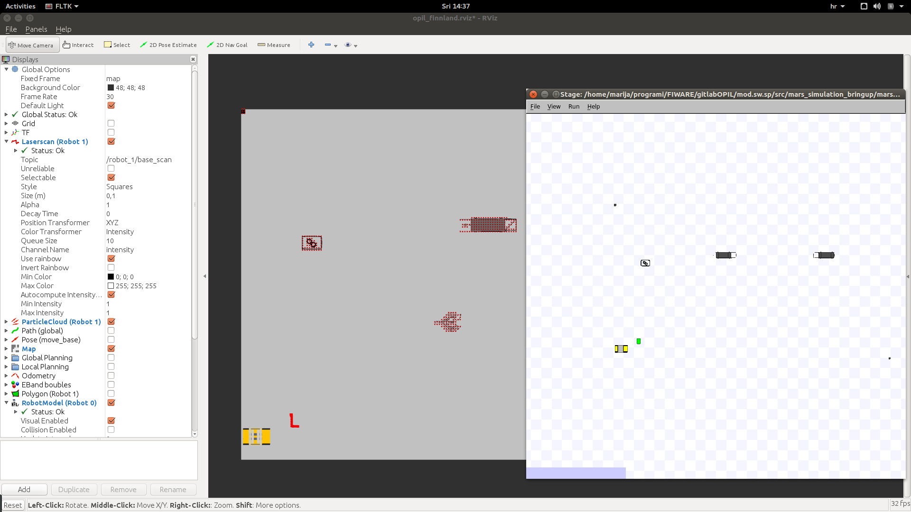

# Local SP Installation

There are two ways of installing the SP module. You can use the docker containers or compile it from the source.

## Install from Docker Container

There are two docker containers - the Central SP and the Local SP.
The Local SP is located at 
<https://docker.ramp.eu/?page=1#!taglist/opil/opil.iot.sp.local>

### The Local SP as a standalone module

The Local SP docker container can be started in two ways: without RAN and with RAN. If started without RAN then the simulator Stage is used for testing and visualizing what the Local SP does. Here, installing the Local SP as a standalone module is described.

To install it you need to prepare a ***docker-compose.yml*** following this example:
### <a name="dockercomposelocal">docker-compose.yml</a>
```
version: "3"
services:      
    mongo:
        image: mongo:3.4
        command: --nojournal

    ### Proxy for Context Broker ###
    ngsiproxy:
        image: fiware/ngsiproxy:latest
        ports:
            - 3000:3000

    ### Context Broker ###
    orion:
        image: fiware/orion:2.3.0
        depends_on:
            - mongo
            - ngsiproxy
        ports:
            - 1026:1026
        command:
            -dbhost mongo -corsOrigin __ALL -inReqPayloadMaxSize 2097152
    splocal:
        restart: always
        image: l4ms/opil.iot.sp.local:3.0.6-beta
        volumes:
            #- path on the host : path inside the container
            - /tmp/.X11-unix:/tmp/.X11-unix:rw
            - ./floorplan.yaml:/map.yaml:ro
            - ./floorplan.png:/map.png:ro
            - ./amcl.launch:/amcl_map.launch:ro
            - ./floorplan.world:/map.world:ro
            - ./local_robot_sim.launch:/local_robot_sim.launch:ro
        environment:
            - FIWAREHOST=orion
            - HOST=splocal
            - DISPLAY=$DISPLAY
            - SIMULATION=true
        ports: 
            - "39003:39003"
```
It is important to put the environment variable `SIMULATION=true`.
First, set up the display for viewing the rviz visualization and Stage:
```
xhost local:root
```
This needs to be called only once.
Then, start it from the folder where you put your ***docker-compose.yml*** file:
```
sudo docker-compose up
```
To check if everything is working properly follow the guide [Starting from Docker - Local SP.](#fromdockerlocal)

## The Local SP docker working with RAN

It is possible to start the Local SP docker with RAN docker and also to start the Local SP docker with the source of RAN. First it will be explained how to test two dockers together: RAN with Local SP, and afterwards how to setup the Local SP docker to work with RAN started from source.

The Local SP docker container is the same but the environment variable needs to be `SIMULATION=false`. By this, the Local SP does not start the Stage simulator and it is connected directly to RAN through a single ROS master. For that purpose RAN docker container is called without the **map_server** and **fake_localization**.

To install it you need to prepare a ***docker-compose.yml*** that also includes RAN container:
### <a name="dockercomposelocalran">docker-compose.yml</a>
```
version: "3"
services:      
    mongo:
        image: mongo:3.4
        command: --nojournal

    ### Proxy for Context Broker ###
    ngsiproxy:
        image: fiware/ngsiproxy:latest
        ports:
            - 3000:3000

    ### Context Broker ###
    orion:
        image: fiware/orion:2.3.0
        depends_on:
            - mongo
            - ngsiproxy
        ports:
            - 1026:1026
        command:
            -dbhost mongo -corsOrigin __ALL -inReqPayloadMaxSize 2097152
#RAN
  	ran: 
    	image: "l4ms/opil.iot.ran:3.0.1-alpha"
    	environment: 
      		- "ROS_MASTER_URI=http://localhost:11311"
      		- DISPLAY=$DISPLAY
    	volumes:
      		- /tmp/.X11-unix:/tmp/.X11-unix:rw
		    - ./mod_iot_ran_no_fakelocalization.launch:/catkin_ws/src/mod_iot_ran/launch/mod_iot_ran.launch 
			- ./floorplan.world:/catkin_ws/src/mars_simulation_bringup/mars_simulation_data/world/opil_finnland.world 
      		- ./simulation_no_mapserver.launch:/catkin_ws/src/mars_simulation_bringup/mars_simulation/launch/opil_finnland_simulation.launch
    	ports: 
      		- "39000:39000"

#S&P
  	splocal:
    	restart: always
    	image: l4ms/opil.iot.sp.local:3.0.6-beta
    	volumes:
            #- path on the host : path inside the container
      		- /tmp/.X11-unix:/tmp/.X11-unix:rw
            - ./floorplan.yaml:/map.yaml:ro
            - ./floorplan.png:/map.png:ro
            - ./amcl.launch:/amcl_map.launch:ro
      		- ./local_robot.launch:/local_robot.launch:ro
	      	- ./firos_robots_localsp.json:/robots.json:ro
      		- ./firos_whitelist_localsp.json:/whitelist.json:ro
    	environment:
      		- ROS_MASTER_URI=http://ran:11311
      		- ROS_IP=splocal
      		- FIWAREHOST=orion
      		- HOST=splocal
      		- DISPLAY=$DISPLAY
      		- SIMULATION=false
    	ports: 
      		- "39003:39003"
```
Then, start it from the folder where you put your ***docker-compose.yml*** file:
```
sudo docker-compose up
```
To check if everything is working properly follow the guide [How to start the Local SP and RAN docker containers together.](#fromdockerlocalran)


## Install from Scratch 

To install Firos v2:

```git clone -b v0.2.0 --recursive https://github.com/iml130/firos.git```


Install ROS packages:

```sudo apt-get install ros-kinetic-navigation```

```sudo apt-get install ros-kinetic-gmapping```

```sudo apt-get install ros-kinetic-teleop-twist-keyboard```

Install from SourceCode:

* put everything to your src folder of your catkin workspace or create a new one by typing **catkin_init_workspace** in src folder. Then compile it with **catkin_make** in one folder up.
```
cd ..
catkin_make
```
To check if everything is working properly follow the guide [Starting from Scratch.](#fromscratch)

# <a name="SPStartGuide">Local SP Start Guide</a>


In the following, two start options will be described, depending if you installed the source from the docker containers or from scratch.


## <a name="fromdockerlocal">Starting from Docker - Local SP</a>

The Local SP container can be started in two ways: without RAN and with RAN. If started without RAN then the simulator Stage is used for testing and visualizing what the Local SP does. This option is described first. Prepare [docker-compose.yml](#dockercomposelocal).
It is important to put the environment variable `SIMULATION=true`.

As a default, no map is loaded and the following message will appear in terminal:
```
splocal_1  | please insert a floorplan.png and floorplan.yaml file to begin!
splocal_1  | in your docker-compose.yml put under volumes:
splocal_1  |             - ./floorplan.yaml:/map.yaml:ro
splocal_1  |             - ./floorplan.png:/map.png:ro
opilserver_splocal_1 exited with code 0
```

### <a name="prepmap">Setting the map</a>

Three files need to be prepared and put under **volumes** in [docker-compose.yml](#dockercomposelocal): 

*	`floorplan.yaml`
*	`floorplan.png` 
*	`floorplan.world`

Right now in this docker container only PNG file is supported. Export your floorplan layout to PNG. 
Here is an example of `floorplan.png`:


Then, you need to set up parameters for transforming the PNG file into a map with the origin and dimensions in meters. This needs to be prepared in the `floorplan.yaml`. Here is an example:
```
#floorplan.yaml
image: map.png
resolution: 0.0196
origin: [-12.7095, -7.5866, 0.0]
negate: 0
occupied_thresh: 0.65
free_thresh: 0.196
```
Where

* the image name is `map.png` by which your `floorplan.png` is overwritten on the docker side
* **resolution** defines the size of the pixel of the png file in meters. To calculate the resolution, you need to know the width of the image in meters. Then, simply divide the width in meters with the width in the number of pixels. 
* **negate** can inverse the free-occupied values if set to 1
* **occupied_thresh** and **free_thresh** define the thresholds that tell which brightness level should be considered as occupied and free, respectively. 
* **origin** is the (x,y,z) vector in meters describing the lower-left corner. With (0,0,0) the origin will be in the lower-left corner. If the origin is somewhere inside the map, the origin coordinates will always have negative sign, since they represent the coordinates of the lower-left corner.

`floorplan.world` is the world file for the Stage simulator, where example is given as follows:
```
define kinect ranger
(
  sensor
  (
    range [0.0 10]
    fov 360.0
    samples 720
  )

  # generic model properties
  color "black"
  size [ 0.060 0.150 0.030 ]
)

define robot position
(
  origin [ 0.000 0.000 0.000 0.000 ]
  localizaton "odom"
  odom_error [0.03 0.03 0.01 0.01 0.02 0.02] 
  size [ 0.600 0.400 0.400 ]  
  drive "omni"
    
  kinect(pose [ -0.100 0.000 -0.110 0.000 ])
)
#define an obstacle
define worker model
(
  size [0.500 0.500 1.850]
  gui_nose 0  
)

define floorplan model
(
  color "gray30"  
  boundary 0
  gui_nose 0
  gui_grid 0
  gui_outline 0
  gripper_return 0
  fiducial_return 0
  laser_return 1
)

resolution 0.05

# simulation timestep in milliseconds
interval_sim 100  

#stage view window
window
(
  size [ 935 412 ]
  center [ 18.080 20.285 ]
  rotate [ 0.000 0.000 ]
  # pixel per meter
  scale 13.110
)

# stage map
floorplan
(
  name "floorplan"
  bitmap "map.png"
  size [ 29.40 21.168 1.000 ]
  pose [ 1.9905 2.9974 0.000 0.000 ] 
)

# throw in a robot
robot
(
  pose [ 1.0 0 0.000 0.000 ] 
  name "robot_0"
  color "blue"  
)

worker
(
	pose [ -2.538 1.380 0.000 180.000 ]
	color "green"
)
```
The most important parameters are **size** and **pose** in the **floorplan** section which need to be calculated in meters from pixels of `floorplan.png` and **resolution** in `floorplan.yaml`. For example, our `floorplan.png` has 1500 x 1080 pixels, and in `floorplan.yaml` we see that resolution is 0.0196.

*	The first column in **size** is the width of the map along **x** axis in meters obtained by multiplication of resolution and width in pixels, i.e., 1500 x 0.0196 = 29.4 m, while the second column in **size** is the height along **y** axis obtained by multiplication of resolution and height in pixels, i.e., 1080 x 0.0196 = 21.168 m. The third column is the height along **z** axis of the floorplan, i.e., 1 meter.
*	**pose** of the **floorplan** defines the origin of the loaded map in Stage in the form of **x**, **y**, **z**, **theta** (in degrees) values. If values for **x** and **y** coordinates are all zeros, then the origin will be in the middle of the floorplan. Therefore, to have aligned coordinate systems of Stage and map_server we need use the following formula:
```
x= (x of size of the floorplan)/2 + (x of origin in floorplan.yaml) = 29.4/2 -12.7095 = 1.9905 (in this example)
y= (y of size of the floorplan)/2 + (y of origin in floorplan.yaml) = 21.168/2 -7.5866 = 2.9974 (in this example)
z=0
theta=0
```

*	Choose the **pose** of the **robot**. It should be aligned to the initial pose in [amcl.launch](#amcllaunch).
*	Choose the pose of the **worker**. It is here treated as moving obstacle. 
*	The rest of the parameters can be the same as in this example. For more explanation about the **world** files visit <http://wiki.ros.org/stage>. 

### Setting the initial pose for the localization

The initial pose needs to be set for a good performance of the **amcl** localization. Prepare the following file and put it under **volumes** in [docker-compose.yml](#dockercomposelocal):

*	`amcl.launch`

### <a name="amcllaunch">amcl.launch</a>
```
<launch>
<node pkg="amcl" type="amcl" name="amcl" respawn="true">
<remap from="scan" to="base_scan" />
  <!-- Publish scans from best pose at a max of 10 Hz -->
  <param name="odom_model_type" value="omni"/>
  <param name="odom_alpha5" value="0.1"/>
  <param name="transform_tolerance" value="0.2" />
  <param name="gui_publish_rate" value="10.0"/>
  <param name="laser_max_beams" value="24"/>
  <param name="min_particles" value="500"/>
  <param name="max_particles" value="5000"/>
  <param name="kld_err" value="0.05"/>
  <param name="kld_z" value="0.99"/>
  <param name="odom_alpha1" value="0.2"/>
  <param name="odom_alpha2" value="0.2"/>
  <!-- translation std dev, m -->
  <param name="odom_alpha3" value="0.8"/>
  <param name="odom_alpha4" value="0.2"/>
  <param name="laser_z_hit" value="0.5"/>
  <param name="laser_z_short" value="0.05"/>
  <param name="laser_z_max" value="0.05"/>
  <param name="laser_z_rand" value="0.5"/>
  <param name="laser_sigma_hit" value="0.2"/>
  <param name="laser_lambda_short" value="0.1"/>
  <param name="laser_lambda_short" value="0.1"/>
  <param name="laser_model_type" value="likelihood_field"/>
  <!-- <param name="laser_model_type" value="beam"/> -->
  <param name="laser_likelihood_max_dist" value="2.0"/>
  <param name="update_min_d" value="0.2"/>
  <param name="update_min_a" value="0.05"/>
  <param name="odom_frame_id" value="odom"/>
  <param name="global_frame_id" value="map" />
  <param name="resample_interval" value="1"/>
  <param name="transform_tolerance" value="0.1"/>
  <param name="recovery_alpha_slow" value="0.0"/>
  <param name="recovery_alpha_fast" value="0.0"/>
  <param name="initial_pose_x" value="1.0"/> 
  <param name="initial_pose_y" value="0"/>  
  <param name="initial_pose_a" value="0"/>
</node>
</launch>
```
The most important parameters are as follows:

*	The **amcl** localization listens to the **scan** topic, so remapping is needed for the different names, which is the case for the simulator - **base_scan**
*	The **amcl** localization performs poorly if the initial pose is not set to the correct ones. Measure the pose of the robot from the origin (or use the **pose** from the world file), and put it to **initial_pose_x**, **initial_pose_y**, **initial_pose_a** (angle in radians).
*	By default, the robot will be localized inside the **map** frame. If your robot has different map frame you should change the **global_frame_id** to the right frame.
*	For all other parameters visit <http://wiki.ros.org/amcl>.


All files need to be in the folder where you put your ***docker-compose.yml.***
After restarting ***docker-compose.yml***, i.e.,
```
sudo docker-compose up
```
 This is what should be the result:


This starts the **amcl** localization inside the map shown on topic `/robot_0/pose_channel`, and calculation of map updates shown on topic `/robot_0/newObstacles`. The robot in the Stage simulator can be moved by mouse dragging, and changed pose can be seen in topic `/robot_0/pose_channel` which shows the current pose and the covariance of the pose estimation. There is also an obstacle in the Stage simulator that can be used for test of showing the map updates, seen in topic `/robot_0/newObstacles`.
In the rviz window you can see the AGV's pose (red arrow) and local updates (red tiny squares). All new obstacles are processed as they are detected, and there is a clearance of obstacles after 5 seconds. That is the reason why there is a trail of the obstacle. 


To change the default configuration of Local SP that uses the common frame names and topics prepare the following file and put it under **volumes** in [docker-compose.yml](#dockercomposelocal):

*	`local_robot_sim.launch`

### <a name="localrobotsimlaunch">local_robot_sim.launch</a>
```
<launch>
<node name="map_server" pkg="map_server" type="map_server" args="$(find lam_simulator)/yaml/map.yaml" respawn="false" >
<param name="frame_id" value="/map" />
</node>
<node pkg="stage_ros" type="stageros" name="stageros" args="$(find lam_simulator)/yaml/map.world" respawn="false" >
    <param name="base_watchdog_timeout" value="0.2"/>
</node>
<include file="$(find lam_simulator)/launch/amcl_map.launch" />
     <!--- Run pubPoseWithCovariance node from sensing_and_perception package-->
     <!-- Put args="1" if you are testing the robot with the id number 1 -->
     <node name="publishPoseWithCovariance" pkg="sensing_and_perception" type="pubPoseWithCovariance" output="screen" args="0">	
        <param name="amcl_topic" value="/amcl_pose" />
        <param name="map_frame" value="/map" />
        <param name="base_frame" value="/base_link" />
    </node>

     <!--- Run mapup node from mapupdates package-->
     <!-- Put args="1" if you are testing the robot with the id number 1 -->
    <node name="mapup" pkg="mapupdates" type="mapup" output="screen" args="0" >
        <param name="cell_size" type="double" value="0.1" />
        <param name="laser_inverted" type="bool" value="0" />
        <param name="scan_topic" value="/base_scan" />
        <param name="map_frame" value="/map" />
        <param name="map_service_name" value="/static_map" />
    </node>

    <!-- Run FIROS -->
    <node name="firos" pkg="firos" type="core.py" />

<node name="rviz" pkg="rviz" type="rviz" args="-d $(find lam_simulator)/rviz_cfg/singlerobot.rviz" /> 

</launch>
```
In this launch file you can set various parameters:

*	**map_server** node has a parameter **frame_id** which is by default **/map**. If your robot has different frame name change it to correct one.
*	**amcl_topic** used by **publishPoseWithCovariance** needs to be set to correct one. The default one is **/amcl_pose**
*	**cell_size** defines the fine gridmap for calculating new obstacles (presented as tiny red squares)
*	robot ID is an argument of packages _sending_and_perception_ and _mapupdates_ for having more robots (0,1,2,etc.), where args="0" means the topic will have a prefix robot_0. By now it is implemented that the Central SP can handle three robots with ID's 0, 1 and 2. If you change the ID of the robot to 1 the topics `/robot_1/newObstacles` and `/robot_1/pose_channel` will be created and visible in OCB.
*	**scan_topic** for defining the topic for the range data, where **/base_scan** is used by the Stage simulator
*	a parameter **laser_inverted** is used to indicate if the laser is mounted upside down on the robot (use value 1), or normally (use value 0). The simplest check if the laser is setup correctly is to see in rviz if laser readings are aligned with the obstacles in the map.  
*	**map_frame** is usually **/map**, but if your robot has different name change this to correct one
*	**base_frame** is usually **/base_link**, but if your robot has different name change this to correct one
*	**map_service_name** is the topic to obtain the map from the map_server. If your robot uses different map topic, change this to correct one.

To sum up, if your robot has different map frame, you need to set it in four places. Assume that your map frame is robot_0_map.
Change map_server parameter frame_id to robot_0_map as here:

```
<node name="map_server" pkg="map_server" type="map_server" args="$(find lam_simulator)/yaml/map.yaml" respawn="false" >
<param name="frame_id" value="/robot_0_map" />
</node>
```

Then, the node **publishPoseWithCovariance** needs to have changed map frame parameter as follows:
```
     <node name="publishPoseWithCovariance" pkg="sensing_and_perception" type="pubPoseWithCovariance" output="screen" args="0">	
        <param name="amcl_topic" value="/amcl_pose" />
        <param name="map_frame" value="/robot_0_map" />
        <param name="base_frame" value="/base_link" />
    </node>
```

Additionally, the map updates needs to have changed **map_frame** as here:
```
    <node name="mapup" pkg="mapupdates" type="mapup" output="screen" args="0" >
        <param name="cell_size" type="double" value="0.1" />
        <param name="laser_inverted" type="bool" value="0" />
        <param name="scan_topic" value="/base_scan" />
        <param name="map_frame" value="/robot_0_map" />
        <param name="map_service_name" value="/static_map" />
    </node>

```

Finally, the map frame of amcl localization ([amcl.launch](#amcllaunch)) needs to be changed as follows:
```
  <param name="global_frame_id" value="/robot_0_map" />
```

After a restart, you need to change the map frame in rviz to robot_0_map. 

## <a name="fromdockerlocalran">How to start the Local SP and RAN docker containers together</a>

The Local SP container needs to be started with the environment variable `SIMULATION=false`, as is the case in [docker-compose.yml](#dockercomposelocalran).
Additionally, it is important to set ROS master within environment variables of the local SP container to have the name of the RAN docker container, which is in this example:

```json
      - ROS_MASTER_URI=http://ran:11311
      - ROS_IP=splocal
```
where **ran** is the name of the RAN docker image, while **splocal** is the name of the Local SP docker image.

Again, you need to set up the map as explained [previously](#prepmap) to obtain three files: `floorplan.png`, `floorplan.yaml`, `floorplan.world`.

Then, RAN needs to be started without **fake_localization** and **map_server** so we will modify `mod_iot_ran.launch` explained in [RAN guide](../RAN/opil_server_ran_install.md) and name it `mod_iot_ran_no_fakelocalization.launch`:

### <a name="modiotran">mod_iot_ran_no_fakelocalization.launch</a>
```
<launch>
  <arg name="robot_1_name" default="robot_1" />

  <arg name="initial_pose_robot_1_x" default="-8.916"/>
  <arg name="initial_pose_robot_1_y" default="-5.12"/>
  <arg name="initial_pose_robot_1_a" default="0.0"/>

  <arg name="robot_1_description" default="robot_description_default"/>

  <arg name="robot_1_ns" default="00000000000000000000000000000001"/>

  <arg name="robot_1_id" default="00000000-0000-0000-0000-000000000001"/>
  
  <!-- ****** Firos ***** 
  <node name="firos" pkg="firos" type="core.py"/>
  -->
  <!-- RVIZ -->
  <node name="rviz" pkg="rviz" type="rviz" args="-d $(find mars_simulation)/rviz/opil_finnland.rviz" />

  <!--  ****** Stage simulation *****  -->
  <include file="$(find mars_simulation)/launch/opil_finnland_simulation.launch"/>

    <!-- BEGIN ROBOT 0 -->
    <group ns="robot_opil_v2">
      <param name="tf_prefix" value="robot_1" />

      <!-- start path planner (this launch file uses a few yaml-files to configure the planner) -->
      <include file="$(find mars_simulation_ctv_agent)/launch/mars_simulation_ctv_agent.launch">
        <arg name="robot_id" value="$(arg robot_1_id)"/>
        <arg name="robot_name" value="$(arg robot_1_name)"/>
        <arg name="initial_pose_x" value="$(arg initial_pose_robot_1_x)"/>
        <arg name="initial_pose_y" value="$(arg initial_pose_robot_1_y)"/>
        <arg name="initial_pose_a" value="$(arg initial_pose_robot_1_a)"/>
        <arg name="robot_description" value="$(arg robot_1_description)"/>
        <arg name="scan_topic" value="/robot_1/base_scan" />
      </include>

      <node pkg="tf2_ros" type="static_transform_publisher" name="link1_broadcaster" args="0 0 0 0 0 0 1 map robot_1/odom" />

<!--
      <node name="fake_localization" pkg="fake_localization" type="fake_localization">
        <param name="odom_frame_id" value="robot_1/odom"/>
        <param name="base_frame_id" value="robot_1/base_link"/>
      </node>
-->
      <!--  ***************** Robot Model *****************  -->
      <param name="robot_description" command="$(find xacro)/xacro --inorder '$(find mars_simulation)/urdf/ctv_1.xacro'" />
      <node pkg="robot_state_publisher" type="state_publisher" name="robot_1_state_publisher" />
    </group>

</launch>
```
Note in [mod_iot_ran_no_fakelocalization.launch](#modiotran) there is commented **fake_localization** and **firos** packages. The reason for commenting **firos** lies in having one ROS master so two **firos** nodes can not be started twice, one from RAN and another from Local SP.

The second file to be modified is `simulation.launch`, which we will name as `simulation_no_mapserver.launch`:
### <a name="simulationnomap">simulation_no_mapserver.launch</a>
```
<launch>

  <arg name="robot_1_ns" default="00000000000000000000000000000001"/>

  <master auto="start"/>
  <param name="/use_sim_time" value="true"/>

  <!--  ****** Maps *****  
  <node name="map_server" pkg="map_server" type="map_server" args="$(find mars_simulation_data)/world/opil_finnland.yaml">
    <param name="frame_id" value="/map"/>
  </node>
-->
  <node pkg="stage_ros" type="stageros" name="stage_ros" args="$(find mars_simulation_data)/world/opil_finnland.world" respawn="false">
    <param name="base_watchdog_timeout" value="0.2"/>

    <!-- Remaps -->
    <remap from="robot_1/cmd_vel" to="/robot_opil_v2/cmd_vel" />

  </node>

</launch>
```
Note that here **map_server** is commented.
Since RAN has prefixes `/robot_1` we need to include them into Local SP files as follows:

Prepare `amcl.launch` as explained [here](#amcllaunch) but with changed remapping topics **scan** to:

```
<remap from="scan" to="/robot_1/base_scan" />
```

Then, prepare `local_robot.launch` as follows:
### <a name="localrobotlaunch">local_robot.launch</a>
```
<launch>
<node name="map_server" pkg="map_server" type="map_server" args="$(find lam_simulator)/yaml/map.yaml" respawn="false" >
<param name="frame_id" value="/map" />
</node>
<include file="$(find lam_simulator)/launch/amcl_map.launch" />
     <!--- Run pubPoseWithCovariance node from sensing_and_perception package-->
     <!-- Put args="1" if you are testing the robot with the id number 1 -->
     <node name="publishPoseWithCovariance" pkg="sensing_and_perception" type="pubPoseWithCovariance" output="screen" args="0">	
        <param name="amcl_topic" value="/amcl_pose" />
        <param name="map_frame" value="/map" />
        <param name="base_frame" value="/robot_1/base_link" />
    </node>

     <!--- Run mapup node from mapupdates package-->
     <!-- Put args="1" if you are testing the robot with the id number 1 -->
    <node name="mapup" pkg="mapupdates" type="mapup" output="screen" args="0" >
        <param name="cell_size" type="double" value="0.1" />
        <param name="laser_inverted" type="bool" value="0" />
        <param name="scan_topic" value="/robot_1/base_scan" />
        <param name="map_frame" value="/map" />
        <param name="map_service_name" value="/static_map" />
    </node>

    <!-- Run FIROS -->
    <node name="firos" pkg="firos" type="core.py" />

</launch>
```

[local_robot.launch](#localrobotlaunch) is very similar to [local_robot_sim.launch](#localrobotsimlaunch) but it does not have Stage simulator, and it has changed topic names for **base_frame** and **scan_topic**.

The last two files to prepare are for communication with OCB through **firos**: `firos_robots_localsp.json` and `firos_whitelist_localsp.json`. These files need to include both topics for RAN and topics for Local SP. We will reuse `firos_robots.json` and `firos_whitelist.json` explained in [RAN guide](../RAN/opil_server_ran_install.md), and put at the end Local SP topics as follows:

### <a name="robotslocalsp">firos_robots_localsp.json</a>
```
{
    "robot_opil_v2": {
        "topics": {
            "current_motion": {
                "msg": "mars_agent_physical_robot_msgs.msg.Motion",
                "type": "subscriber"
            },
            "robot_description": {
                "msg": "mars_agent_physical_robot_msgs.msg.RobotAgentProperties",
                "type": "subscriber"
            },
            "cancel_order": {
                "msg": "mars_agent_physical_robot_msgs.msg.CancelTask",
                "type": "publisher"
            },
            "motion_assignment": {
                "msg": "mars_agent_physical_robot_msgs.msg.MotionAssignment",
                "type": "publisher"
            },
            "action_assignment": {
                "msg": "mars_agent_physical_robot_msgs.msg.ActionAssignment",
                "type": "publisher"
            }
        }
    },
    "robot_0":{
		"topics": {
			"pose_channel": {
				"msg": "geometry_msgs.msg.PoseWithCovarianceStamped",
				"type": "subscriber"
			},
			"newObstacles": {
				"msg": "mapupdates.msg.NewObstacles",
				"type": "subscriber"
			}
		}
	} 
}
```

### <a name="whitelistlocalsp">firos_whitelist_localsp.json</a>
```
{
    "robot_opil_v2": {
        "publisher": [
            "cancel_order",
            "motion_assignment",
            "action_assignment"
        ],
        "subscriber": [
            "current_motion",
            "robot_description"
        ]
    },
    "robot_0": {
        "subscriber": ["pose_channel","newObstacles"]
    }
}
```

The following example presents testing the ICENT map. The following figure describes the possible outcome, where arrow trails correspond to the past positions of the robot:


## <a name="fromdockerlocalransrc">How to start the Local SP docker with RAN started from source</a>

Prepared files in the previous section for RAN docker container can be used in the source code of RAN. All files for the Local SP docker container are the same as in the previous section.

Put [mod_iot_ran_no_fakelocalization.launch](#modiotran) into the **mod_iot_ran** package into the folder **launch**. As a reminder, there is commented **fake_localization** and **firos** packages, since they will be used by the Local SP docker container.

Use [simulation_no_mapserver.launch](#simulationnomap) and rename it to `opil_finnland_simulation.launch` since it is invoked in the [mod_iot_ran_no_fakelocalization.launch](#modiotran) and put it to the same folder: **mars_simulation/launch/**. As a reminder, **map_server** is commented since the Local SP will used it.

Start the RAN from source by typing:

```
roslaunch mod_iot_ran mod_iot_ran_no_fakelocalization.launch
```

As a result you will see a Stage simulator with the robot and a black background in rviz window:



Prepare the following `docker-compose.yml`, which will start only Local SP. Here it is assumed that you start OPIL server before:
### <a name="dockercomposelocalspransrc">docker-compose.yml</a>
```
version: "3"
services:      

#S&P
  	splocal:
    	restart: always
    	image: l4ms/opil.iot.sp.local:3.0.6-beta
    	volumes:
            #- path on the host : path inside the container
      		- /tmp/.X11-unix:/tmp/.X11-unix:rw
            - ./floorplan.yaml:/map.yaml:ro
            - ./floorplan.png:/map.png:ro
            - ./amcl.launch:/amcl_map.launch:ro
      		- ./local_robot.launch:/local_robot.launch:ro
	      	- ./firos_robots_localsp.json:/robots.json:ro
      		- ./firos_whitelist_localsp.json:/whitelist.json:ro
    	environment:
      		- ROS_MASTER_URI=http://localhost:11311
      		- ROS_IP=127.0.0.1
      		- FIWAREHOST=161.53.68.89
      		- HOST=161.53.68.89
      		- DISPLAY=$DISPLAY
      		- SIMULATION=false
    	ports: 
      		- "39003:39003"
    	network_mode: "host"
```

The most important change in [docker-compose.yml](#dockercomposelocalspransrc) is in setting ROS master to localhost and to add **network_mode=host** to allow topics flow from the local machine into the docker container:

```json
      - ROS_MASTER_URI=http://localhost:11311
      - ROS_IP=127.0.0.1
   network_mode: "host"
```

Start the Local SP by typing `docker-compose up`.
As a result you will see a change in the background of rviz window since map is loaded:


You should be able to see entities in the OCB. If you also start the Central SP, you will be able to see the updates of the topology if obstacles are detected.

## <a name="fromscratch">Starting from Scratch</a>

In this quick guide, everything will be started on the same computer where you installed ROS and this source code. For advanced configuration of starting at different computers check [Interfaces for Local SP](./../../develop/SP/opil_local_sp_interfaces.md#localsp). The example uses the Stage simulator, but testing it on a real robot assumes only removing the simulator and setting up your robot as explained here <http://wiki.ros.org/navigation/Tutorials/RobotSetup/TF>.

* First, start the Stage simulator with the loaded example map and one AGV inside the map (red) and one box as the unknown obstacle (green):

```
terminal 1: roslaunch lam_simulator AndaOmnidriveamcltestZagrebdemo.launch
```
The result should be the started rviz and the Stage simulator as presented here:


The green dots are simulated laser readings, and the red arrow is the localized AGV.

You can create your own simulation by preparing the map as explained in Section [Setting the map](#prepmap), with slightly different context and some additional files as explained here:

Four files need to be prepared with indicated paths in the source of this package: 

*	`localization_and_mapping/lam_simulator/world/demo.yaml`
*	`localization_and_mapping/lam_simulator/world/elements/demo.png` 
*	`localization_and_mapping/lam_simulator/world/demo.world`
*	`localization_and_mapping/lam_simulator/launch/amcltestmap.launch`
*	`localization_and_mapping/lam_simulator/launch/demoamcltest.launch`


You can have PNG or PGM file here. Then, you need to set up parameters for transforming the PNG/PGM file into a map with the origin and dimensions in meters. This needs to be prepared in the `demo.yaml`:
```
#demo.yaml
image: elements/demo.png
resolution: 0.014005602
origin: [-9.916, -6.12, 0.0]
negate: 0
occupied_thresh: 0.65
free_thresh: 0.196

```
where

* the image name is `demo.png` in the correct relative path from `localization_and_mapping/lam_simulator/world` where `demo.yaml` is located
* **resolution** defines the size of the pixel of the png file in meters. To calculate the resolution, you need to know the width of the image in meters. Then, simply divide the width in meters with the width in the number of pixels. 
* **negate** can inverse the free-occupied values if set to 1
* **occupied_thresh** and **free_thresh** define the thresholds that tell which brightness level should be considered as occupied and free, respectively. 
* **origin** is the (x,y,z) vector in meters describing the lower-left corner (that is the reason why the example coordinates have negative sign since the origin is somewhere inside the image). With (0,0,0) the origin will be in the lower-left corner.

`demo.world` is the world file for the Stage simulator, where example is given as follows:
```
# the size of a pixel in Stage's underlying raytrace model in meters
resolution 0.01

interval_sim 100  # milliseconds per update step
#interval_real 100 # real-time milliseconds per update step

# defines Pioneer-like robots
include "elements/pioneer.inc"

# defines 'map' object used for floorplans
include "elements/map.inc"
include "elements/sick2.inc"

window( size [ 569 392 ] center [3.287 4.369] scale 19.013 )


floorplan
(
  name "floorplan"
  bitmap "elements/demo.png"
  size [ 26.89 15.126 1.000 ]
  pose [ 3.53 1.443 0.000 0.000 ] 
)


# create a robot
omnirob
(
  pose [ 1.0 0 0.000 0.000 ] 
  name "robot_0"
  color "blue"  
  sicklaser(
     pose [0.400 0.000 0.000 0.000]
     # ctrl "lasernoise"  # uncomment this line to run a laser noise generator
  )
  localization_origin [ 0 0 0 0 ]
)

define box model
(
  size [0.300 0.500 0.500]
  laser_return 1 
  obstacle_return 1
  gui_nose 0
)

box( pose [ -2.538 1.380 0.000 180.000 ] color "green")
```
The most important parameters are **size** and **pose** in the **floorplan** section which need to be calculated in meters from `demo.png` and **resolution** in `demo.yaml`.

*	**size** is [x y z] size of the map in meters, obtained by multiplication of **resolution** in `demo.yaml` with widht and height in pixels.

*	**pose** is [x y z theta] of the origin of the map calculated from the middle of the floorplan. To align the origin of the `demo.yaml` with the origin of the Stage use the following equation:

```
x= (x of size of the floorplan)/2 + (x of origin in demo.yaml)
y= (y of size of the floorplan)/2 + (y of origin in demo.yaml)
z=0
theta=0
```

*	**pose** of the **robot** should be aligned to the initial pose in `amcltestmap.launch`.
*	Choose the **pose** of the **box**. It is here treated as moving obstacle.
*	The rest of the parameters can be the same as in this example. For more explanation about the **world** files visit <http://wiki.ros.org/stage>. 

Parameters of **amcl** localization can be set in `amcltestmap.launch`:
```
<launch>
<node pkg="amcl" type="amcl" name="amcl" respawn="true">
<remap from="scan" to="base_scan" />
  <!-- Publish scans from best pose at a max of 10 Hz -->
  <param name="odom_model_type" value="omni"/>
  <param name="odom_alpha5" value="0.1"/>
  <param name="transform_tolerance" value="0.2" />
  <param name="gui_publish_rate" value="10.0"/>
  <param name="laser_max_beams" value="24"/>
  <param name="min_particles" value="500"/>
  <param name="max_particles" value="5000"/>
  <param name="kld_err" value="0.05"/>
  <param name="kld_z" value="0.99"/>
  <param name="odom_alpha1" value="0.2"/>
  <param name="odom_alpha2" value="0.2"/>
  <!-- translation std dev, m -->
  <param name="odom_alpha3" value="0.8"/>
  <param name="odom_alpha4" value="0.2"/>
  <param name="laser_z_hit" value="0.5"/>
  <param name="laser_z_short" value="0.05"/>
  <param name="laser_z_max" value="0.05"/>
  <param name="laser_z_rand" value="0.5"/>
  <param name="laser_sigma_hit" value="0.2"/>
  <param name="laser_lambda_short" value="0.1"/>
  <param name="laser_lambda_short" value="0.1"/>
  <param name="laser_model_type" value="likelihood_field"/>
  <!-- <param name="laser_model_type" value="beam"/> -->
  <param name="laser_likelihood_max_dist" value="2.0"/>
  <param name="update_min_d" value="0.2"/>
  <param name="update_min_a" value="0.05"/>
  <param name="odom_frame_id" value="odom"/>
  <param name="global_frame_id" value="map" />
  <param name="resample_interval" value="1"/>
  <param name="transform_tolerance" value="0.1"/>
  <param name="recovery_alpha_slow" value="0.0"/>
  <param name="recovery_alpha_fast" value="0.0"/>
  <param name="initial_pose_x" value="1.0"/> 
  <param name="initial_pose_y" value="0"/>  
  <param name="initial_pose_a" value="0"/>
</node>
</launch>
```
The most important parameters are as follows:

*	The **amcl** localization listens to the **scan** topic, so remapping is needed for the different names, which is the case for the simulator - **base_scan**
*	The **amcl** localization performs poorly if the initial pose is not set to the correct ones. Measure the pose of the robot from the origin (or use the **pose** from the world file), and put it to **initial_pose_x**, **initial_pose_y**, **initial_pose_a** (angle in radians).
*	By default, the robot will be localized inside the **map** frame. If your robot has different map frame you should change the **global_frame_id** to the right frame.
*	For all other parameters visit <http://wiki.ros.org/amcl>.

Prepare `demoamcltest.launch` which will start everything needed for the amcl localization (map_server, Stage simulator, and **amcl** localization):
```
<launch>
  <master auto="start"/>
  <param name="/use_sim_time" value="true"/>

<node name="map_server" pkg="map_server" type="map_server" args="$(find lam_simulator)/world/demo.yaml" respawn="false" >
<param name="frame_id" value="map" />
</node>

<node pkg="stage_ros" type="stageros" name="stageros" args="$(find lam_simulator)/world/demo.world" respawn="false" >
    <param name="base_watchdog_timeout" value="0.2"/>
</node>
<include file="$(find lam_simulator)/launch/amcltestmap.launch" />

<node name="rviz" pkg="rviz" type="rviz" args="-d $(find lam_simulator)/rviz_cfg/singlerobot.rviz" /> 
</launch>
```

*	If your robot has different map frame, change the parameter **frame_id** of the **map_server** node to the right frame.

Start the newly prepared simulation by typing:
```
terminal 1: roslaunch lam_simulator demoamcltest.launch
```

* Then, launch the file `localization_and_mapping/sensing_and_perception/send_posewithcovariance.launch`, which will start the module for creating the topic for Pose with Covariance of the AGV:
```
<launch>

     <!--- Run pubPoseWithCovariance node from sensing_and_perception package-->
     <!-- Put args="1" if you are testing the robot with the id number 1 -->
     <node name="publishPoseWithCovariance" pkg="sensing_and_perception" type="pubPoseWithCovariance" output="screen" args="0">	
        <param name="amcl_topic" value="/amcl_pose" />
        <param name="map_frame" value="/map" />
        <param name="base_frame" value="/base_link" />
    </node>

</launch>
```
where

*	**amcl_topic** for **amcl** localization needs to be set to correct one. The default one is **/amcl_pose**
*	**map_frame** is usually **/map**, but if your robot has different name change this to correct one
*	**base_frame** is usually **/base_link**, but if your robot has different name change this to correct one
*	args="0" indicates the robot id and defines the topic prefix **robot_0**. If you have more robots, change the args value, which will create different topics names with respect to the robot id.

```
terminal 2: roslaunch sensing_and_perception send_posewithcovariance.launch 
```
You can type 'rostopic echo' to see the message of pose with covariance:
```
rostopic echo /robot_0/pose_channel
```

* Finally, launch the file `mapupdates/launch/startmapupdates.launch`, that starts the calculation of local map updates that the AGV sees as new obstacles which are not mapped in the initial map:
```
<launch>

    <node name="mapup" pkg="mapupdates" type="mapup" output="screen" args="0" >
        <param name="cell_size" type="double" value="0.1" />
        <param name="laser_inverted" type="bool" value="0" />
        <param name="scan_topic" value="/base_scan" />
        <param name="map_frame" value="/map" />
        <param name="map_service_name" value="/static_map" />
    </node>

</launch>
```
*	Here you need to put the right robot id by setting the args value, where in this example it is set to 0. This will create the topic prefix robot_0.
*	**cell_size** defines the size of the fine gridmap used for local updates calculation, and the default value is 0.1m.
*	**laser_inverted** needs to be set to 1 if your robot has upside down mounted laser scanner.
*	**scan_topic** is set to the simulated **base_scan**, but use the right topic for your robot.
*	**map_frame** is usually **map**, but use the right frame for your robot.
*	**map_service_name** is usually **static_map**, but use the right topic for your robot.
```
terminal 3: roslaunch mapupdates startmapupdates.launch
```
You can check the topic of local map updates by typing: 
```
rostopic echo /robot_0/newObstacles
```
<!--You can change the resolution of the local map updates by following the guide in Section [Map updates](./../../develop/SP/opil_api_local_sp.md#mapupdates).-->


To test if entities are sent to OCB, prepare the following docker-compose.yml on the machine where you want to have the OPIL server:
```
version: "3"
services:      
    #Context Broker
    orion:        
        image: fiware/orion
        ports:
            - 1026:1026
        command: 
            -dbhost mongo
            
    mongo:
        restart: always
        image: mongo:3.4
        command: --nojournal
```

To test sending local map updates and pose with covariance to OCB put in firos/config all json files described in [Interfaces for Local SP](./../../develop/SP/opil_local_sp_interfaces.md#localsp).
Set the right IP addresses for your machine (endpoint), OPIL server (contextbroker) in firos/config/config.json. This example uses the local configuration:
```
{
  "environment": "fof_lab",

  "fof_lab": {
    "server": {
        "port"      : 10104
    },
    "contextbroker": {
        "address"   : "127.0.0.1",
        "port"      : 1026,
        "subscription": {
          "throttling": 0,
          "subscription_length": 300,
          "subscription_refresh_delay": 0.5
        }
    },
    "endpoint": {
      "address": "127.0.0.1",
      "port": 39003
    },
    "log_level": "INFO"
  }
}
```

Run firos in a new terminal and check entities in a web browser at the address <http://OPIL_SERVER_IP:1026/v2/entities>.
```
terminal 5: rosrun firos core.py 
```

All previous steps can be replaced by calling a single launch file for the Local SP:
```
roslaunch sensing_and_perception local_robot_sim.launch 
```
This launch file starts the localization, local map updates and module for publishing Pose with Covariance, and firos. The launch file that does not start the simulator Stage because it will be started at RAN is **local_robot.launch**.

For more examples on sending and receiving these topics through OCB check the Section [Examples](./../../develop/SP/opil_api_sp.md#examplesOCB).


# Deinstallation

There is currently no deinstallation how-to. Simply remove all unused docker images and remove the source code.


# Upgrades

This is the first appearance of SP module so there is no upgrade procedure.


# Local SP Deprecated 

Currently there are no deprecated features.

