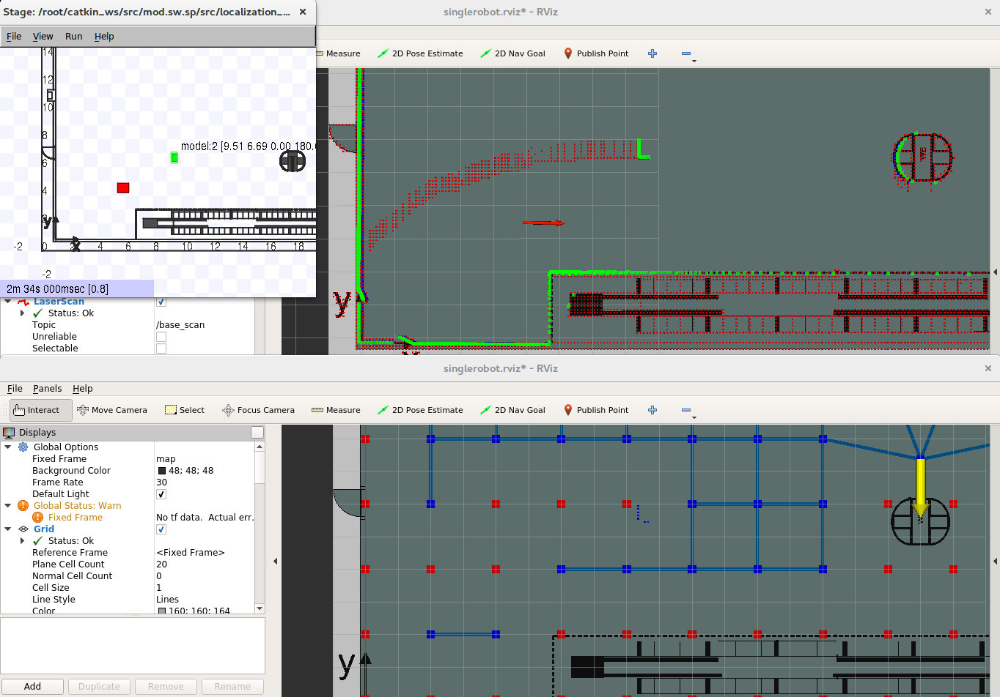

# Start Guide

Before starting the SP module follow the [Install guide](./opil_server_sp_install.md).

<!--
 and [API Walkthrough](./user/api.md) procedures.
-->

In the following, two start options will be described, depending if you installed the source from the docker containers or from scratch.


## <a name="fromdocker">Starting from Docker - Central SP</a>

Go to the folder where you put your [docker-compose.yml](./opil_server_sp_install.md#dockercompose) file and type:
```
xhost local:root (call this only once - this is for display)
sudo docker-compose up
```
You should see the entities in, e.g. firefox, at the address <http://localhost:1026/v2/entities>. There should be a topic `/map/graph`.

This docker container starts the creation of a topology graph from the given map file and with included annotations from the annotation file. As a default, IML lab will be started with 4 annotations, as is the case in this example:

 

To zoom the rviz window use mouse scroll, to translate the view press shift key and mouse button at the same time.
The output topic that is presented in OCB is a **graph** composed of arrays of **edges** and **vertices**. Vertices have coordinates (**x**, **y**) of the cell center defined by the parameter **cell_size** (2 m in this example), a **footprint** of the robot defined by a square of edge size equal to **cell_size**, a string **name** that describes the vertex, and a string **uuid** uniquely identifying the vertex. The example of one vertex has the following structure:
```
    x: 21.0
    y: 7.0
    theta: 0.0
    name: "vertex_73"
    uuid: "d3ef3744-18cc-551b-80b9-95ef2095919e"
    footprint: 
      - 
        x: 20.0
        y: 6.0
        z: 0.0
      - 
        x: 22.0
        y: 6.0
        z: 0.0
      - 
        x: 22.0
        y: 8.0
        z: 0.0
      - 
        x: 20.0
        y: 8.0
        z: 0.0
```
**Edges** are pairs of neighbor vertices and are composed of **uuid_src** of the first vertex in the pair, and **uuid_dest** of the second vertex in the pair. The order of the first and second vertex is irrelevant since edges are bidirectional. There is a string **name** of the edge describing the connection of vertices, and a unique **uuid** of the edge. The example of one edge has the following structure:
```
    uuid_src: "27819669-6b67-57e9-a412-d0226f0d4f7e"
    uuid_dest: "cb94a6e7-2531-5285-a090-cdac96307386"
    name: "edge_8_15"
    uuid: "a41a0772-9407-5d31-b1dd-c03c3d27a7f7"
```


To use arbitrary annotations file and map file you should create `annotations.ini`, `testmap.yaml`, and `testmap.png` files and put it in the same folder next to the docker-compose.yml and uncomment the lines containing these files in [docker-compose.yml](./opil_server_sp_install.md#dockercompose) under the **volumes**. These example files can be found in the folder `test/docker_compose_files/Central_SP_docker`. 

**Annotations** are written in the vertex such that coordinates of the vertex is changed from the cell center to the coordinates defined by the annotation that belongs to that cell, and it's **name** is changed to the label of the annotation. The following example explains the creation of annotations in the topology graph. First, create the following file and save it under the name `annotations.ini`:
```
#annotations.ini
[P1]
# coordinates
point_x = 18.4
point_y = 6.5
theta = 180
distance = 1.8
```
where **P1** is the annotation label, **point_x**, **point_y** are coordinates of the annotation, and **theta** and **distance** determine where the topology vertex should be so that Task Planner can use this coordinates as the goal distanced for a defined **distance** (1.8 m in this example) from the annotation and oriented towards the annotation so that AGV has heading **theta** (180 degrees in this example) with respect to the positive x-axis. To use the created `annotations.ini` instead the default one inside the docker, uncomment the line (remove #) in [docker-compose.yml](./opil_server_sp_install.md#dockercompose) under the **volumes**:
```
            - ./annotations.ini:/root/catkin_ws/src/maptogridmap/launch/annotations.ini:ro
```
The example of the changed vertex in the graph has now the following structure:
```
    x: 20.2
    y: 6.5
    theta: 180.0
    name: "P1"
    uuid: "d3ef3744-18cc-551b-80b9-95ef2095919e"
    footprint: 
      - 
        x: 19.2
        y: 5.5
        z: 0.0
      - 
        x: 21.2
        y: 5.5
        z: 0.0
      - 
        x: 21.2
        y: 7.5
        z: 0.0
      - 
        x: 19.2
        y: 7.5
        z: 0.0
``` 
Notice that coordinates of the cell center at (21,7) moved to (20.2,6.5) with respect to given **distance** and **theta** from the annotation, and the **name** has changed from `vertex_73` to `P1`. The **footprint** coordinates are also changed according to the new position of the vertex.

After restarting docker-compose.yml, i.e., type:
```
sudo docker-compose up
```
the result should be as in this figure:


<a name="prepmap">The map</a>
can be changed by putting two files as **volumes** in [docker-compose.yml](./opil_server_sp_install.md#dockercompose): `testmap.yaml` and `testmap.png`. The second file can be any bitmap picture (pgm), grayscale is desired, but if not, it will be automatically converted to a grayscaled image. 
Here is an example of the CHEMI factory floorplan saved as png file:


`testmap.yaml` is a parameter file with **resolution** and gray thresholds for defining what is free and what is occupied, as in this example yaml file:
```
#testmap.yaml
image: map.png
resolution: 0.06
origin: [0.0, 0.0, 0.0]
negate: 0
occupied_thresh: 0.65
free_thresh: 0.196
```
where the image name is `map.png` to which your `testmap.png` is copied to on the docker side, **resolution** defines the size of the pixel of the png file in meters. To calculate the resolution, you need to know the width of the image in meters. Then, simply divide the width of the image with the number of pixels. Adjust the parameters **occupied_thresh** and **free_thresh** to different values, depending on which shade of grey should be considered as occupied and free, respectively. 
To use the created `testmap.png` and `testmap.yaml` uncomment the lines in the docker-compose.yml:
```
            - ./testmap.yaml:/root/catkin_ws/src/maptogridmap/launch/map.yaml:ro
            - ./testmap.png:/root/catkin_ws/src/maptogridmap/launch/map.png:ro
```
After restarting docker-compose.yml this is what should be the result:


It can be seen that here the topology nodes are too rare and we are missing some of them in narrow passages. In the following we will change the size of the grid cell so that we do not miss topology nodes in the passages between the racks (however, this will be solved differently in OPIL v3). In this example map the passage is 2.5 m wide, which means the size of the cell size should be half of it to include the worst case of the alignment of passages with the grid.
To change the size of the grid cell for calculating the topology, use this example `topology.launch` file:

### <a name="topologylaunch">topology.launch</a>
```
<launch>
<node name="map_server" pkg="map_server" type="map_server" args="$(find maptogridmap)/launch/map.yaml" respawn="false" >
<param name="frame_id" value="/map" />
</node>
<node name="rviz" pkg="rviz" type="rviz" args="-d $(find maptogridmap)/singlerobot.rviz" /> 
<node name="map2gm" pkg="maptogridmap" type="map2gm" output="screen">
        <param name="cell_size" type="double" value="2.0" />
        <param name="annotation_file" textfile="$(find maptogridmap)/launch/annotations.ini" />
</node>
    <!-- Run FIROS -->
    <node name="firos" pkg="firos" type="core.py" />
</launch>
```
and change the **cell_size** to something else than 2.0 m. 
To use the created topology.launch uncomment the line in [docker-compose.yml](./opil_server_sp_install.md#dockercompose):
```
            - ./topology.launch:/root/catkin_ws/src/maptogridmap/launch/topology.launch:ro
```


This is the result for changing the parameter **cell_size** to 1.25 m:


There are also some prepared maps inside this docker which can be set by changing the `topology.launch` file. Replace the lines from 2-4 in [topology.launch](#topologylaunch) with the following lines:

* CHEMI map
```
    <node name="map_server" pkg="map_server" type="map_server" args="$(find lam_simulator)/yaml/CHEMIchangedres.yaml" respawn="false"> 
       <param name="frame_id" value="/map" /> 
    </node>	    	  
```
* ICENT map
```
<node name="map_server" pkg="map_server" type="map_server" args="$(find lam_simulator)/yaml/Andamapa.yaml" respawn="false" >
<param name="frame_id" value="/map" />
</node>
```
* IML map
```
<node name="map_server" pkg="map_server" type="map_server" args="$(find lam_simulator)/yaml/IMLlab.yaml" respawn="false" >
<param name="frame_id" value="/map" />
</node>
```
* MURAPLAST map
```
<node name="map_server" pkg="map_server" type="map_server" args="$(find lam_simulator)/yaml/floorplan_muraplast.yaml" respawn="false" >
<param name="frame_id" value="/map" />
</node>
```


## <a name="fromdockerlocal">Starting from Docker - Local SP</a>

The Local SP container can be started in two ways: without RAN and with RAN. If started without RAN then the simulator Stage is used for testing and visualizing what the Local SP does. This option is described first. Prepare [docker-compose.yml](./opil_server_sp_install.md#dockercomposelocal).
It is important to put the environment variable `SIMULATION=true`.
This starts IML map, **amcl** localization inside that map shown on topic `/robot_0/pose_channel`, and calculation of map updates shown on topic `/robot_0/newObstacles`. The robot in the Stage simulator can be moved by mouse dragging, and changed pose can be seen in topic `/robot_0/pose_channel` which shows the current pose and the covariance of the pose estimation. There is also an obstacle in the Stage simulator that can be used for test of showing the map updates, seen in topic `/robot_0/newObstacles`.

<a name="simmap">To change the map for the simulation</a> prepare the following files: `testmap.yaml`, `testmap.png` (how to prepare these two files is the same as explained [previously](#prepmap).), `amcl_testmap.launch`, and `testmap.world`, and remove the comment mark # in front of corresponding lines under **volumes**.
These example files can be found in the folder `test/docker_compose_files/Local_SP_docker`.
Parameters of **amcl** localization can be set in `amcl_testmap.launch`, and here is a default file:
### <a name="amcllaunch">amcl_testmap.launch</a>
```
<launch>
<node pkg="amcl" type="amcl" name="amcl" respawn="true">
<remap from="scan" to="base_scan" />
  <!-- Publish scans from best pose at a max of 10 Hz -->
  <param name="odom_model_type" value="omni"/>
  <param name="odom_alpha5" value="0.1"/>
  <param name="transform_tolerance" value="0.2" />
  <param name="gui_publish_rate" value="10.0"/>
  <param name="laser_max_beams" value="24"/>
  <param name="min_particles" value="500"/>
  <param name="max_particles" value="5000"/>
  <param name="kld_err" value="0.05"/>
  <param name="kld_z" value="0.99"/>
  <param name="odom_alpha1" value="0.2"/>
  <param name="odom_alpha2" value="0.2"/>
  <!-- translation std dev, m -->
  <param name="odom_alpha3" value="0.8"/>
  <param name="odom_alpha4" value="0.2"/>
  <param name="laser_z_hit" value="0.5"/>
  <param name="laser_z_short" value="0.05"/>
  <param name="laser_z_max" value="0.05"/>
  <param name="laser_z_rand" value="0.5"/>
  <param name="laser_sigma_hit" value="0.2"/>
  <param name="laser_lambda_short" value="0.1"/>
  <param name="laser_lambda_short" value="0.1"/>
  <param name="laser_model_type" value="likelihood_field"/>
  <!-- <param name="laser_model_type" value="beam"/> -->
  <param name="laser_likelihood_max_dist" value="2.0"/>
  <param name="update_min_d" value="0.2"/>
  <param name="update_min_a" value="0.05"/>
  <param name="odom_frame_id" value="odom"/>
  <param name="resample_interval" value="1"/>
  <param name="transform_tolerance" value="0.1"/>
  <param name="recovery_alpha_slow" value="0.0"/>
  <param name="recovery_alpha_fast" value="0.0"/>
  <param name="initial_pose_x" value="7.717"/> 
  <param name="initial_pose_y" value="32.608"/>  
  <param name="initial_pose_a" value="0"/>
</node>
</launch>
```
The most important parameters are the range topic, which for simulator is **base_scan**, and initial values for the pose of the robot: **initial_pose_x**, **initial_pose_y**, **initial_pose_a** (angle in radians). For all other parameters visit <http://wiki.ros.org/amcl>.

`testmap.world` is the world file for the Stage simulator, where example is given as follows:
```
define kinect ranger
(
  sensor
  (
    range [0.0 10]
    fov 360.0
    samples 720
  )

  # generic model properties
  color "black"
  size [ 0.060 0.150 0.030 ]
)

define robot position
(
  origin [ 0.000 0.000 0.000 0.000 ]
  localizaton "odom"
  odom_error [0.03 0.03 0.01 0.01 0.02 0.02] 
  size [ 0.600 0.400 0.400 ]  
  drive "omni"
    
  kinect(pose [ -0.100 0.000 -0.110 0.000 ])
)
#define an obstacle
define worker model
(
  size [0.500 0.500 1.850]
  gui_nose 0  
)

define floorplan model
(
  color "gray30"  
  boundary 0
  gui_nose 0
  gui_grid 0
  gui_outline 0
  gripper_return 0
  fiducial_return 0
  laser_return 1
)

resolution 0.05

# simulation timestep in milliseconds
interval_sim 100  

#stage view window
window
(
  size [ 935 412 ]
  center [ 18.080 20.285 ]
  rotate [ 0.000 0.000 ]
  # pixel per meter
  scale 13.110
)

# stage map
floorplan
(
  name "testmap"
  bitmap "map.png"
  size [ 111.720 49.320 1.000 ]
  pose [ 55.860 24.660 0.000 0.000 ] 
)

# throw in a robot
robot
(
  pose [ 7.717 32.608 0.000 0.000 ] 
  name "robot_0"
  color "blue"  
)

worker
(
	pose [ -2.538 1.380 0.000 180.000 ]
	color "green"
)
```
The most important parameters are **size** and **pose** in the **floorplan** section which need to be calculated in meters from `testmap.png` and **resolution** in `testmap.yaml`. For example, our `testmap.png` has 1862 x 822 pixels, and in `testmap.yaml` we see that resolution is 0.06. The first column in **size** is the width of the map along **x** axis in meters obtained by multiplication of resolution and width in pixels, i.e., 1862 x 0.06 = 111.72, while the second column in **size** is the height along **y** axis obtained by multiplication of resolution and height in pixels, i.e., 822 x 0.06 = 49.32. The third column is the height along **z** axis of the floorplan, i.e. 1 meter. **pose** of the **floorplan** defines the origin of the loaded map in Stage in the form of **x**, **y**, **z**, **theta** (in degrees) values. If values for **x** and **y** coordinates are half of the **floorplan**'s **size**, then the origin will be in the lower left corner of the map. Adjust the **pose** of the **robot** to be aligned to the initial pose in [amcl_testmap.launch](#amcllaunch), and of the **worker** as desired (treated as moving obstacle). The rest of the parameters can be the same as in this example. For more explanation about the **world** files visit <http://wiki.ros.org/stage>. 

There are also some prepared maps inside this docker which can be set by changing the `local_robot_sim.launch` file, which has the following structure:
### <a name="localrobotsimlaunch">local_robot_sim.launch</a>
```
<launch>
<node name="map_server" pkg="map_server" type="map_server" args="$(find lam_simulator)/yaml/map.yaml" respawn="false" >
<param name="frame_id" value="/map" />
</node>
<node pkg="stage_ros" type="stageros" name="stageros" args="$(find lam_simulator)/yaml/map.world" respawn="false" >
    <param name="base_watchdog_timeout" value="0.2"/>
</node>
<include file="$(find lam_simulator)/launch/amcl_map.launch" />
     <!--- Run pubPoseWithCovariance node from sensing_and_perception package-->
     <!-- Put args="1" if you are testing the robot with the id number 1 -->
     <node name="publishPoseWithCovariance" pkg="sensing_and_perception" type="pubPoseWithCovariance" output="screen" args="0"/>	

     <!--- Run mapup node from mapupdates package-->
     <!-- Put args="1" if you are testing the robot with the id number 1 -->
    <node name="mapup" pkg="mapupdates" type="mapup" output="screen" args="0" >
        <param name="cell_size" type="double" value="0.1" />
        <param name="scan_topic" value="/base_scan" />
    </node>

    <!-- Run FIROS -->
    <node name="firos" pkg="firos" type="core.py" />

<node name="rviz" pkg="rviz" type="rviz" args="-d $(find lam_simulator)/rviz_cfg/singlerobot.rviz" /> 

</launch>
```
In this launch files you can set various parameters: **cell_size** defines the fine gridmap for calculating new obstacles (presented as tiny red squares); robot ID as an argument of packages _sending_and_perception_ and _mapupdates_ for having more robots (0,1,2,etc.), and **scan_topic** for defining the topic for the range data.

To use the changed local_robot_sim.launch uncomment the line in [docker-compose.yml](./opil_server_sp_install.md#dockercomposelocal) under **volumes**:
```
            - ./local_robot_sim.launch:/root/catkin_ws/src/localization_and_mapping/sensing_and_perception/local_robot_sim.launch:ro
```
Replace the lines 2-8 from [local_robot_sim.launch](#localrobotsimlaunch) with the following:

* CHEMI map
```
 <node name="map_server" pkg="map_server" type="map_server" args="$(find lam_simulator)/yaml/CHEMIchangedres.yaml" respawn="false"> 
     <param name="frame_id" value="/map" /> 
</node>	    	  
<node pkg="stage_ros" type="stageros" name="stageros" args="$(find lam_simulator)/world/floormap_CHEMI.world" respawn="false" >
    <param name="base_watchdog_timeout" value="0.2"/>
</node>
<include file="$(find lam_simulator)/launch/amcl_omnisimCHEMI.launch" />
```
* ICENT map
```
<node name="map_server" pkg="map_server" type="map_server" args="$(find lam_simulator)/yaml/Andamapa.yaml" respawn="false" >
    <param name="frame_id" value="/map" />
</node>
<node pkg="stage_ros" type="stageros" name="stageros" args="$(find lam_simulator)/world/andaomnidriveamcltest.world" respawn="false" >
    <param name="base_watchdog_timeout" value="0.2"/>
</node>
<include file="$(find lam_simulator)/launch/amcl_omnisimdemo.launch" />
```
* IML map
```
<node name="map_server" pkg="map_server" type="map_server" args="$(find lam_simulator)/yaml/IMLlab.yaml" respawn="false" >
    <param name="frame_id" value="/map" />
</node>
<node pkg="stage_ros" type="stageros" name="stageros" args="$(find lam_simulator)/world/floormap_IML.world" respawn="false" >
    <param name="base_watchdog_timeout" value="0.2"/>
</node>
<include file="$(find lam_simulator)/launch/amcl_omnisimdemo.launch" />
```
* MURAPLAST map
```
<node name="map_server" pkg="map_server" type="map_server" args="$(find lam_simulator)/yaml/floorplan_muraplast.yaml" respawn="false" >
    <param name="frame_id" value="/map" />
</node>
<node pkg="stage_ros" type="stageros" name="stageros" args="$(find lam_simulator)/world/floormap_muraplast.world" respawn="false" >
    <param name="base_watchdog_timeout" value="0.2"/>
</node>
<include file="$(find lam_simulator)/launch/amcl_omnisim.launch" />
```

## How to start the Local and Central SP docker containers together

Prepare a following docker-compose.yml to start both Central and Local SP. You can also start them on different machines.
This example uses the Local SP that contains the Stage simulator. 

```
version: "3"
services:      
    #Context Broker
    orion:        
        image: fiware/orion
        ports:
            - 1026:1026
        command: 
            -dbhost mongo
    mongo:
        restart: always
        image: mongo:3.4
        command: --nojournal    
#S&P
    sp:
        restart: always
        image: l4ms/opil.sw.sp:2.5-central
        volumes:
            #- path on the host : path inside the container
            - /tmp/.X11-unix:/tmp/.X11-unix:rw
        environment:
            - FIWAREHOST=orion
            - HOST=sp
            - NETINTERFACE=eth0
            - DISPLAY=$DISPLAY
    splocal:
        restart: always
        image: l4ms/opil.sw.sp:2.5-local
        volumes:
            #- path on the host : path inside the container
            - /tmp/.X11-unix:/tmp/.X11-unix:rw
        environment:
            - FIWAREHOST=orion
            - HOST=splocal
            - NETINTERFACE=eth0
            - DISPLAY=$DISPLAY
            - SIMULATION=true
```

This will start everything with the IML lab. The following figure presents the output after moving the green box in the Stage simulator:


One rviz window is from the Local SP, where you can see the AGV's pose (red arrow) and local updates (red tiny squares). Another rviz window is from the Central SP, where you can see the updates of the topology and new obstacles presented with blue tiny squares showing only the current position of the new obstacle. All new obstacles are processed as they are received so only new ones are sent. That is the reason why in the Local SP you can see a trail of the obstacle, while in the Central SP there is no trail but the topology is permanently changed.

To test different maps follow the guide from previous two sections.

Here is the examle of using the ICENT map (changed [topology.launch](#topologylaunch) and [local_robot_sim.launch](#localrobotsimlaunch)). 
After moving the green box in the simulator the result can be obtained as in this figure:


## <a name="fromdockerlocalran">How to start the Local SP and RAN docker containers together</a>

The Local SP container needs to be started with the environment variable `SIMULATION=false`, as is the case in [docker-compose.yml](./opil_server_sp_install.md#dockercomposelocalran).

IML map will be started and you can command the robot through rviz by pressing 2D Nav Goal button and clicking the point on the map.
To change the map prepare `testmap.yaml`, `testmap.png`, `amcl_testmap.yaml`, `testmap.world` as explained [previously](#simmap).

Like in previous sections, there are some prepared maps inside both docker containers which can be set by changing the `local_robot.launch` file for Local SP, and `robot_launcher.launch` for RAN. First prepare `local_robot.launch` as follows:
### <a name="localrobotlaunch">local_robot.launch</a>
```
<launch>
<node name="map_server" pkg="map_server" type="map_server" args="$(find lam_simulator)/yaml/map.yaml" respawn="false" >
<param name="frame_id" value="/map" />
</node>
<include file="$(find lam_simulator)/launch/amcl_map.launch" />
     <!--- Run pubPoseWithCovariance node from sensing_and_perception package-->
     <!-- Put args="1" if you are testing the robot with the id number 1 -->
     <node name="publishPoseWithCovariance" pkg="sensing_and_perception" type="pubPoseWithCovariance" output="screen" args="0"/>	

     <!--- Run mapup node from mapupdates package-->
     <!-- Put args="1" if you are testing the robot with the id number 1 -->
    <node name="mapup" pkg="mapupdates" type="mapup" output="screen" args="0" >
        <param name="cell_size" type="double" value="0.1" />
        <param name="scan_topic" value="/base_scan" />
    </node>

    <!-- Run FIROS -->
    <node name="firos" pkg="firos" type="core.py" />

<node name="rviz" pkg="rviz" type="rviz" args="-d $(find lam_simulator)/rviz_cfg/singlerobot.rviz" /> 

</launch>
```
To use the changed local_robot.launch uncomment the line in [docker-compose.yml](./opil_server_sp_install.md#dockercomposelocalran) under **volumes**:
These example files can be found in the folder `test/docker_compose_files/Local_SP_docker_with_RAN`.
```
            - ./local_robot.launch:/root/catkin_ws/src/localization_and_mapping/sensing_and_perception/local_robot.launch:ro
```
Replace the lines from 2-5 in [local_robot.launch](#localrobotlaunch) with the following:

* CHEMI map
```
 <node name="map_server" pkg="map_server" type="map_server" args="$(find lam_simulator)/yaml/CHEMIchangedres.yaml" respawn="false"> 
     <param name="frame_id" value="/map" /> 
</node>	    	  
<include file="$(find lam_simulator)/launch/amcl_omnisimCHEMI.launch" />
```
* ICENT map
```
<node name="map_server" pkg="map_server" type="map_server" args="$(find lam_simulator)/yaml/Andamapa.yaml" respawn="false" >
    <param name="frame_id" value="/map" />
</node>
<include file="$(find lam_simulator)/launch/amcl_omnisimdemo.launch" />
```
* IML map
```
<node name="map_server" pkg="map_server" type="map_server" args="$(find lam_simulator)/yaml/IMLlab.yaml" respawn="false" >
    <param name="frame_id" value="/map" />
</node>
<include file="$(find lam_simulator)/launch/amcl_omnisimdemo.launch" />
```
* MURAPLAST map
```
<node name="map_server" pkg="map_server" type="map_server" args="$(find lam_simulator)/yaml/floorplan_muraplast.yaml" respawn="false" >
    <param name="frame_id" value="/map" />
</node>
<include file="$(find lam_simulator)/launch/amcl_omnisim.launch" />
```

Then, prepare `robot_launcher.launch` as follows:
### <a name="robotlauncherlaunch">robot_launcher.launch</a>
```
<launch>
    <!-- Run FIROS -->  
    <node name="firos" pkg="firos" type="core.py" />
    <!-- Run the Stage simulation -->
    <node name="stageros" pkg="stage_ros" type="stageros" args="$(find opil_v2)/map/map.world" respawn="false"> 
        <param name="base_watchdog_timeout" value="0.2" />
    </node>
 
        <node pkg="move_base" type="move_base" respawn="false" name="move_base" output="screen">
            <remap from="map" to="/map" />                      
            <param name="controller_frequency" value="10.0" />
            <rosparam file="$(find opil_v2)/config/costmap_common_params.yaml" command="load" ns="global_costmap" />
            <rosparam file="$(find opil_v2)/config/costmap_common_params.yaml" command="load" ns="local_costmap" />
            <rosparam file="$(find opil_v2)/config/global_costmap_params.yaml" command="load" />
            <rosparam file="$(find opil_v2)/config/local_costmap_params.yaml" command="load" />
            <rosparam file="$(find opil_v2)/config/base_local_planner_params.yaml" command="load" />
        </node>  
         <!--- Run the Robot Agent node -->
         <node name="robot_agent" pkg="opil_v2" type="opil_v2_robot_agent_with_SandP" output="screen" args="0"/>
    
</launch>
```
To use the changed robot_launcher.launch uncomment the line in [docker-compose.yml](./opil_server_sp_install.md#dockercomposelocalran) under **volumes**:
```
            - ./robot_launcher.launch:/root/catkin_ws/src/opil_v2/robot_launcher_with_SandP.launch:ro
```
Replace the lines from 5-7 in [robot_launcher.launch](#robotlauncherlaunch) with the following:


* CHEMI map
```
<node pkg="stage_ros" type="stageros" name="stageros" args="$(find lam_simulator)/world/floormap_CHEMI.world" respawn="false" >
    <param name="base_watchdog_timeout" value="0.2"/>
</node>
```
* ICENT map
```
<node pkg="stage_ros" type="stageros" name="stageros" args="$(find lam_simulator)/world/andaomnidriveamcltest.world" respawn="false" >
    <param name="base_watchdog_timeout" value="0.2"/>
</node>
```
* IML map
```
<node pkg="stage_ros" type="stageros" name="stageros" args="$(find lam_simulator)/world/floormap_IML.world" respawn="false" >
    <param name="base_watchdog_timeout" value="0.2"/>
</node>
```
* MURAPLAST map
```
<node pkg="stage_ros" type="stageros" name="stageros" args="$(find lam_simulator)/world/floormap_muraplast.world" respawn="false" >
    <param name="base_watchdog_timeout" value="0.2"/>
</node>
```

The following example presents testing the ICENT map. The robot can be controlled through rviz by pressing 2D Nav Goal button and clicking the point on the map. The following figure describes the possible outcome, where arrow trails correspond to the past positions of the robot:


You can also add Central SP in the docker-compose and obtain results similar to the previous section.

## <a name="fromscratch">Starting from Scratch</a>

In this quick guide, everything will be started on the same computer where you installed ROS and this source code. For advanced configuration of starting at different computers check [Interfaces](./../../develop/SP/opil_sp_interfaces.md).

* First, start the Stage simulator with the loaded example map and one AGV inside the map (red) and one box as the unknown obstacle (green):

```
terminal 1: roslaunch lam_simulator AndaOmnidriveamcltestZagrebdemo.launch
```
The result should be the started rviz and the Stage simulator as presented here:


The green dots are simulated laser readings, and the red arrow is the localized AGV.

* Then, start the module for creating the topic for Pose with Covariance of the AGV:
```
terminal 2: roslaunch sensing_and_perception send_posewithcovariance.launch 
```
You can type 'rostopic echo' to see the message of pose with covariance:
```
rostopic echo /robot_0/pose_channel
```
You can start some other simulation example following [this guide.](./../../develop/SP/opil_api_sp.md#poswithcov) 
You can also prepare your own simulation following [the guide for preparing the map.](./../../develop/SP/opil_api_sp.md#preparingmap)

* Start the calculation of local map updates that the AGV sees as new obstacles which are not mapped in the initial map.
```
terminal 3: roslaunch mapupdates startmapupdates.launch
```
You can check the topic of local map updates by typing: 
```
rostopic echo /robot_0/newObstacles
```
You can change the resolution of the local map updates by following the guide in Section [Map updates](./../../develop/SP/opil_api_sp.md#mapupdates).

 All previous steps can be replaced by calling a single launch file for the Local SP:
```
roslaunch sensing_and_perception local_robot_sim.launch 
```
This launch file starts the localization, local map updates and module for publishing Pose with Covariance. The launch file that does not start the simulator Stage because it will be started at RAN is **local_robot.launch**.

* To merge the local map updates into a global gridmap and topology, launch the maptogridmap:
```
terminal 4: roslaunch maptogridmap startmaptogridmap.launch
```
You can change the resolution of the global gridmap and topology (the distance between the nodes) by checking the Section [Topology](./../../develop/SP/opil_api_sp.md#topology). There you can also find about annotations and how to change theirs parameters. 

Now, you can reproduce the figures from [SP introduction](./opil_desc_SP_intro.md#mapupdates1) by moving the green box in front of the AGV (use the left click of the mouse and hold it while dragging the box around).

 


 

