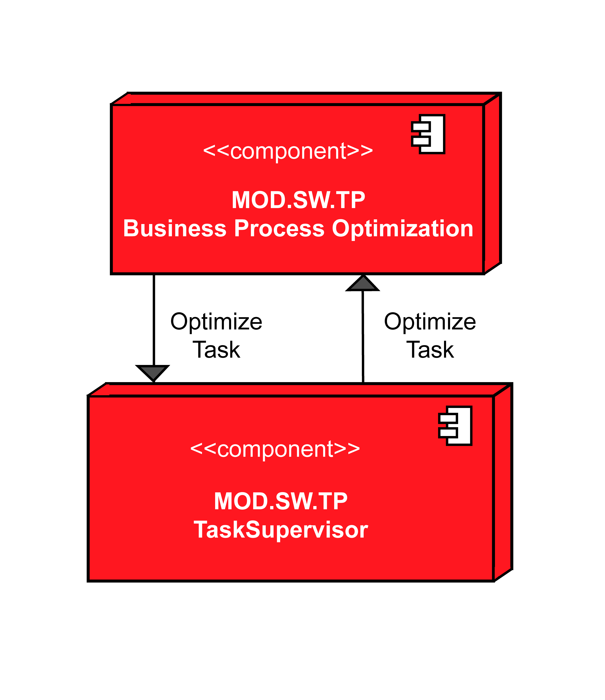

# Introduction Task Planner (TP)

The "Software system" layer represents the highest level of OPIL where all the services that this platform provides to the end users are logically grouped by design. This level is made of three main modules. Task Planner is one of the three OPIL Components and Functional blocks which this 3rd Layer is made of. Regarding the OPIL architecture, this node consists of three different sub-modules. Firstly, the Task Supervisor monitors the execution of the task dispatched to the agents (Robots). Secondly, the Motion Task Planning plans the motion tasks for the robot agents. Lastly, the Business Process Optimization functional block decides and optimizes the tasks to be dispatched to the different agents (not included in v3.x of Opil). Task Planner makes it possible for the different components to communicate with each other and be composed into full-fledged logistic system in a manufacturing environment.

## Overview TP
The three main functional building blocks like the Task  Supervisor (TS), the Motion Task Planning (MTP) and the Business Process Optimization (BPO) will be described in this section.

## Task Supervisor
The Task Supervisor (TS) module receives task specification from the HMI Module in an appropriate formal language and parameterized task specification. The TS process the received task information and assigns transport order to the available Robots. The Task Supervisor is also able to send the current state information to the HMI. Any changes inside the system will be handled through this sub-module.
***

## Motion Task Planning
The submodule Motion Task Planner (MTP) of the Task Planner (TP) is a software module as part of OPIL (Open Platform for Innovation in Logistics). The MTP modules creates/computes a motion task plan for the involved agents. This motion task provides a deadlock-free, optimal or near optimal path without loops and collision. Beyond this path computation the Motion Task Planning component handles the communication with the Agents. 

The MOD.SW.TP Motion Task Planning receives the start and end destinations of the appropriate Robot Agent Nodes. It computes the best, shortest and/or fastest path for the navigation and it handles the communication with the Robotic Agent Nodes (MOD.SW.RAN). Moreover, it is aware about the state, like current pose, current task, of the agents nodes.
***
 
## Business Process Optimization (not included in v3.x of Opil)
The Business Process Optimization (BPO) sub-module of the OPIL Task Planner handles the on-the-fly optimization of the task that is received from the Task Supervisor sub-module of the OPIL Task Planner. The BPO sub-module is responsible for minimizing the logistics resources that are required for a given task. The BPO receives a task specification from the Task Supervisor sub-module of the OPIL Task Planner in an appropriate formal language and parameterizes the task specification so that the resulting specification requires minimal (or near minimal) logistics resources for its fulfilment. The parameterized task specification is then transmitted back to the Task Supervisor sub-module of the OPIL Task Planner for determining the eventual Motion Task Plan that fulfils the specification. The Figure below depicts the interaction between the BPO sub-module with the Task Supervisor sub-module.

***
 

