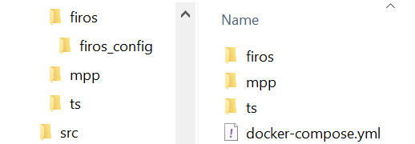

#Introduction
 
Welcome to Module's Installation & Administration Guide! 

Any feedback on this document is highly welcome, including bug reports, typos or information you think should be included but is not. Please send the feedback through email to: module@l4ms.eu. Thank you in advance.

# From Scratch
Currently we are recommending *NOT* to install this Task Planner from scratch. We are having a lot of dependencies (ROS, FIROS, Python Packages, ...) therefore we are focussing on the Docker deployment. A installation from scratch will follow soon.

# How to use the TaskPlanner with Docker/Docker-Compose

 This module depends on FIWARE's Orion Context Broker. We will include a setup for Orion only inside the Docker-Compose file. If you are following Steps 2 and 3, you have to include Orion by yourself.

## 1. The Fastest Way
Docker Compose allows you to set up the OPIL TaskPlanner in a few minutes. For this, you have to have Docker-Compose installed. 


Follow these steps:

1. Create a directory on your system on which to work (for example, ~/opil). Inside this folder create three folders (firos/firos_config, mpp and ts) as depicted in the next figure:

<div style="text-align:center">



</div>

** ATTENTION **: "firos_config" is a dedicted folder inside the "firos" directory.
 

1. Create a new file called docker-compose.yml inside your directory with the following contents:

```
    
version: "3.5"
services: 

firos: 
    image: fhgiml130/firos:latest
    container_name: firos
    depends_on: 
    - orion
    - rosmaster
    environment: 
    - PYTHONUNBUFFERED=1
    - "ROS_MASTER_URI=http://rosmaster:11311"
    ports: 
    - "10100:10100"
    volumes: 
    - "./firos/firos_config/robots.json:/catkin_ws/src/firos/config/robots.json"
    - "./firos/firos_config/whitelist.json:/catkin_ws/src/firos/config/whitelist.json" 

opil.mod.sw.tp.ts:
    image: l4ms/opil.sw.tp.ts:latest
    hostname: opil.mod.sw.tp.ts
    depends_on: 
    - opil.mod.sw.tp.mtp
    - orion
    environment: 
    - PYTHONUNBUFFERED=1
    - "ROS_MASTER_URI=http://rosmaster:11311"
    volumes:
    - ./ts/fiware_config.ini:/catkin_ws/src/ts/fiware_config.ini 
    ports: 
    - "2906:2906"  

 opil.mod.sw.tp.mtp: 
    image: l4ms/opil.sw.tp.mtp:latest
    container_name: opil.mod.sw.tp.mtp
    depends_on: 
    - rosmaster
    environment: 
    - "ROS_MASTER_URI=http://rosmaster:11311" 

 mongo: 
    command: "--nojournal"
    container_name: mongo
    image: "mongo:3.4" 

orion: 
    command: "-dbhost mongo"
    container_name: orion
    image: fiware/orion
    links: 
    - mongo
    hostname: orion
    ports: 
    - "1026:1026" 

rosmaster: 
    command: 
    - roscore
    container_name: rosmaster
    hostname: rosmaster
    image: "ros:melodic-ros-core"
    ports: 
    - "11311:11311" 

sp:
    restart: always
    image: l4ms/opil.sw.sp:2.6-central
    volumes: 
        - /tmp/.X11-unix:/tmp/.X11-unix:rw 
    environment:
        - FIWAREHOST=orion
        - HOST=sp
        - NETINTERFACE=eth0
        - DISPLAY=$DISPLAY
    

```

2. firos/firos_config/ 

    Create inside the `firos/firos_config/ ` directory two fils named `robots.json` and `whitelist.json`.

    2.1 robots.json:
    
    ```json 
    {
        "map": {
            "topics": {
                "graph": {
                    "msg": "maptogridmap.msg.Graph",
                    "type": "publisher"
                }
            }
        },
        "robot_opil_v2": {
            "topics": {
                "assignment_state": {
                    "msg": "mars_agent_physical_robot_msgs.msg.AssignmentStatus",
                    "type": "publisher"
                },
                "current_motion": {
                    "msg": "mars_agent_physical_robot_msgs.msg.Motion",
                    "type": "publisher"
                },
                "robot_description": {
                    "msg": "mars_agent_physical_robot_msgs.msg.RobotAgentProperties",
                    "type": "publisher"
                },
                "cancel_order": {
                    "msg": "mars_agent_physical_robot_msgs.msg.CancelTask",
                    "type": "subscriber"
                },
                "motion_assignment": {
                    "msg": "mars_agent_physical_robot_msgs.msg.MotionAssignment",
                    "type": "subscriber"
                }
            }
        }
    }
    ```

   2.2 whitelist.json:
   
    ```json 
    {
        "map": {
            "publisher": [
                "graph"
            ],
            "subscriber": []
        }
    }
    ``` 


3. mtp/

    Create inside the `mtp` directory one file named `start_mars.h`.

    3.1 start_mars.h

    ```bash
    #!/bin/bash

    source /opt/ros/melodic/setup.bash
    source /catkin_ws/devel/setup.bash

    roslaunch mod_sw_tp mod_sw_tp.launch
    ```

4. ts/
   
    Create inside the `ts` directory one file named `fiware_config.ini`.

    4.1 fiware_config.ini
    
    ```ini
    [flask]
    host = 0.0.0.0 

    [taskplanner]
    ; hostname or ip address of the TaskPlanner machine 
    ; Please note that "tp" in docker-compose.yml must match
    host = opil.mod.sw.tp.ts
    ; Port of the task planner
    PORT = 2906

    [contextbroker]
    ; hostname or ip address of the context broker machine 
    ; Please note that "orion" in docker-compose.yml must match
    host= orion
    ; Port of the context broker
    port=1026
    ```


## 2. Testing the setup 

Using the command-line and within the directory (~/opil/) you created type: 

**ATTENTION:** after computer reboot/restart run the following command first, ONLY ONCE: `host local:root`


```bash
docker-compose up. 
```

**sudo** rights might be required to launch the docker-compose file.

Regarding `--nojournal` it is not recommened for production, but it speeds up mongo container start up and avoids some race conditions problems if Orion container is faster and doesn't find the DB up and ready. 

After a few seconds you should have your OPIL TaskPlanner running and listening on port `2906`.


Check that everything works with

```bash
curl localhost:2906
```

The expected output should be a:

```
Fraunhofer IML
OPIL TaskPlanner VERSION_NUMBER - DATE
Running...
```


What you have done with this method is download images for OPIL TaskPlanner, Orion Context Broker and MongoDB from the public repository of images called Docker Hub. Then you have created two containers based on both images.

 If you want to stop the scenario you have to press Control+C on the terminal where docker-compose is running. Note that you will lose any data that was being used in Orion using this method.


## 3. Other Information: 

Things to keep in mind while working with docker containers and OPIL's TaskPlanner.

3.1 Data persistence: once you are closing the docker container, data will be non-persistent.

3.2 Subscriptions: close the docker container by using the `Ctrl-C` command. While we are receiving this command, we are unsubscribing from the Orion Context Broker. If you close this container improperly, some old subscription may mess up the behaviour.