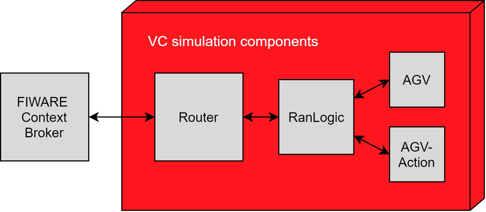

# VC-RAN

## 1 Introduction

The VC-RAN (Visual Components Robot Agent Node) is the OPIL IoT Nodes layer module devoted to the control of the virtual robots. VC-RAN provides two main functionalities: it manages virtual robot navigation inside Visual Components simulation software and works as an interface between the virtual robots and the FIWARE Orion Context Broker of the OPIL Cyber Physical Middleware layer.

## 2 Components and structure

Figure 1 presents the structure of VC-RAN. Router handles communication between the Orion Context Broker (OCB) and RanLogic components. Messages are transmitted using signals and interfaces in the simulation layout. For every AGV there is one RanLogic and one AgvAction component. From the OCB-messages received and delivered by the VC-Router, RanLogic filters those that contain the robot id of the AGV. RanLogic stores the data (motion and action assignments) to data structures based on the task id and receive time and handles the data delivery to the AGV (motion assignments) and AgvAction components (action assignments). RanLogic also maintains data structures for completed and cancelled tasks as well as for task variables such as current and last motion and action.

RanLogic sends description message every minute to Router, which delivers the message as is to OCB. RobotState message is sent by the AGV every second to RanLogic that then sends RAN-state message to Router. RanLogic likewise sends assignment status message to Router every second. Router delivers both RAN-state and assignment status messages to OCB. AGV and AgvAction components send a message after every completed assignment to RanLogic, which the RanLogic uses to update its data structures, task variables and state.

*Figure 1. Structure of VC-RAN.*

## 3 RanLogic

### 3.1 Task handling

Tasks are executed in the order they are received. When a motion or action assignment with a particular task id is first received, it is inserted into a data structure together with timestamp. Collectively, they form the task queue. Received tasks are executed in the order of ascending timestamp value. Robot motion planning and  action execution begins immediately after receiving first assignment message for the task with the lowest timestamp value. All the motion assignments belonging to the same current task are sent to the AGV one by one. After all the motion assignments are completed, action assignments belonging to the current task are sent to the AgvAction component one at a time. The task is completed when all the action assignments have been carried out.

### 3.2 State machine

RanLogic is always in one of the finite states specified in Figure 2. Starting state is state-waiting, which changes to state-task after new task is received. When the first motion assignment belonging to the current task has been received, the state changes to state-motion and RanLogic will start sending motion assingments to the AGV. After all the motion assignments have been completed and the first action assignment belonging to current task has been received, state changes to state-action. In this state, RanLogic sends action assignments one by one to the AgvAction component until all the assignments are completed and RanLogic returns to state-waiting.

*Figure 2. RanLogic state machine.*

## 4 Setup

Under Connections tab in Router component, set the "OCB IP" and "Host IP" to point to the OCB and Host IP, respectively. Connect Router to every RanLogic component by joining Ranlogic and Router interfaces. Likewise, connect Ranlogic components to their respective AGV and AgvAction components. OCB should be initialized before simulation. First, old entity is deleted if it exists. Then, a new, empty entity is created without attributes. There is a button with this functionality in Router component under Connections &rightarrow; Initialize OCB.

## 5 AGV actions

Currently, VC-RAN supports two actions: "10" is for loading a part and "20" is for unloading it. Action "5" is a dummy action meant for tasks that do not include actions.

## 6 Example demo: VC RAN demo.vcmx

The demo contains two conveyors and one of each of the following components: Router, RanLogic, AgvAction and AGV. There are three tasks which are executed in sequence. First task includes two motion assignments and one action assignment: the AGV moves next to a conveyor through two points and loads a part. Then the AGV moves through two points next to the other conveyor and unloads the part on the conveyor. Finally, the AGV returns to its initial location through three points. This is followed by an empty dummy action to signal the end of the task. The collection of task assignments for the demo is provided as part of a JMeter file.

## 7 Missing features

* Cancelling individual assignments
