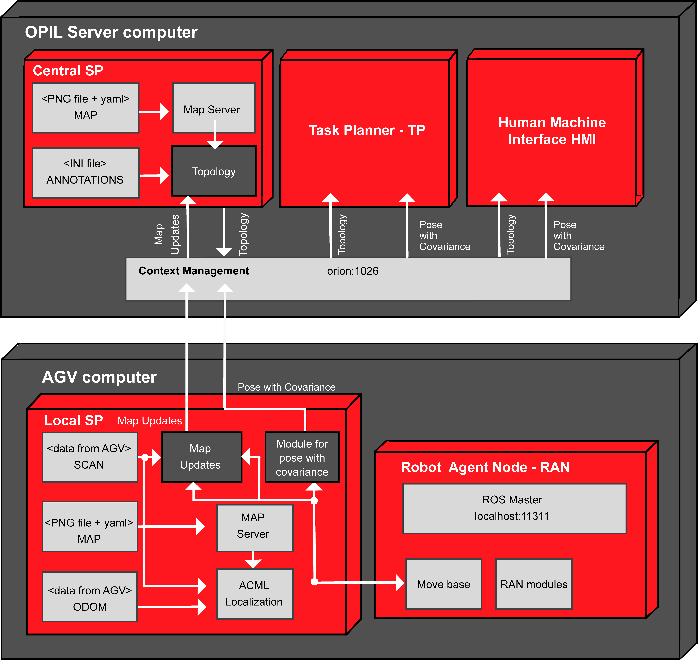

The following sections describe how other modules needs to be connected to the Local SP module. First, the workflow is listed with the repeated image from [SP introduction](./../../admin/SP/opil_desc_local_SP_intro.md) describing it. Then, each section is dedicated to the computer running the module to which the Local SP is connected.

# Workflow
* Local SP is on an AGV next to RAN
* Pose of the AGV is calculated in the Local SP
* Map updates are calculated in the Local SP from the range data (laser or kinect) and the initial map
* Map updates are sent to the Central SP for the topology update
* There is no service calls implemented yet in firos so map is not transmitted through firos. Each module (Local SP on every AGV, Central SP and HMI) should have its own copy of map file (from CAD or as a SLAM result).
* Map updates are sent through firos, which are calculated from the new sensor readings that hit the free grid cells
* Map merging is done in the Central SP from map updates of up to three Local SPs (three AGVs) into one global gridmap from which the updated topology is calculated (later it will be from more than three Local SPs, i.e., AGVs)
* HMI should have the initial map file, and ability to present map updates over the initial map 


# AGV's computer with the Local SP
The main reason having the Local SP on the AGV's computer is to have high-rate closed navigation loop when relying on laser data and odometry for pose calculation, with no delay introduced when using the large data flow (lasers) through wifi. 

## Pose with covariance of the AGV
To start the Local SP on the AGV's computer you should use _lam_simulator_ ROS package, which contains prepared launch files with AMCL localization and tests in the simulator Stage.
Afterwards, use _sensing_and_perception_ ROS package to publish AGV's pose with covariance. 
AMCL is a standard ROS package that publishes the tf_tree transformations so any navigation package (like _move_base_) can be attached to this node in a standard way.
Here is an example how to start simulated robot:
```
terminal 1: roslaunch lam_simulator AndaOmnidriveamcltestZagrebdemo.launch
terminal 2: roslaunch sensing_and_perception send_posewithcovariance.launch 
```

To test different example maps repeat the commands from Section [Pose with covariance](opil_api_local_sp.md#poswithcov).
The successful transmission of data can be seen as example in [topic /robot_0/pose_channel](opil_api_local_sp.md#examplepose).

## Map updates collected at the AGV (laser data)

To start the calculation of local map updates at the AGV you should start the _mapupdates_ ROS package.
First start the AMCL localization in the known map and connect to your robot's laser data (or use the simulator Stage in which laser data are simulated).
Then start the package _mapupdates_. This is an example with the simulator Stage:
```
terminal 1: roslaunch lam_simulator AndaOmnidriveamcltestZagrebdemo.launch
terminal 2: roslaunch mapupdates startmapupdates.launch
```
More detailed explanations and examples can be seen in Section [Map updates](opil_api_local_sp.md#mapupdates).

## <a name="localsp">Local SP sends the map updates and pose with covariance from AGV with ID name robot_0 through firos</a>

For sending the topics through firos, robots.json and whitelist.json should look like this:
### robots.json
```
{
	"robot_0":{
		"topics": {
			"pose_channel": {
				"msg": "geometry_msgs.msg.PoseWithCovarianceStamped",
				"type": "subscriber"
			},
			"newObstacles": {
				"msg": "mapupdates.msg.NewObstacles",
				"type": "subscriber"
			}
		}
	}
}
```
### whitelist.json
```
{
    "robot_0": {
        "subscriber": ["pose_channel","newObstacles"]
    }
}
```
You can find the firos config files in test/config_files/Local_SP_computer.
After putting the json files to firos/config folder run firos as:
```
rosrun firos core.py
```

# OPIL server computer with the Central SP


## Central SP receives the map updates from AGV with ID name robot_0

For receiving the map updates through firos, robots.json and whitelist.json should look like this:
### robots.json
```
{
	"robot_0":{
		"topics": {
			"newObstacles": {
				"msg": "mapupdates.msg.NewObstacles",
				"type": "publisher"
			}
		}
	}
}
```
### whitelist.json
```
{
    "robot_0": {
        "subscriber": [],
        "publisher": ["newObstacles"]
    }
}
```
You can find the firos config files in test/config_files/Central_SP_computer.
After putting the json files to firos/config folder run firos as:
```
rosrun firos core.py
```
To test receiving of three robots to Central SP modify the config files accordingly:
### robots.json
```
{
	"robot_0":{
		"topics": {
			"newObstacles": {
				"msg": "mapupdates.msg.NewObstacles",
				"type": "publisher"
			}
		}
	},
    "robot_1":{
        "topics": {
            "newObstacles": {
                "msg": "mapupdates.msg.NewObstacles",
                "type": "publisher"
            }
        }
    },
    "robot_2":{
        "topics": {
            "newObstacles": {
                "msg": "mapupdates.msg.NewObstacles",
                "type": "publisher"
            }
        }
    }
}
```
### whitelist.json
```
{
    "robot_0": {
        "subscriber": [],
        "publisher": ["newObstacles"]
    },
    "robot_1": {
        "subscriber": [],
        "publisher": ["newObstacles"]
    }"robot_2": {
        "subscriber": [],
        "publisher": ["newObstacles"]
    }
}
```


# OPIL server computer with the Task Planner - TP

## TP receives pose with covariance through firos


For receiving the topics through firos, robots.json and whitelist.json should look like this:
### robots.json
```
{
   "robot_0":{
       "topics": {
            	"pose_channel": {
                		"msg": "geometry_msgs.msg.PoseWithCovarianceStamped",
                		"type": "publisher"
            	}
       }
   }
}
```
### whitelist.json
```
{
    "robot_0": {
        "publisher": ["pose_channel"]
    }
}
```
Start firos and write a subscriber for the topics as suggested in Section [Writing a simple listener explaining the maplistener package](opil_api_local_sp.md#writelis).
You can find the firos config files in test/config_files/TP_HMI_computer.

# OPIL server computer with the Human Machine Interface - HMI

## HMI receiving map updates and pose with covariance

HMI should have a map file. Drawing the map updates (array of x,y points) over the initial map is not yet implemented, but as an idea is to draw the AGV shape in the received pose within the map.

For receiving the map updates and pose with covariance from the Local SP here is how entities look in OCB (applying in Postman GET localhost:10100/robots):


### Map updates and Pose with covariance entities from the Local SP
```
    {
        "topics": [
            {
                "type": "mapupdates.msg.NewObstacles",
                "name": "newObstacles",
                "structure": {
                    "y": "float64[]",
                    "header": {
                        "stamp": {
                            "secs": "int32",
                            "nsecs": "int32"
                        },
                        "frame_id": "string",
                        "seq": "uint32"
                    },
                    "x": "float64[]"
                },
                "pubsub": "subscriber"
            },
            {
                "type": "geometry_msgs.msg.PoseWithCovarianceStamped",
                "name": "pose_channel",
                "structure": {
                    "header": {
                        "stamp": {
                            "secs": "int32",
                            "nsecs": "int32"
                        },
                        "frame_id": "string",
                        "seq": "uint32"
                    },
                    "pose": {
                        "pose": {
                            "position": {
                                "y": "float64",
                                "x": "float64",
                                "z": "float64"
                            },
                            "orientation": {
                                "y": "float64",
                                "x": "float64",
                                "z": "float64",
                                "w": "float64"
                            }
                        },
                        "covariance": "float64[36]"
                    }
                },
                "pubsub": "subscriber"
            }
        ],
        "name": "robot_0"
    }
```
