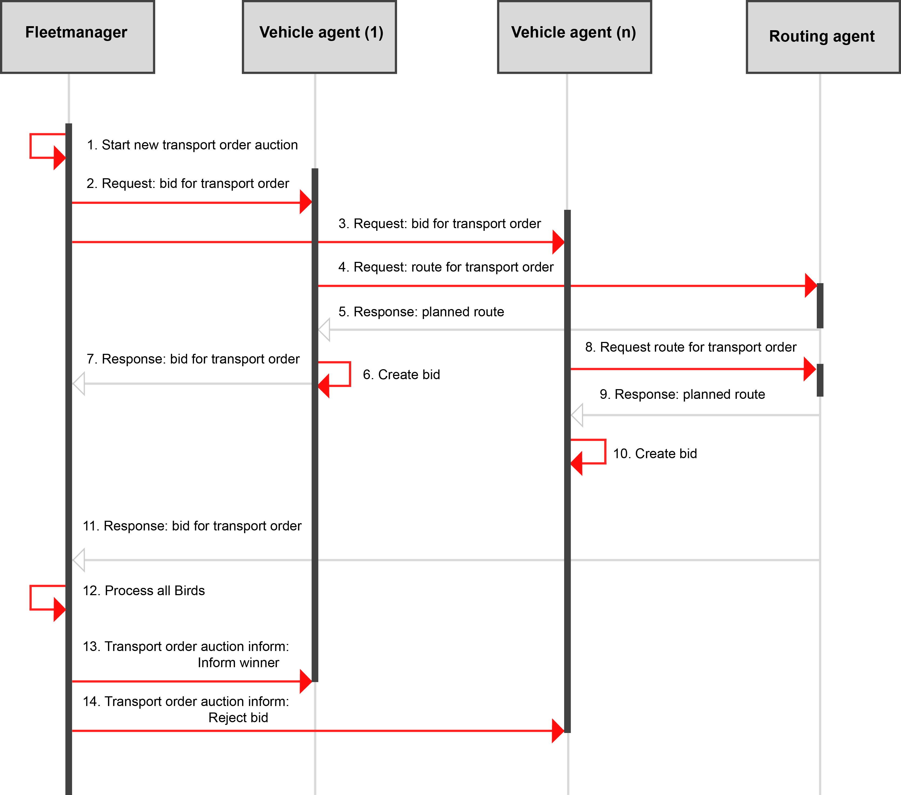

# How it works

This section describes the workflow of each submodule (TS and MTP) inside the TP.

## Table of contents

- [How it works](#how-it-works)
  - [Table of contents](#table-of-contents)
  - [TS](#ts)
    - [Logistic Task Language](#logistic-task-language)
      - [Introduction](#introduction)
        - [Use of Example](#use-of-example)
      - [Primitives](#primitives)
      - [Instances](#instances)
      - [TransportOrderSteps](#transportordersteps)
      - [Tasks](#tasks)
        - [Example Simple Task](#example-simple-task)
        - [Example TriggeredBy Task](#example-triggeredby-task)
        - [Example OnDone Task](#example-ondone-task)
      - [Comments](#comments)
      - [Full Example](#full-example)
  - [MTP](#mtp)
    - [Introduction](#introduction-1)
      - [Used Algorithm](#used-algorithm)
    - [The Routing Concept](#the-routing-concept)
    - [Agent descriptions](#agent-descriptions)
      - [Routing Agents](#routing-agents)
      - [Topology Agents](#topology-agents)
      - [Logical Agent](#logical-agent)
        - [Decision making](#decision-making)

## TS

The TaskSupervisor is a system monitor that provides information about the ongoing tasks, as well as its general status. The TaskSupervisor is responsible for publishing information about the running tasks as well as those that were stopped (the latest is not implemented yet).

The TaskSchedular has three divisions: 

* **TaskSchedular**: The TaskSchedular is responsible for creating and monitoring the TaskManager. The TaskSchedular denotes a collection of one or more TaskManager.
* **TaskManager**: The TaskManager is responsible for creating and monitoring tasks. A TaskManager denotes a collection of one or more tasks.
* **Task**: A task is the lowest part of the TaskSchedular and describes a transport order that is being executed. Each task includes some information about what will be transported, from where to which destination, how this task will be triggered (e.g. a Sensor Event like a button needs to be pushed) and if there is a follow up/child task.

An example of this TaskSchedular is depicted in the following listing:
```
TaskSchedular
 ->TaskManager_1
	Task_1->Task_2->Task_3
 ->TaskManager_2
	Task_A->Task_B
 ->TaskManager_3
	Task_Foo

```

### Logistic Task Language

The Logistic Task Language *(LoTLan)* is a simple, yet powerful approach to describe intralogistic material flow logic. A material flow processes is mainly a transportation task like the pickup *- go to position and get item -* and the delivery *- got to position and unload item*.

___

#### Introduction

The *LoTLan* consists of 3 different building blocks, that combined with each other describes such a process:

- Primitives
- Instances
- Tasks

A *Primitive* is an abstract model for a series of similar objects. It is the blueprint for the representation of real objects in software objects and describes attributes (properties) of the objects. Through the instantiation of such a *Primitive* a *Instance* of a concrete object is created. A *Task* then combines these *Instances* to a logical process flow.

##### Use of Example

The following documentation of *LoTLan* utilizes the example of a production hall that has an area for storing goods *- the Warehouse -* and an area for the manufacturing *- the Production*. To reduce the complexity only one AGV out of a possible lager fleet is used.


*Figure 1: Example floor plan with AGV and production & warehouse area*


This example shown in the figure above will be expanded in the course of time to explain the individual building blocks of the *LoTLan*.

#### Primitives

A *Primitive* can contain multiple member variables, like pallets/storage places, multiple conveyer belts, or like sensors with the same capabilities. Therefore, a *Primitive* summarizes and specifies a set of *Instances*.

In the domain of logistics such a *Primitive* could be a location. Defining such a location is done via the *__template syntax__*:

```text
template Location
    type = ""
    name = ""
end
```

The *Primitive* *Location* has two member variables, a *type* and a *value*. These attributes can be later on accessed inside the instances.

The *Primitives* *Event* and *Time* could be defined as following:

```text
template Event
    name = ""
    type = ""
end

template Time
    timing = ""
end
```

**Syntax**: It is important that the attributes inside a *template - end* definition begin with a lowercase character. The name has to start with an uppercase character. Each attribute also needs to be prefixed with four spaces (or a `\t`). Currently only the following 3 attributes are allowed: `name`, `type`, `timing`


#### Instances
An *Instance* is the concrete object of a previously declared *Primitive*. Such set of *Instances* do not share any data other than the definition of their attributes.

As an example, two *Instances* of locations could be initiated out of the previously made *Primitive* (see [Primitives section](#Primitives)):

```text
Location goodsPallet
    type = "pallet"
    name = "productionArea_palletPlace"
end

Location warehousePos1
    type = "pallet"
    name = "warehouseArea_pos1"
end
```

The *Instance* *goodsPallet* has two member variables, a *type* and a *value*. The *type* attribute states *what item is located there* and the *value* the *logical name of this location*.

The *Instances* *Event* and *Time* could be defined as following:

```text
Event agvLoadedAtGoodsPallet
    type = "Boolean"
    name = "LightBarrier"
end

Event agvLoadedAtWarehousePos1
    type = "Boolean"
    name = "LightBarrier"
end

Time lunchBreak
    timing = "30 12 * * *"  # Cron format
end
```

**Syntax**: The syntax of *Primitives* introduced here is complemented by assigning values to the attributes. These values must be enclosed by `"`. The name has to start with a lowercase character. Each attribute also needs to be prefixed with four spaces (or a `\t`).

In relation to the example introduced in the [introduction](#Logistic-Task-Language), the formerly shown *Location* *Instances*  define each a specific location inside the two areas.


*Figure 2: Floor plan with Positions **goodsPallet** and **warehousePos1***


The figure shows those positions inside the two areas *Warehouse* and *Production*.

#### TransportOrderSteps

A *TransportOrderStep* is a *Task*-fragment that contains only a Location and optionally a *TriggeredBy*, *FinishedBy* or *OnDone* statement. It can be used by a *Task* as a from/to value.

```text
TransportOrderStep {name}
    Location {location_0}
    TriggeredBy {none|event|time}
    OnDone      {none|followUpTask}
    FinishedBy  {none|event|time}
end
```

As an example, two *TransportOrderSteps* are created, both describing a short process:

```text
TransportOrderStep loadGoodsPallet
    Location    goodsPallet
    FinishedBy  agvLoadedAtGoodsPallet == True
end

TransportOrderStep unloadGoodsPallet
    Location    warehousePos1
    FinishedBy  agvLoadedAtWarehousePos1 == False
end
```

The *TransportOrderStep* *loadGoodsPallet* defines picking up from the *Location* *goodsPallet*, which is finished when the *Event* *agvLoadedAtGoodsPallet* is True. For the the optional statements *TriggeredBy*, *FinishedBy* and *OnDone* see [Tasks section](#Tasks).

**Syntax**: It is important that the values inside an *TransportOrderStep - end* definition begin with a lowercase character. Each value also needs to be prefixed with four spaces (or a `\t`). The name has to start with an lowercase character. Currently only the following 3 attributes are allowed: `Location`, `TriggeredBy`, `FinishedBy`, `OnDone`

#### Tasks

A *Task* orchestrates different *Instances* via operations to result in a logical process flow. Such a *Task* does not need to describe who is going to transport an item - it is important that the item will be transported.

Generally speaking, a *Task* in *LoTLan* describes that a amount of items should be picked up at some location\*s and be delivered to an\*other location\*s. The *Task* can optionally be triggered by an event or by time, can optionally issue a follow up *Task*, can optionally be finished by an event and can optionally be repeated:

```text
Task {name}
    Transport
    From        {transportOrderStep_0}
    To          {transportOrderStep_D}
    TriggeredBy {none|event|time}
    OnDone      {none|followUpTask}
    FinishedBy  {none|event|time}
    Repeat      {none = once|1, ..., n|0 = forever}
end
```

To simplify this, down in the following example, the simplest structure of a *Task* is build and later on extended with optional functionality.

##### Example Simple Task

In its simplest form, a *Task* in *LoTLan* just describes that an item should be picked up at some location and be delivered to another location:

```text
Task TransportGoodsPallet
    Transport
    From        loadGoodsPallet
    To          unloadGoodsPallet
end
```

In terms of the introduced example, production hall this *Task* looks like depicted in the following figure.


*Figure 3: Floor plan with Task **TransportGoodsPallet***

This *Task* *TransportGoodsPallet* could be done by an AGV, that picks up a pallet **from** *goodsPallet* inside the production area and delivers it **to** the *warehousePos1* in the warehouse area.

##### Example TriggeredBy Task

A *Task* can be extended with a *TriggeredBy* statement that activates that *Task* if the case occurs. This statement can be an event like a button press or be something simple as a specific time:

```text

Event buttonPallet
    name = "A_Unique_Name_for_a_Button"
    type = "Boolean"
end

Task TransportGoodsPallet_2
    Transport
    From        loadGoodsPallet
    To          unloadGoodsPallet
    TriggeredBy buttonPallet == True
end
```

In this example, the *Task* *TransportGoodsPallet_2* will be triggered by the event if the value is equal (*== True*).

In terms of the introduced example production hall this *Task* looks like depicted in the following figure.


*Figure 3: Floor plan with Task **TransportGoodsPallet_2***

This *Task* *TransportGoodsPallet_2* could be done by an AGV, that picks up a pallet **from** *goodsPallet* inside the production area and delivers it **to** the *warehousePos1* in the warehouse area, when the button *buttonPallet* is pressed.

##### Example OnDone Task

A *Task* can be extended with a *OnDone* statement that activates another *Task* when the original one has ended:

```text
TransportOrderStep loadEmptyPallet
    Location    warehousePos1
    FinishedBy  agvLoadedAtWarehousePos1 == True
end

TransportOrderStep unloadEmptyPallet
    Location    goodsPallet
    FinishedBy  agvLoadedAtGoodsPallet == False
end

Task Refill
    Transport
    From        loadEmptyPallet
    To          unloadEmptyPallet
end

Task TransportGoodsPallet_3
    Transport
    From        loadGoodsPallet
    To          unloadGoodsPallet
    TriggeredBy buttonPallet == True
    OnDone      Refill
end
```

In this example another *Task* is introduced. This *Task* *Refill* is the almost the same to the transport task as the formerly introduced *TransportGoodsPallet*, having as main difference that in this case it is te other way around. Furthermore, *TransportGoodsPallet_3* here shows now the *OnDone* statement that points to *Refill* an runs that *Task* if done. That means a concatenation of *Tasks* is allowed. Exploiting this behaviour infinite *Tasks* can be managed by pointing to each other. So *Refill* could also point to *TransportGoodsPallet_3* in a *OnDone* statement.

In terms of the introduced example production hall this *Task* looks like depicted in the following figure.


*Figure 3: Floor plan with Task **TransportGoodsPallet_3** & **Refill***

This *Task* *TransportGoodsPallet_3* could be done by an AGV, that picks up a pallet **from** *goodsPallet* inside the production area and delivers it **to** the *warehousePos1* in the warehouse area, when the button *buttonPallet* is pressed. After that the AGV executes the *Task* *Refill* and so, it picks up a empty pallet **from** the *warehousePos1* and delivers it **to** the *goodsPallet* location.

#### Comments

A comment starts with a hash character (`#`) that is not part of a string literal, and ends at the end of the physical line. That means a comment can appear on its own or at the end of a statement. In-line comments are not supported.

```text
###
# This task shows the usage of comments in LoTLan
###
Task TransportPalletTask
    # Comment inside a task
    Transport
    From        loadGoodsPallet  # A pallet
    To          unloadGoodsPallet
    TriggeredBy buttonPallet == True  # More comments
    OnDone      Refill
    Repeat      5  # Repeat it 5 times!
end
```

This example shows a mimicked multi-line comment that consists of three `#` that are joined together.


#### Full Example


```text
###
# Defining a Primitive Location with the two attributes type and value
###
template Location
    type = ""
    name = ""
end

template Event
    name = ""
    type = ""
end

template Location
    name = ""
    type = ""
end

###
# Initiation of the two Locations goodsPallet, warehousePos1 and the three Events agvLoadedAtGoodsPallet, agvLoadedAtWarehousePos1, buttonPallet.
###
Location goodsPallet  # Using the Primitive Location
    type = "pallet"
    name = "productionArea_palletPlace"
end

Location warehousePos1
    type = "pallet"
    name = "warehouseArea_pos1"
end

Event agvLoadedAtGoodsPallet
    type = "Boolean"
    name = "LightBarrier"
end

Event agvLoadedAtWarehousePos1
    type = "Boolean"
    name = "LightBarrier"
end

Event buttonPallet
    name = "A_Unique_Name_for_a_Button"
    type = "Boolean"
end

###
# Creation of the TransportOrderSteps loadGoodsPallet and unloadGoodsPallet
###
TransportOrderStep loadGoodsPallet
    Location    goodsPallet
    FinishedBy  agvLoadedAtGoodsPallet == True
end

TransportOrderStep unloadGoodsPallet
    Location    warehousePos1
    FinishedBy  agvLoadedAtWarehousePos1 == False
end

TransportOrderStep loadEmptyPallet
    Location    warehousePos1
    FinishedBy  agvLoadedAtWarehousePos1 == True
end

TransportOrderStep unloadEmptyPallet
    Location    goodsPallet
    FinishedBy  agvLoadedAtGoodsPallet == False
end

###
# Creation of a Task that transports from goodsPallet to warehousePos1
###
Task TransportGoodsPallet
    Transport
    From        loadGoodsPallet
    To          unloadGoodsPallet
end

###
# Creation of a Task that is triggered if agvLoadedAtGoodsPallet occurs
###
Task TransportGoodsPallet_2
    Transport
    From        loadGoodsPallet
    To          unloadGoodsPallet
    TriggeredBy buttonPallet == True
end

###
# Creation of a Task that will call Refill when done
###
Task Refill
    Transport
    From        loadEmptyPallet
    To          unloadEmptyPallet
end

Task TransportGoodsPallet_3
    Transport
    From        loadGoodsPallet
    To          unloadGoodsPallet
    TriggeredBy buttonPallet == True
    OnDone      Refill  # If this Task is done, call Refill
end
```

## MTP

The main target of the Motion Task Planning is the calculation and coordination of robot paths. This ensures a safe coexistence between robots which operate together in the same environment. To certify this, the path planner will always try to avoid crossing paths or blockings. 

### Introduction

 The coordination of robots in logistics environments has special requirements and constraints related to the used routing algorithms and data representations. In most cases, current routing algorithms do not follow the necessary requirements or are not able to integrate them due to inappropriate data representations. Special requirements for routing algorithms are  e.g. routing of multiple robots to the same destination, handling of blocking robots that may lead to a deadlock situation, creation of order sequencing, managing heterogeneous robot fleets. The handling of scalability and performance when the number of robots increases is also a crucial issue. Especially in the latter case, a decentralized approach can help to fulfill these requirements. As mentioned before, requirements to the routing appear on one side, on the other side the data representation of the logistics environment is a key factor. Special traffic regulations, like restricted driving directions (e.g. one way roads), or critical traffic situations, like narrow lanes, have to be mapped into a topological representation of the used routing algorithm. It is also necessary to depict vehicle positions and the positions of objects such as relocatable storage areas as a logistical environment which is in a state of constant changes, whereby all of these possible changes and requirements must be continuously updated in the data representation of the routing algorithm.

The used routing concept uses a topology which is based on a topological graph and a time window based routing.  

#### Used Algorithm

 The publication **C**ontext **A**ware **R**oute **P**lanning ***(CARP)*** approach of ***[ter Mors](https://link.springer.com/chapter/10.1007/978-3-642-16178-0_14 "Context-Aware Route Planning")*** presents a central approach for collision-free navigation of autonomous systems. The algorithm is graph based and guarantees to calculate shortest paths from a start to a destination location, without colliding with any of the other robots, or ending up in a deadlock situation. For the path calculation and coordination time windows are used. Calculated routes can be defined as $\pi_n=\left(\left[r_1,\tau_1 \right], \dots,\left[r_n,\tau_n \right] \right), \tau_i=\left[t_i,t'_i\right)$  where $r_n$ is a node of the resource graph and $\tau_n$ is a time window that indicates that resource $r_n$ is available from time $t_i$ to $t'_i$, see subsequent figures. The basic idea of CARP can be defined as follows. Within routing, individual agents plan their routes successively one after the other. If an agent $n$ plans its route, the already planned $(n-1)$ routes are included in the current calculation. Every node of the resource graph has its own time windows that defines when the node is available. For planning conflict-free routes, overlapping time windows between the individual nodes of a route are required, in a way that $\tau\cap\tau'\neq\emptyset$. A calculation of the needed time windows takes place on the basis of real time values of the deployed vehicles. These values can be used to estimate the vehicle positions at a given time point. Based on this information the time windows of each node in the graph can be created. The algorithm also offers the possibility to integrate current events, such as delays, into the planning of future routes through a delay propagation approach.


   

### The Routing Concept

 To establish a flexible and scalable path planning architecture, a new routing architecture will be presented, where an agent based approach is introduced. An overview of this agent model is shown in the subsequent figure. The chosen design provides the possibility of a simple decentralization as well as reduction of the complexity of the routing algorithm by dividing it into different agents. The presented approach consists of four different types of agents. Logical agents represent a software component which reacts to its environmental influences. In general, these agents have a higher level logic and serve as managers. Logical and **R**obot **A**gent **N**ode (RAN), (mod.iot.ran) have a one to one relation, thus a logical agent is permanently assigned to a specific RAN agent and viceversa. RAN agents act as a driver for the hardware and send driving commands or status information back to the logical agent. The responsibility for the routing is to calculate a path for the vehicle. This can be done in direct interaction with the topology. A route calculation is only possible within a direct coordination between the agents, whereby possible movements and solutions for critical situations are arranged. The developed routing concept acts mainly autonomously during the execution of an order. This includes the assignment of an order, the pick and place and subsequently the finish report. The interface to bring new orders to the system is the [TaskSupervisor](opil_config_tp_tasksupervisor.md "TaskSupervisor") which can interact with all available logical agents.


 All mentioned agents will be described in detail in the section [Agent descriptions](#agent-descriptions).

### Agent descriptions

 This Section describes the developed decentralized agent based routing architecture in detail. A description of the responsibilities of the agents and the interaction among the agents is given. The main idea of this architecture relays on a distribution of responsibilities, knowledge and interactions among the agents. For this purpose, the agent offers services corresponding to its tasks. To get in contact with other specific agents, only the knowledge of the individual ID is necessary.

#### Routing Agents

 The major task of the routing agent is to compute routes that are requested by the logical agents. For that reason, a routing service is offered to logical agents. This service allows to calculate real routes as well as test routes. The difference is time windows of test routes are not saved and do not serve as real routes. Information of a test route can be used during the negotiation process for new orders. While test routing, all necessary information, like other routes are taken into account. Hence a test route consists of the following information: travel distance, travel time and way points of the topology. Based on this information a better decision for an order can be made. 
The used routing algorithm inside the routing agent corresponds to the CARP algorithm which is presented in chapter [Used Algorithm](#used-algorithm). The basis of the route calculation is a topology, managed by the topology agent. After the launch of a routing agent, the agent has no knowledge about the topology. The topology is dynamically built during the first route requests. Therefore a route request consists of a start ID and destination ID. With this, all needed information can be queried from the topology agents. Queried topology information is cached by the routing agent. This ensures that basic information like connections, positions, restrictions, etc. are only requested once reducing network traffic and ensuring a maximum of dynamics. Free time windows and reservations of the topology are not cached and must be requested at any time required. After a route was successfully calculated by the routing agent, all calculated time slots are saved via a service call of the appropriate topology agent. Contrary to [Routing Concept](#The-Routing-Concept), the algorithm for the decentralized calculation of the routes has not yet been implemented in the current version of the router. Currently, the calculation of a route is only supported by one router at a time, but several router instances specialized for the calculation for certain vehicles can exist. This can be done e.g. by a token between the routers.

#### Topology Agents 

The topology agent depicts the current representation of the logistics environment in a topology. This topology is offered to other agents, for example to the routing agent. In the case where a new route is calculated, the topology will be updated with reservation (time slots) of the calculated path. The reservation describes a time, how long a vehicle or human will stay on a topology entity. In case of the topology, a topology entity can be represented by a vertex or an edge. One of the main tasks of a topology entity is the management of the reservations and calculation of free time slots for the routing through which new reservations can be calculated. 

For the time of a reservation, the topology entity is exclusively reserved for an specific agent. The calculation of reservations are part of the routing and are entered by the routing agent. In order to access a topology entity, it must be first reserved by a logical agent. Only the agent with the next reservation receives the surcharge. Other agents can already request the point for an allocation, but have to wait until it is released from the previously allocating agent. To know when a point is traveled to or left, every topology entity has a footprint. The footprint describes an area that may not be navigated on if it has not been validly allocated, as well as an area that can be safely navigated on if it has been allocated. A footprint is described by a 2D polygon course. Every topology entity, vertex and edge, consists of such a footprint. 

Another important task of the topology is the management of important information like connections and restrictions. In case of a vertex, connections are edges which are connected with the vertex. In this case the vertex stores the ID of the connected edges, but has no further information. In case of an edge, the connecting vertex IDs (1 in case of an unidirectional edge, 2 in case of an bidirectional edge) are stored, also without further knowledge. It is the responsibility of the requesting agent to obtain further information from the adjacent agent. Restrictions of a topology entity can be for example a maximum velocity, special vehicle types, a maximum payload, etc. A topology entity can also be locked for a specific time interval. During this period a reservation and allocation of the topology entity is not possible for an agent. Locks are very helpful if something went wrong on the shop floor, or e.g. a vehicle has a technical problem. In terms of delay, a delay propagation can be performed. In this case, the delayed logical agent informs the topology entity of the delay, causing it to postpone the reservation for the reporting as well as all of the following logical agents. All following logical agents will be informed of the delay by the topology entity.

![This figure shows times slots managed by topology entities. The planned path $p$ starts at $v_1$ and ends at $v_3$ ($p=[v_1, e_1, v_2, e_2, v_3$]). Each vertical time line corresponds to one topology entity (vertices: $v_1, v_2, v_3$ and edges: $e_1, e_2$). The grey colored reservation ($r_n$) illustrates a planned path of a vehicle. Between reservations of a topology entity, free time windows ($f_n$) can be built which can serve for new reservations.](./img/reservation_free_time_slots.png)


#### Logical Agent

 The logical agent is a high level manager for RAN, or in other words for a vehicle or human. Main task for the logical agent is e.g. the order management, which includes the participation of order actions, the route management and status updating of orders. New orders are assigned to the logical agents via order auctions. Here, the logical agent prepare bids for tendered contracts. A central instance selects the best logical agent for the respective order and assigns the order to it. A more detailed description of the order auction is given in chapter [Decision making](#Decision-making). In case a route is assigned to a logical agent, the agent retrieves the knowledge from the auction strategy and the order will be stored in a queue. 
Another main task of the logical agent is the route management. After a new task is picked from the queue, a path has to be calculated to the picking and placing location of the order. After a path has been received from the routing agent, the RAN agent can start traversing the path. Therefore the logical agents start with the allocation of topology entities which are a part of the calculated path and already reserved by the routing agent. After a topology entity is successfully allocated, the position can be send as a driving command to the RAN agent. The task of the logical agent is now to check whether the calculated time slots for this path segment are adhered to and the footprint of the path is not left by the RAN agent. In case the calculated time window cannot be kept, a delay propagation will be carried out by the logical agent. The challenge here is to predict how long the delay will be. However, since it can depend on a wide variety of influences, no prediction has been made. Influences can be e.g. blocked way, a person steps in front of a vehicle, the prediction of the time window was not precise, etc. Therefore a static time is currently propagated as delay. After a topology entity was traversed and the footprint of the topology entity is not longer occupied by the RAN agent footprint, the topology entity can be deallocated by the logical agent.
 For handling errors, if the RAN agent e.g. is a vehicle, the logical agent continuously receives status information of the RAN agent. Beside information like position, finished orders, etc., errors are send to the logical agents. Some failures can be handled by the agent itself, others have to be handled by an operator. Protective field errors e.g. can be handled by the logical agent. If the error can not be handled by the logical agent, by waiting for a defined amount of time and propagating a delay, the error will be forwarded to an operator. 

##### Decision making

 In our scenario, a logical agent delivers e.g ordered parts from a shelf-based warehouse to workstations on the shop floor. Therefore, the basic logical agent was extended by a behavior to process transport orders from the fleet manager. To obtain orders, a logical agent sends bids on auctioned transport orders. For this purpose, the logical agent has an additional behavior to conduct contract negotiations. Auction for orders are given in the form of a direct inquiry of a logical agent and a request to submit a bid. The bid of a logical agent includes information such as: travel distance and travel time, which can be received from a routing agent via a test route; battery life and actual workload of the logical agent. For the test route it is important to know the possible start time and start position, which equivalent to the end time and position of the last order in the queue. If the queue is empty, the start time and position corresponds to the current time and position. 

In our agent model the auctions for orders takes place between the logical agents and the fleet manager. For the included auction in this decision point the FIPA CNET protocol was applied. [Branisso et al.](https://ieeexplore.ieee.org/document/6825356 "A Multi-Agent System Using Fuzzy Logic to Increase AGV Fleet Performance in Warehouses") pointed out that CNET produces a larger task throughout as the First Come First Serve approach. All of the following input values are part of a bid that was sent from a supply logical agent to the warehouse agent during a transport order auction. Three input values are used at this decision point. More precisely, these are the travel distance between the source and destination location, the travel time and the battery charging state of the vehicle. The auction process between the fleet manager and the logical agents is shown in the figure below.

