# HMI User Manual

## Login
When HMI and OPIL is up and running, enter the HMI's URL to the web browser (host or IP address and the port number if configured other than 80 in the installation). 

Enter the User ID and Password configured in the docker compose file (default is admin/admin).

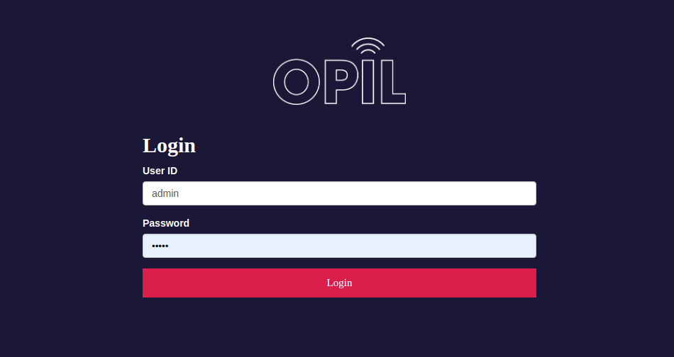

You should see the user interface on the 'Overview' tab without much content.

If the browser is not able to connect to the OCB, you will see an error message like below. In that case check the connection from your client device to the middleware (http://[OCB_IP]:1026/v2/entities). You should get empty brackets or list of the entities in the context broker. Check the docker-compose.yml file as well that the IP addresses are correct.

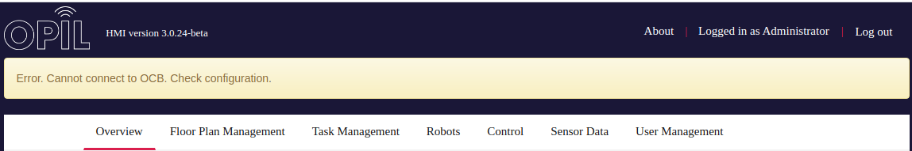

## User Management
After login it would be good idea to change the admin password on the 'User Management' tab. From there it's possible to create other users to the HMI too. Users with role 'user' can't access this tab or create control buttons to the system and they see only buttons assigned to them or to all users.

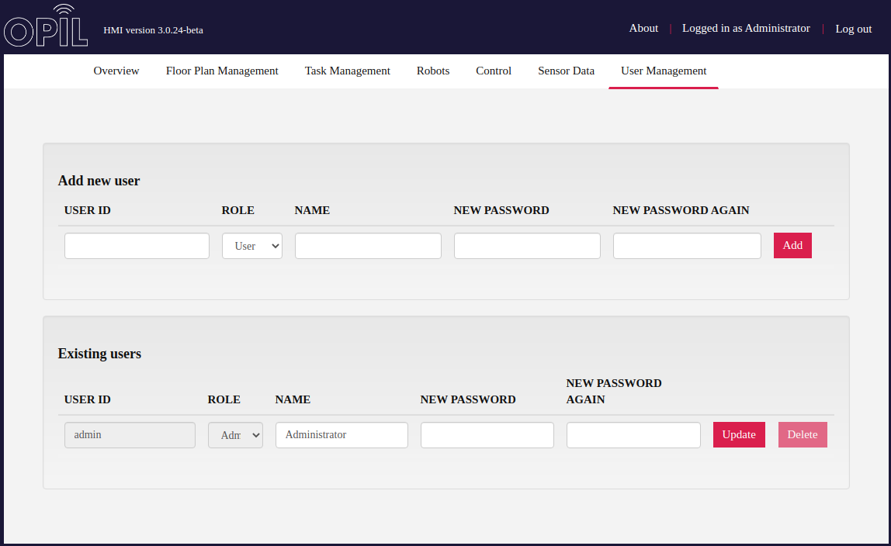

## Floorplan Management

At this point you should have an image of the factory floor layout preferably in PNG format to upload to the HMI server. 

From that image you have to determine the scale in meters per pixel. For example in the image below is drawn a red line between two known points on the factory floor as far as possible to each other. The distance measured is 17 meters. With image editing software the length of the line is measured to be 1214 pixels. So the scale is 17 m / 1214 px = 0.0140032948929.

You should have already chosen the zero point of the OPIL system. To that point is then measured from the bottom left corner of the image X- and Y-offsets in pixels.

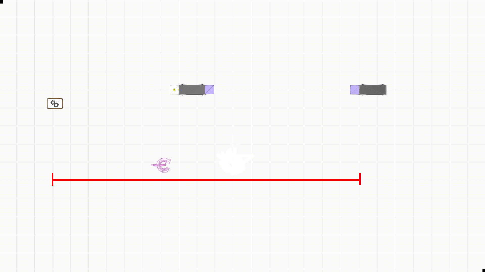

In the 'Floorplan Management' tab you should then pick the image file, give it a name and enter the values determined previously.

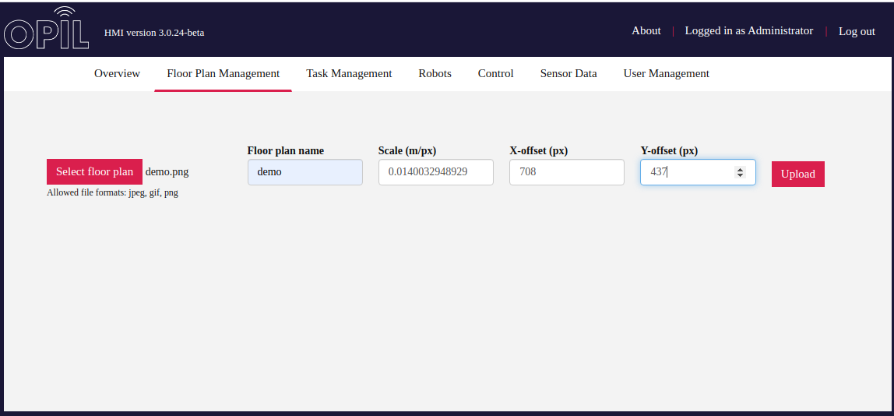

After uploading floorplan image is shown below. It's possible to replace this by uploading the floorplan again with different values for example.

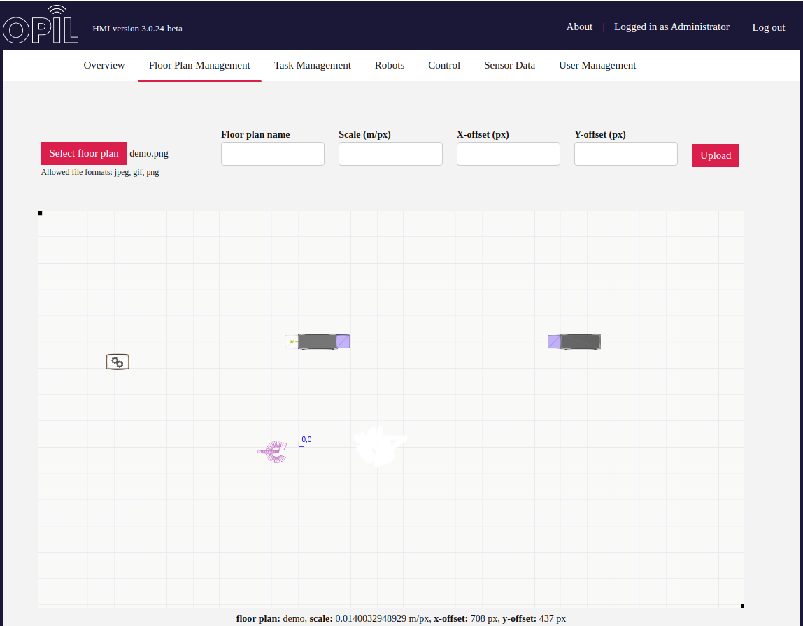

## Task Management

On this tab the user is able to write or paste the task specifications in Logistic Task Language. For a detailed description see [TP documentation](../TP/User_Manual/how_it_works.md#logistic-task-language).

HMI creates an entity 'Materialflow' to the OCB. Sent task specifications are then listed below and TP updates the state of them if they are ok or not. The user is able to set them active or non-active and may delete them.

When a task is running TP updates the Transport orders list which the user is able to filter with checkboxes by task info.

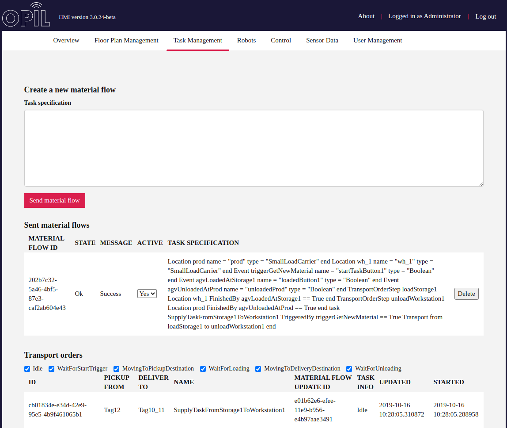

## Control

On 'Control' tab an administrator is able to create HMI buttons which can be used to trigger events in the task specification. Event's name should be entered in the id and the name input boxes. The buttons could be assigned to all users or to some individual user.

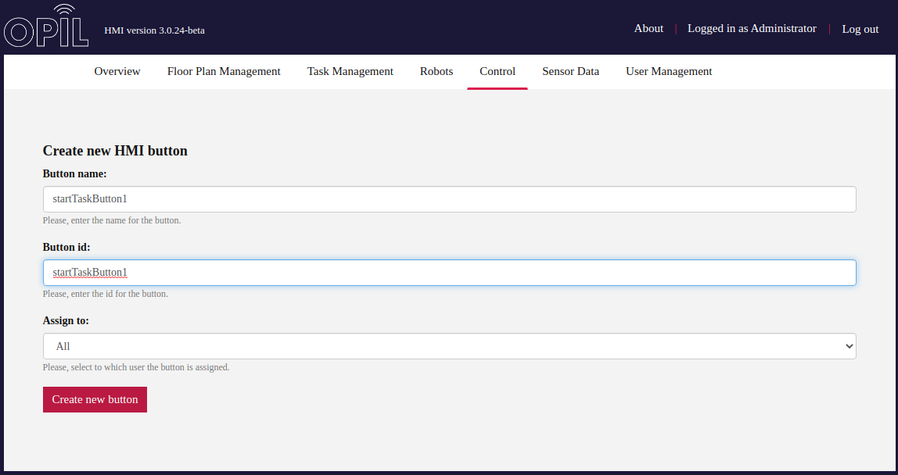

In the image below is created three buttons according to the task specification sent in the Task Management part before. HMI creates 'Sensor Agent' type entities to the OCB and updates the boolean value true whenever the button is pressed. HMI saves the configuration of the buttons to its local database so they are created again in case of HMI restart.

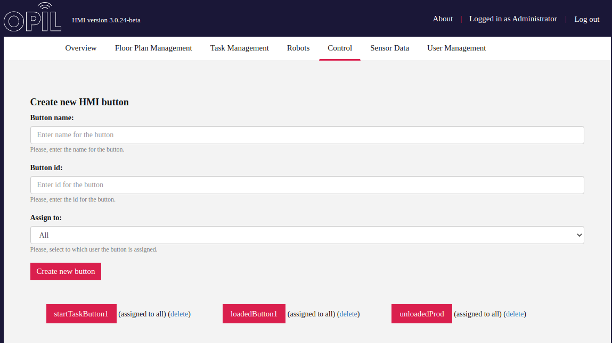

## Overview

Floorplan image is loaded to the canvas on the 'Overview' tab. In the screenshot below HMI has not yet received any robot data and the Sensing & Perception graph is turned off.

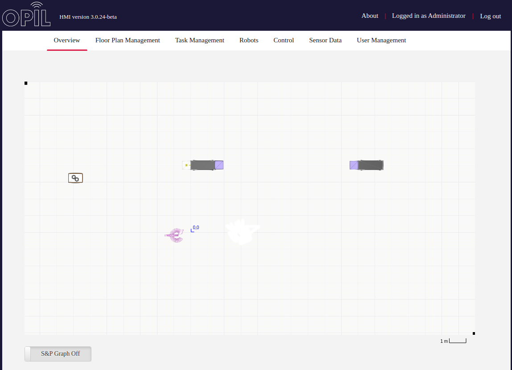

When HMI receives notifications of robot's motion it should appear on the floorplan as a blue dot. In the image below is S&P Graph turned on and S&P notifies HMI with graph updates. It's possible to get information about annotations, vertices and edges by moving the mouse cursor on top of them. Below the canvas is tables of robot and sensor data updated by notifications.

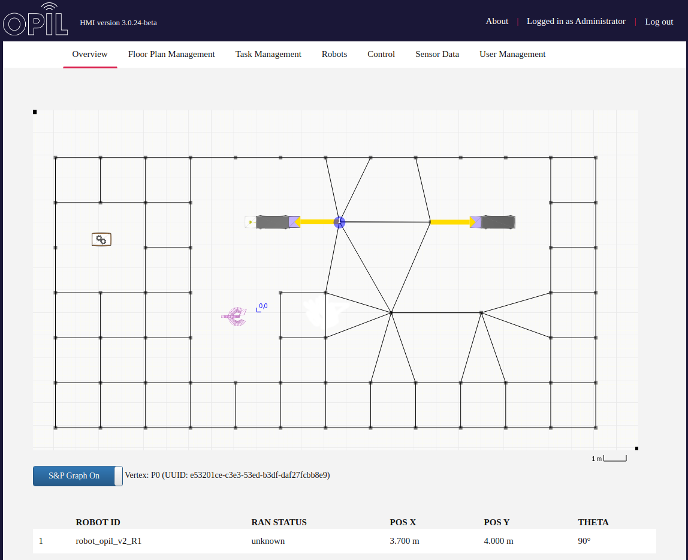

## Sensor Data

On this tab is drawn zoomable time series charts of sensor data showing their current value as well.

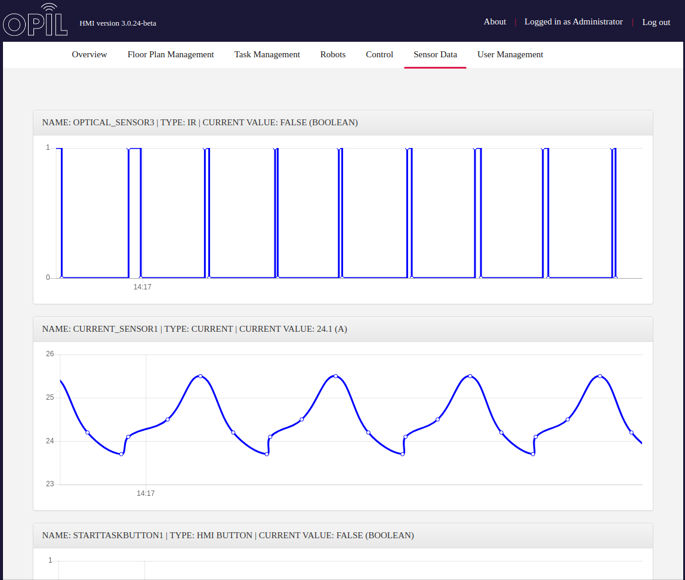

