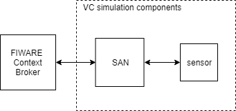
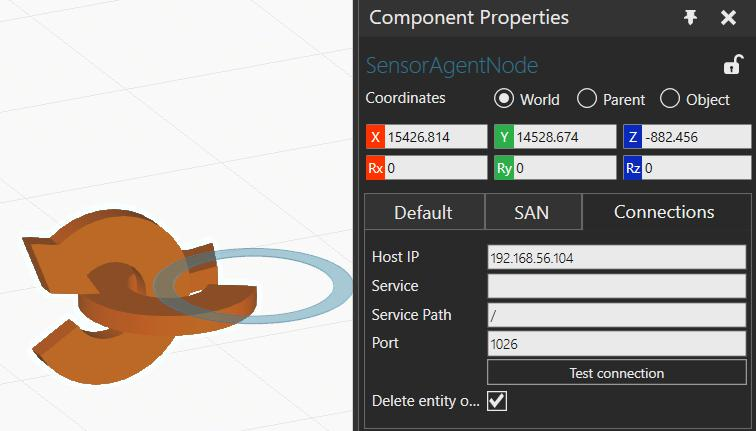
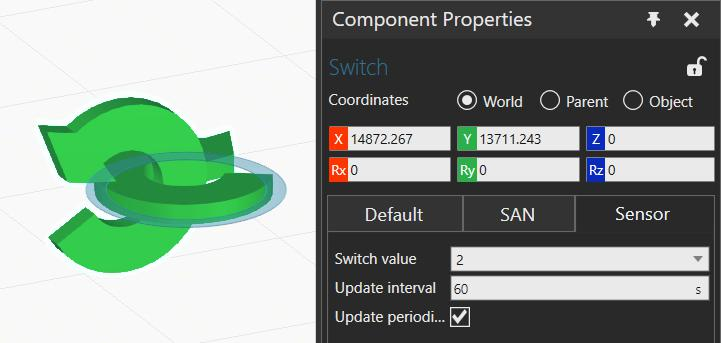
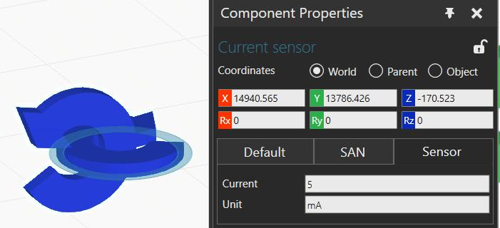
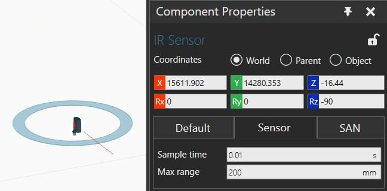
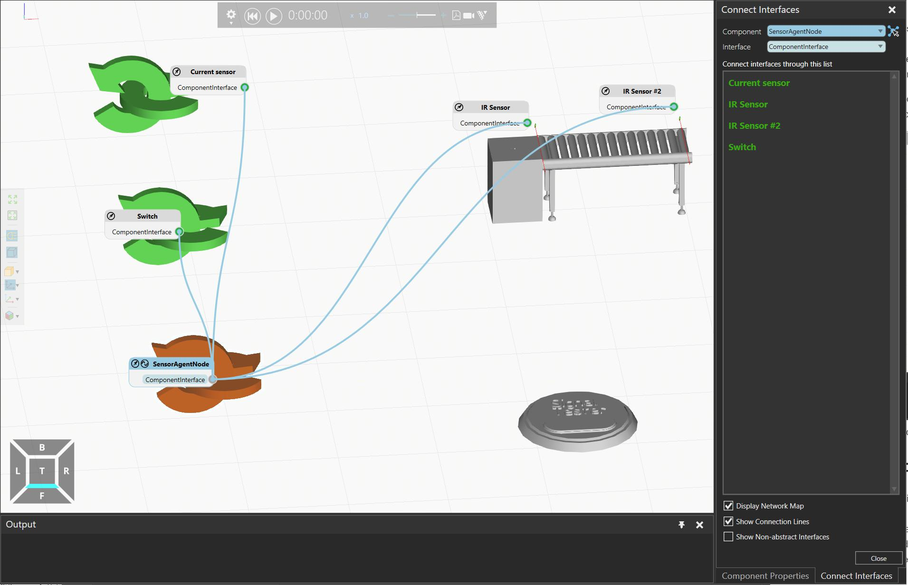

# VC-SAN

## 1 Introduction
The VC-SAN is the OPIL IoT Nodes layer module devoted to sending virtual sensor data to the FIWARE Orion Context Broker (FOCB) of the OPIL Cyber Physical Middleware layer. VC-SAN is the digital twin of MOD.IOT.SAN and imitates its behaviour.

## 2 Components and structure
Figure 1 presents the structure of VC-SAN. There are several simulation components defined in two main categories, SAN and Sensors (Switch, Current and IR).
* **SAN** (orange), connects the sensors in the simulation with the FOCB.
* **SwitchSensor** (green), switch connector (parametric). GUI allows to define the Switch value to 0,1,2
* **CurrentSensor** (blue), current measurement, real values in mA (IMPORTANT: the entity has not  defined units values)
* **IRSensor** (Infrared Component), infrared sensor, value changes to 1 when it detects an object in front of the sensor, otherwise 0

Figure 1. Structure of VC-SAN.

## 3 Description of the Components in the Simulation

### 3.1 SAN
 **SAN** (SensorAgentNode)  handles the communication between the FIWARE Orion Context Broker (FOCB) and sensor components. Messages are transmitted using signals and interfaces in the simulation layout. There is only one entity per SAN component and all the sensors connected to the same SAN send simulation data to the same entity in FOCB.

Note that one entity is created per SAN meaning that it is possible to have several SANs connected to the same FOCB, in this case each SAN will handle a different entity. When simulation starts, entity is created unless for some reason the entity already exist in the FOCB. When the simulation ends, the entity is deleted.

Figure 2 shows the connection tab of the SAN Properties. Here the user can place the *Host IP* of the FOCB. Once the direction has been set up *Test connection* buttom will validate the connection to the FOCB.

Figure 2. Screenshot of the connection tab of the SAN.

### 3.2 Switch
**Switch** Simulates a *swith* allowing values of "0,1,2". Values can be configured in *Switch sensor tab* Properties (Figure 3).

Figure 3. Screenshot of the *switch* sensor configuration tab.

### 3.3 Current
**Current** Simulates a current sensor. It can be also configured in the properties tab as shown in Figure 4.

Figure 4. Screenshot of the *current* sensor configuration tab.

### 3.4 IR
**IR** Simulates an IR sensor. Similar to previous sensors, it can be configured as shown in Figure 5.

Figure 5. Screenshot of the *IR* sensor configuration tab.

## 4 Setup
Adding VC-SAN components to the simulation follows the same logic as creating a simulation in Visual Components.
- First add the SAN component (remember one SAN per entity)
- Add the required components (Switch, Current or IR to the simulation layout)

Once the SAN and the sensors have been added to the simulation layout, connect them as shown in Figure 6 (Enable the interfaces and connect the sensors to the SAN ).

Figure 6. Screenshot of the *switch* sensor configuration tab.

## 5 Demo Layout
In order to test the functionalities of the SAN and related sensor components, a demo layout (*SensorAgentNode_Demo*) has been created (Figure 5). The demo layout simulates a simple feeder with a conveyor. Two IR sensors are included with the conveyor, one is located at the beginning and one at the end of the conveyor. The sensors detect when a part enters and exists the conveyor. In addition, two other sensors have been added: the switch (detects change in "switch value" in sensor tab) and the current sensor, which can be validated with the SignalTester (change "RealSignalValue" value and presh "TriggerSignal").

The SAN connects with the FOCB by posting the entities to be read by the HMI.

## 6 Potential future improvements
* Adding more sensors
* Gathering multiple sensor measurements and sending them together periodically
