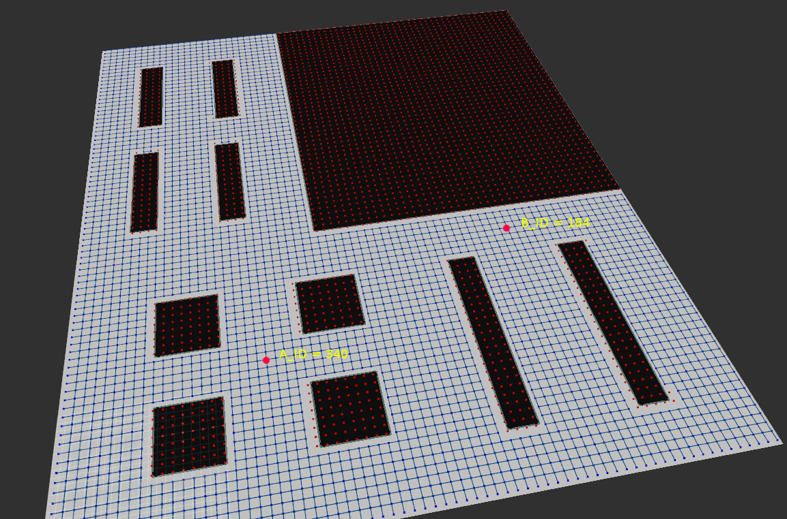

# Business Process Optimization (BPO) module
The OPIL BPO (Business Process Optimization) module determines an optimized solution to the optimized motion task sequencing problem. The major focus of BPO are actions that have to be executed by factory floor agents (humans and AGVs) to carry out logistics motion tasks. BPO takes as input a description of the capabilities of the environment, the agents, the cost of the agents’ actions and the expected system state as a task specification in a language specifically developed for this module.

The Business Process Optimization (BPO or MOD.SW.BPO) module is a stand-alone component of OPIL that handles the on-the-fly optimization of a task. The BPO module is tasked with minimizing the logistic resources required and the total cost of the task. BPO contains information regarding the state of each agent (where agent is considered as any logistic entity) involved during the task execution. In case of a failure of a sub-task, the BPO module is capable to recalculate the plan for the current task based on the current state of the agents. 

The required input of MOD.SW.BPO parsed in a language specifically developed for the module contains the environment definition, the current state of the agents (i.e. the current location of each agent) and a logistic task. (i.e. “Transport item_1 from location A to location B”) provided by the production manager utilizing the Human Machine Interface (HMI) module. The environment definition describes the agents involved with their capabilities and constraints. Capabilities contain the allowed state transitions whereas constraints contain the forbidden state transitions utilizing the topology map created by the Central Sensing and Perception (Central SP) module. The BPO module generates the optimal sequence of sub-tasks subject to the constraints imposed and the capabilities provided while satisfying the task specification in the sense that MOD.SW.BPO provides the sequence of the agents’ transitions in order to fulfil the given task plan. 


## BPO module integration with OPIL modules
The BPO module is integrated with HMI and Central SP modules. The user could send a task from the HMI to BPO. BPO utilizing the topology map of the Central SP module, provides the optimal task plan with the minimum total cost for the given task. The optimal task plan is fed to the Task Planner which handles the task execution.

BPO receives the setup of the environment, the enable transitions from one location to another, the initial state of the agents as the initial location of each agent and a task defined as objective. A task could be "Transport item C at location A". BPO receives these information in a language specifically developed for the needs of this module. Finally, BPO produce the sequence of actions as steps of a shortest path from the initial state of the agents to a target and the time needed. Then, the path is parsed from the Task Planner to handle the task execution.


## BPO Formal Specification 
In this section, we are going to describe the operation of the BPO module, to aid in its design and to analyze its behavior.

### How the BPO module Works
The BPO module is tasked with generating the optimal sequence of tasks based on the provided task specification. The task specification provided by the user is parsed by a parser in a language specifically developed for the module to generate the required input for the BPO module. The output of the BPO is fed to the Task Planner in order to handle the task execution. As an example consider the following topology with two locations of interest (A and B). We assume that we want a worker to load items at location A to a robot and the robot to transport them to location B.



### Input Requirements 
Below is the input to the BPO to carry out the sought task. 

Small letters are reserved as follows:
`*`: Anything (can only be used in the constraints definitions and in the objectives) 

Reserved letters for positions:
`v` := Any undefined position 

Reserved letters for Robots: `r[Robot ID]`, i.e.:
```
r1, r2, …, rn
```
Reserved letters for Workers: `w[Worker ID]`, i.e.:
```
w1, w2, …, wn
```
Reserved letters for Items: `i[Item ID]`, i.e.:
```
i1, i2, …, in
```
### Definition of locations 
List of location IDs of interest (based on the topology).

Capital letters are for identifying location IDs.
```
A 340
B 184
```

### Definition of transitions
Each `x_Transitions` statement indicates a partial state of the factory floor. 

Allowed transitions for *r1* implies that the first position in the state “word” will be `#occupied` by the location available through `r1_transitions`
```
r1_Transitions := ['AB', 'BA', 'vA', 'vB']
```
Allowed transitions for `w1`
```
w1_Transitions := ['AB', 'BA', 'vA', 'vB']
```
Allowed transitions for `i1`
```
i1_Transitions := ['Ar1', 'BA', 'r1B']
```

### States Definition 
We have now defined in this example 3-lettered words defining the state of the system. For example, if robot *r1* is at location *v*, worker *w1* is at location *A* and the item *i1* is at location *A*, then the system state is `[v][A][A]`. Constraint transitions `i1_transitions` are the possible transitions for item *i1*. In the case below it is indicated that an item can only be loaded from position A on robot *r1* if both the robot and worker are at position *A* and can only be unloaded in location *B*, if both robot and worker are at location *B*.
```
i1_constraints := [AAA : AAr1, **r1:**r1,BBr1:BBB] 
```
### Objective Definition 
We can now define the objective of the BPO. For example, transport the item *i* to location B)
```
Objective := [**B]
```

### Statement of the Output 
The output of the BPO is an optimized sequence of states to achieve the Objective.

 Below is the output received by the BPO. 
 
```
[vvA:vAA:AAA:AAr1:ABr1:BBr1:BBB]
```