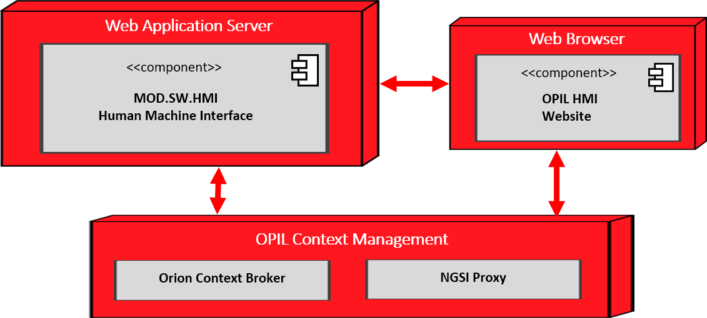

# Introduction Human Machine Interface (HMI)

HMI (Human Machine Interface) is a software layer module of the OPIL architecture. It is a web application server
with its own local database for storing data needed in this module. HMI serves a web browser user interface for the
human agents to monitor and control OPIL data entities. Figure below shows the components and their connections to each other and to OPIL context management server using HTTP protocol.

Web application server is a Node.js application which uses Express.js back end framework. It has its own local MongoDB database to store information needed such as configuration data, user and floorplan information as well as user interface control buttons. HMI server offers a user authenticated access point to web browser clients and a REST API to manage and retrieve the data from the database. It also connects to Orion Context Broker to manage the entities this module has created such as sensor type control buttons.

Web browser user interface is created as a single page application implemented with Embedded JavaScript templating. It uses the FIWARE Ngsijs Javascript library to create a connection to the Orion Context Broker with the NGSI Proxy. Through this connection it retrieves and manages data of the entities from the broker and creates subscriptions to get notifications of the changes in certain entities. Notification data is used to update the views in the user interface. Following figures illustrates some of the views arranged as tabs.
