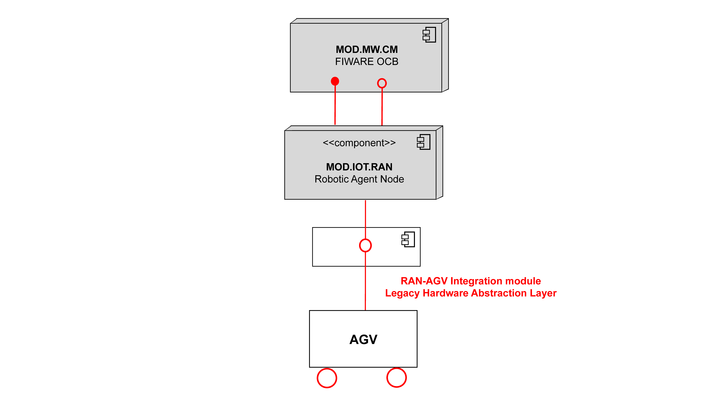

# Introduction Robot Agent Node (RAN)
This is the Robot Agent Node (RAN) documentation. 

Here you will find the information required for installing and configuring the RAN.

## Overview RAN

The RAN (Robot Agent Node) sits between OPIL and the Robot Hardware. It provides two main functionalities: it manages robot navigation, based on ROS, and works as an interface between the robot hardware and the OPIL Cyber Physical Middleware, based FIWARE Orion Context Broker. In order to accomplish the second functionality, the RAN "translates" and adapts FIWARE entities into something understandable by ROS, i.e., messages and services, and vice versa. In doing so, it accomplishes the goal set for the Communication/Messaging sub-module described by the OPIL Reference Architecture in the main document to which this annex refers to.

In its first embodiment the RAN translation is performed by using FIROS. The FIROS component on the RAN integrates the FIWARE NGSI Context Management Interfaces with the ROS-speaking robots. Non-ROS speaking robots are interfaced via a ROS node which uses an ad-hoc protocol defined by the OPIL consortium, i.e., by ASTI. All communications inside the RAN are handled via ROS messages and services.

For navigation, messages concerning the target positions to be reached are sent to the robot. These targets are provided by the OPIL Task Planner and are delivered to the local execution layer, i.e., a local trajectory planner, inside the RAN. In particular, Task Planner messages provide target points to the RAN, one point for each message. The RAN plans its trajectory to reach the point. 

The Task Planner in the meanwhile can send a new message to guide the robot through a series of points – called waypoints. Once the final target – or goal – is reached the Robot stops and awaits for new messages that defines which action it has to perform. As for destinations, actions are sent by the Task Planner and describe which action the robot has to perform once it reaches its destination.  By sending sequences of points to reach (motions) and actions it is possible to define tasks for the robot.

To perform an effective navigation, in addition to the sequence of points, the RAN should receive the MAP description and its own POSITIONING, within the MAP reference system, through Orion Context Broker. OCB also receives periodical notifications about the robot status (including robot status, battery level, current target point, etc…) from the RAN.

## RAN structure

   
   
   This schema shows how the RAN connects OPIL with the Hardware (AGV/Robot)

## General prerequisite

In order to execute the RAN module, the HW requirements for the machine are the ones needed for a ROS installation:

• 1 GHz processor

• 1.5 GB RAM

• Network adapter

### Context Broker

A FIWARE Orion Context Broker server has to run - probably on a different machine. There are various ways to have this OCB, some can be found [here](https://fiware-orion.readthedocs.io/en/master/admin/install/index.html) or [here](https://hub.docker.com/r/fiware/orion/)

## Source code

In order to enable the RAN to work, the machine must run an Ubuntu distribution (we recommend 20.04)

Moreover, the following softwares have to be installed:

### ROS

ROS can be installed following [this guide](http://wiki.ros.org/ROS/Installation).
	
You should create a simple workplace, following [this tutorial](http://wiki.ros.org/catkin/Tutorials/create_a_workspace).

### FIROS

It is possible to get FIROS following a guide availabe at [this link](https://github.com/iml130/firos).

