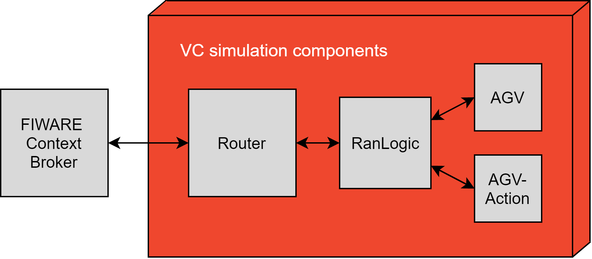
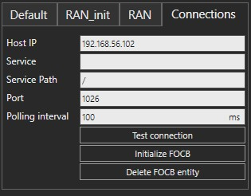
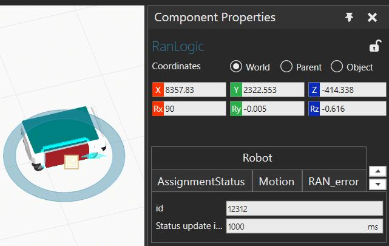
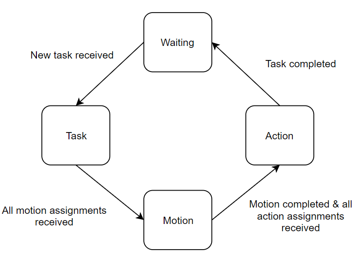
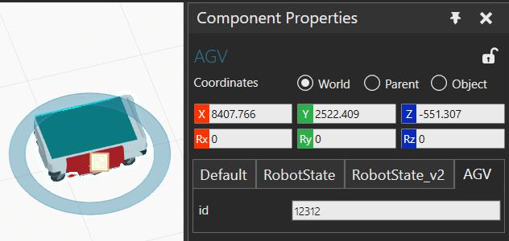
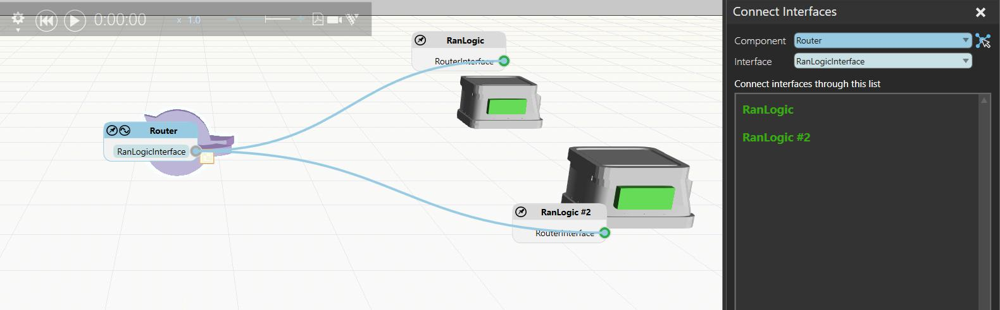
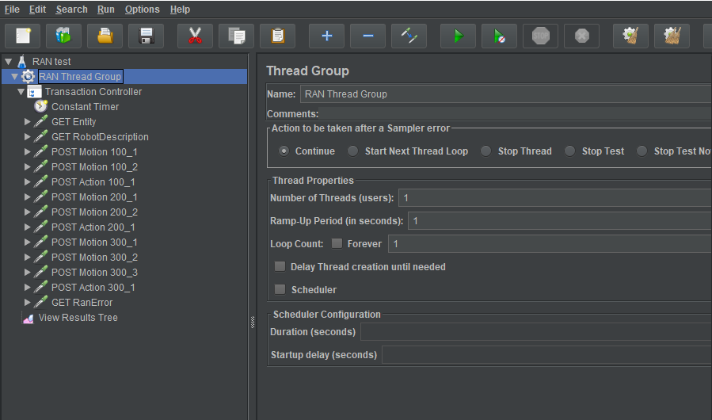

# VC-RAN

## 1 Introduction

The VC-RAN is the OPIL IoT Nodes layer module devoted to the control of the virtual robots. VC-RAN provides two main functionalities:
* it manages virtual robot navigation inside Visual Components simulation software
* it works as an interface between the virtual robots and the FIWARE Orion Context Broker (OCB) of the OPIL Cyber Physical Middleware layer.

## 2 Components and structure

Figure 1 presents the structure of VC-RAN.  The VC-RAN is composed of four simulation components:
* **AGV** Automated Guided Vehicle used in the simulation and controlled by OPIL. This component handles the movement tasks of the AGV. Note that this AGV is required if OPIL manages the AGV, meaning that simulated AGVs cannot be controlled by OPIL.
* **RanLogic** This component handles the messages between the Router and the AGV and the AgvAction components. Each AGV and AgvAction in the simulation requires one RANLogic component.
* **AgvAction** This component handles the action tasks of the AGV. Currently, three actions are supported (0,1,2). Action "1" is used for loading a part and "2" is for unloading it. Action "0" is a dummy action meant for tasks that do not include actions.
* **Router**  It routes the communication between the FIWARE Orion Context Broker (OCB) and RanLogic component. While for each AGV in the simulation layout one *AgvAction* and one *RanLogic* component are required, only one *Router* is required in the simulation to handle different AGVs.

Figure 1. Structure of VC-RAN.

## 3 Description of the Components in the Simulation
As mentioned previously, for each *AGV*, there is one *RanLogic* and one *AgvAction* connected through the *RanLogic* to the *Router*. One Router can support several AGVs (see section 4, Figure 7).
This organization of the VC-RAN has been created to maintain and update the components in the simulation faster, but it is expected that in the future versions the design will be simplified.

### 3.1 Router
The OCB messages are received and delivered by the *Router* into the simulation. The *Router* component handles messages, which are transmitted using signals and interfaces in the simulation layout, to the AGVs connected to the *OCB* through the *Router*.

Figure 2 shows the connections tab of the *Router*. *OCB IP* is the IP address of the *OCB*. Once the IP has been set up, test the connection and the create the entity by pressing *"Initialize OCB"*. When the component is removed, the entity can be deleted by pressing *"Delete OCB entity"*

Figure 2. Screenshot of the Router configuration properties tab.

### 3.2 RanLogic
The *RanLogic* component filters the messages according to the robot id of the *AGV*. *RanLogic* stores the data (motion and action assignments) to data structures based on the task id and receive time and handles the data delivery to the *AGV* (motion assignments) and *AgvAction* (action assignments). Robot id for the *RanLogic* can be set in the *RanLogic* properties tab (see Figure 3)

Figure 3. Screenshot of the RanLogic configuration properties tab, AGV ID.

*RanLogic* also maintains data structures for completed and cancelled tasks as well as for task variables such as current and last motion and action.

*RanLogic* sends the following messages:
* "Description message" every minute to *Router*, which delivers the message as is to OCB.

* *AGV* sends "Current motion message" every second via *RanLogic* to *Router* which delivers it to OCB.

* *AGV* and *AgvAction* components send a message after every completed assignment to *RanLogic*, which the *RanLogic* uses to update its data structures, task variables and state.

#### 3.2.1 Task handling (AgvAction and AGV)
Tasks are executed in the order they are received. When a motion or action assignment with a particular task id is first received, it is inserted into a data structure together with timestamp. Collectively, they form the task queue. Received tasks are executed in the order of ascending timestamp value. Robot motion planning and  action execution begins immediately after receiving first assignment message for the task with the lowest timestamp value. All the motion assignments belonging to the same current task are sent to the AGV one by one. After all the motion assignments are completed, action assignments belonging to the current task are sent to the AgvAction component one at a time. The task is completed when all the action assignments have been carried out.

#### 3.2.2 State machine
*RanLogic* is always in one of the finite states specified in Figure 4. Starting state is state-waiting, which changes to state-task after new task is received. When the first motion assignment belonging to the current task has been received, the state changes to state-motion and RanLogic will start sending motion assingments to the AGV. After all the motion assignments have been completed and the first action assignment belonging to current task has been received, state changes to state-action. In this state, RanLogic sends action assignments one by one to the AgvAction component until all the assignments are completed and RanLogic returns to state-waiting.

Figure 4. RanLogic state machine.

### 3.3 AgvAction
This component handles the action tasks of the AGV. Currently, the following actions are supported:
* 5 Dummy action used for task that does not include actions
* 10 Loading parts action
* 20 Unloading parts action

### 3.4 AGV
The identification of the AGV is unique and is determined by an ID. This ID can be set in the AGV properties tab (See Figure 5). The ID of the *AGV* should be the same as the *RanLogic* to ensure that the movement messages are delivered to the AGV. (Figure 5)

Figure 5. Screenshot of the AGV configuration properties tab, AGV ID.

Currently, in the VC-RAN demo an AGV interpolator component called *"AGV"* is used. This AGV interpolates positions between waypoints transmitted through *OCB*.

### 3.5 VC-RAN components deployment
In order to facilitate the deployment of the simulation of VC-RAN related components, two components are provided: *Router* and *AGV*, which contain the *AGV*, the *AgvAction* and the *RanLogic*.
When using the *AGV* it is required to check during the configuration that the *AGV* and the *RanLogic* have the same robot id.

## 4 Setup
Adding VC-RAN components to the simulation follows the same logic as creating a simulation in Visual Comnponents. Components available in the *eCat* can be picked and placed in the simulation.

As previously indicated, in order to ease the creation of the simulation, *AGV*, *AgvAction* and *RanLogic* have been deployed as a single component, *AGV*.
Pick and place the *Router* component in the simulation and place the required "AGV Intepolator" components.
Under the connections tab in the *Router*, as shown in Figure 2, set the Host IP to point to the IP of the OCB. Connect the *Router* component to every *RanLogic* component interface by joining *RanLogic* and *Router* interfaces as shown in Figure 6.

Figure 6. Screenshot of the connection of the *Router* with several *AGVs* through the *RanLogic*.

Don't forget to check that the robot id in the *RanLogic* is the same as that in the *AGV* and the new configuration is ready to be tested.

## 5 VC-RAN Demo Layout
A demo layout is provided at eCat for testing purposes. The demo layout (VC-RobotAgentNode_Demo) contains a basic production layout. In the simulation, one part is produced in one side of the layout. An AGV controlled through OPIL is called when the part produced is ready and waypoints are provided to move the part from one side to another where the simulation continues.

In the demo layout, there are three tasks which are executed in sequence. First task includes two motion assignments and one action assignment: the AGV moves next to a conveyor through two points and loads a part. Then the AGV moves through two points next to the other conveyor and unloads the part on the conveyor. Finally, the AGV returns to its initial location through three points. This is followed by an empty dummy action to signal the end of the task. The collection of task assignments for the demo is provided as part of a JMeter file (VC_RAN_v2_demo.jmx).

Testing the demo layout:
1. Start the *OCB*
2. Open RobotAgentNode_Demo layout.
   1. Select the *SAN* component and under the connections tab set the Host IP to point to the IP of the *OCB*.
   2. Check that the connection to the *OCB* is working by clicking the *“Test connection”* button. Message *“Connection OK”* is printed to the output window if *OCB* is running and the IP was set correctly
   3. Initializethe *FCB* by clicking *“Initialize OCB”*. This creates an empty rosmsg entity.
3. Open *VC_RAN_v2_demo.jmx* in JMeter. Select (left click) *VC_RAN* test in the menu on the left, and change correct values for variables Fiware Orion Context Broker IP (OCB_IP) and hosting computer IP address (HOST_IP)
4. Start (run) the Visual Components demo simulation
5. To start sending assignments to OCB in JMeter, click Run in the menu up top, and then Start in the dropdown menu.
6. Double click VC_RAN test in JMeter to open the hierarchical menu. To view results of the sent requests, click the View Results Tree (Figure 7).

Figure 7. Screenshot of the Jmeter.

## 6 Potential future improvements
The work in the VC-RAN continues as the entities are updated in the documenation. Features currently missing include:
* Cancelling assignments and tasks
* Error messages not implemented (not defined)
