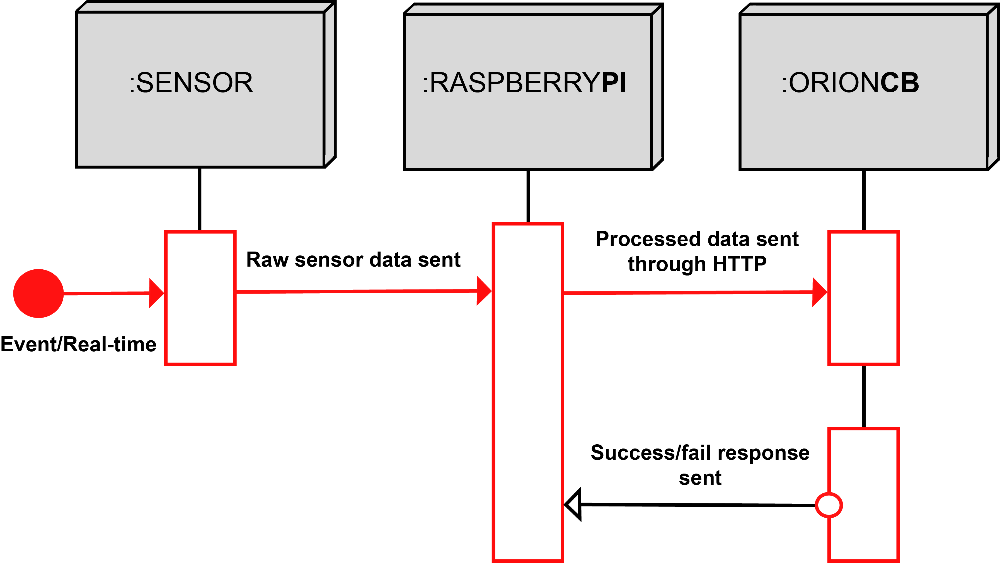

# Introduction Sensor Agent Node (SAN)

This is the Sensor Agent Node documentation! 
Here you will find everything you need to set-up, configure and run the Sensor Agent Node, either via cloning the source code from Git, or using a convenient Docker container.

## Overview SAN
Sensor Agent Node (SAN for short) is one of the modules in IoT layer defined by [OPIL](http://project.l4ms.eu/OPIL-Documentation) architecture. It is responsible for connecting various sensors to OPIL and providing data about them to [Orion Context Broker](https://fiware-orion.readthedocs.io/en/master).

*Figure 1: Simplified working principle of SAN*

*Figure 2: Sequence diagram with Raspberry Pi as an example*

Before proceeding make sure you have [Orion Context Broker](https://fiware-orion.readthedocs.io/en/master) installed and running.

If you intend to run SAN as a container, make sure you have you have [Docker](https://docs.docker.com/install/linux/docker-ce/ubuntu/) installed.

## Current version features:

* Plug'n'play for digital sensors
* Non-complex configuration
* Automatic conversion of non-standard units(standard: meters, radians), and units with prefixes
* Data visualisation using the OPIL Human Machine Interface node
* Three configurable modes for submitting the data: event-driven, time-series, fixed-interval
* Supports Revolution Pi and Raspberry Pi devices
* Supports USB devices

## Where should you start?

In order to start working with SAN you should simply follow the documentation, firstly installing the SAN code or the Docker container following **Installation** and configuring SAN according to **Getting Started**. There is also a very quick starting guide available in the Docker Hub description area. For extended information on **Drivers** and the **Configuration File**, refer to the API documentation SAN section.

