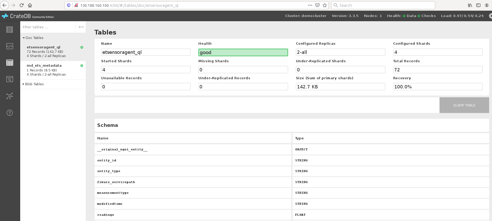
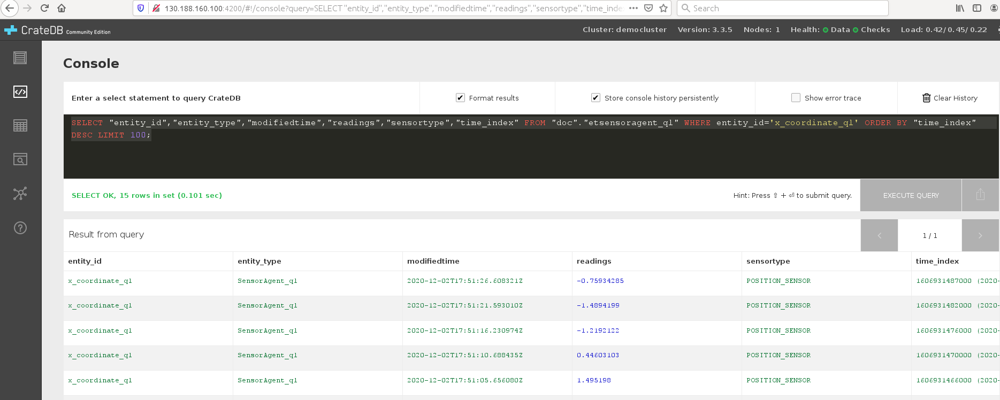
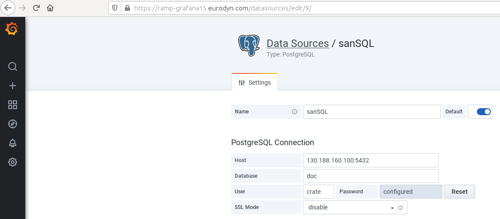
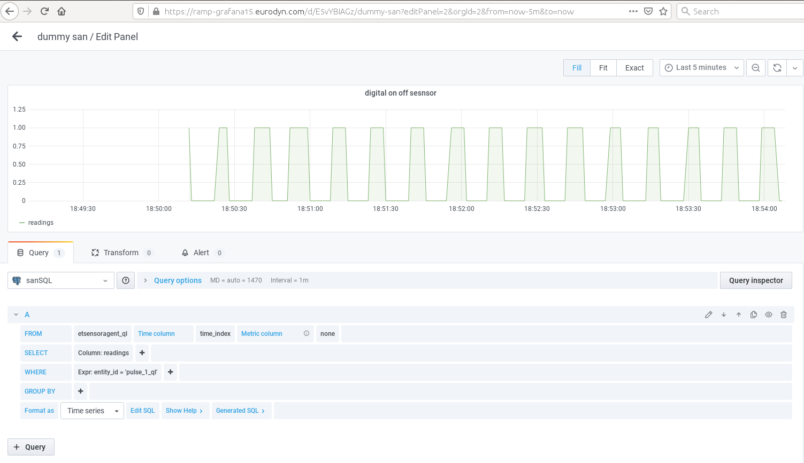

# Connection of SAN to Grafana in RAMP

The goal is to visualize the sensor data in **Grafana** in **RAMP**. By starting SAN, and also VC-SAN and HMI-SAN entities with type **SensorAgent** are created in OCB.
By creating subscriptions for **QuantumLeap** and **Crate**, it is possible to visualize the real data in **Grafana** in **RAMP**. This guide will explain how this can be done with the simulated sensor.


Data format from SAN has NGSI entities not readable by FIWARE **QuantumLeap**.
See, for example, [digitalsensor.json](files/digitalsensor.json), which has id **pulse_1** and an array as a type of reading.

FIWARE QuantumLeap has a specific format that it "understands". To make use of QuantumLeap and software like Grafana, a translator is needed to convert these entities using the SAN PROXY: <https://hub.docker.com/r/sejego/ql_san_proxy> 

The SAN PROXY will create entities with a *_ql* postfix in entity id and entity type. For example, previously defined **pulse_1** will have a new entity with the right form for **QuantumLeap**. See for example [digitalsensorforquantumleap.json](files/digitalsensorforquantumleap.json), which has id **pulse_1_ql**, and a Number as a type of reading.

In the following, a guide will show how to connect one digital and two analog demo sensors. The OCB is running on the server computer which has the external IP address and is allowed to open port 5432 for Grafana. On the same computer **QuantumLeap** and **Crate** will be started, and SAN PROXY, while SAN will be started on the local computer (no external IP is required).

## Guide for starting a demo sensor

Download the files for creating the demo sensor and put it into the folder **sandemo**:

* [config.json](files/sandemo/config.json)
* [docker-compose.yaml](files/sandemo/docker-compose.yaml)
* [Dockerfile](files/sandemo/Dockerfile)
* [PulseDriver.py](files/sandemo/PulseDriver.py)
* [TrajectoryDriver.py](files/sandemo/TrajectoryDriver.py)

Edit **config.json** and change the IP address to the computer running the OCB.

Build the sensor (this is needed only for the first time) by cd into the **sandemo** folder:
```
docker-compose build
```

Start the demo sensor:
```
docker-compose up
```

You should be able to see three sensors: **pulse_1**, **x_coordinate** and **y_coordinate** (as here: [entities.json](files/entities.json)) in <http://OCB_IP:1026/v2/entities/>.

## Guide for connection of demo sensor with QuantumLeap and Crate

On the computer with the OCB running prepare the SAN PROXY, **QuantumLeap** and **Crate**. 

Download the following files and save into the folder **sanproxy**:

* [config.json](files/sanproxy/config.json)
* [docker-compose.yaml](files/sanproxy/docker-compose.yaml)
* [Dockerfile](files/sanproxy/Dockerfile)
* [post_subscription_san.sh](files/sanproxy/post_subscription_san.sh)

Edit **config.json** and **post_subscription_san.sh** and change the IP address to the computer running the OCB.

Build the SAN PROXY (this is needed only for the first time) by cd into the **sanproxy** folder:
```
docker-compose build
```

Start the SAN PROXY:
```
docker-compose up
```
Create the subscription by executing the script:
```
bash post_subscription_san.sh
```
By this, the subscription is created for all SANs.
Check the entities, where additional three entities needs to be created with *_ql* postfix, as, for example, in [entitiesql.json](files/entitiesql.json).

For starting **QuantumLeap** and **Crate** prepare the following **docker-compose-quantumleap-cratedb.yml** file:
```
version: "3.5"
services:
  # Quantum Leap is persisting Short Term History to Crate-DB
  quantumleap:
    image: smartsdk/quantumleap:0.7.6
    logging:
      driver: "json-file"
      options:
        max-size: "200k"
        max-file: "10"
    hostname: quantumleap
    container_name: fiware-quantumleap
    ports:
      - "8668:8668"
    depends_on:
      - crate-db
    environment:
      - CRATE_HOST=crate-db

  crate-db:
    image: crate:3.3
    hostname: crate-db
    container_name: db-crate
    ports:
      # Admin UI
      - "4200:4200"
      # Transport protocol
      - "4300:4300"
      - "5432:5432"
    command: crate -Cdiscovery.type=single-node -Clicense.enterprise=false -Cauth.host_based.enabled=false  -Ccluster.name=democluster -Chttp.cors.enabled=true -Chttp.cors.allow-origin="*"
    volumes:
      - crate-db:/data

volumes:
  crate-db: ~
```

Start the QuantumLeap and Crate by typing in terminal:
```
docker-compose -f docker-compose-quantumleap-cratedb.yml up -d
```
To have a clean restart type:
```
docker-compose -f docker-compose-quantumleap-cratedb.yml down -v
```
To see if there are any issues or warnings type:
```
docker logs db-crate
```
If you have a warning similar to:
```
[2020-05-05T12:24:10,322][WARN ][o.e.b.BootstrapChecks    ] [Monte Civrari] max virtual memory\
 areas vm.max_map_count [65530] is too low, increase to at least [262144]
```
increase the virtual memory warning by typing in terminal:
```
sudo sysctl -w vm.max_map_count=262144
```
To make the above setting permanent perform the following steps:

1. edit the file /etc/sysctl.conf
2. make entry vm.max_map_count=262144
3. restart

Prepare the following script **post_subscr_san.sh** to post subscriptions:
```
curl --location --request POST 'http://localhost:1026/v2/subscriptions/' --header 'Content-Type: application/json' --data-raw '{
  "description": "Notify QuantumLeap of all sensor changes",
  "subject": {
    "entities": [
      {
        "idPattern": ".*",
        "type": "SensorAgent_ql"
      }
    ],
        "condition": { "attrs": [] }
  },
  "notification": {
    "http": {
      "url": "http://130.188.160.100:8668/v2/notify"
    },
        "attrs": [],
    "metadata": ["dateCreated", "dateModified"]
  }
}'
```
where IP address needs to be set to the one with OCB running. Notice that the **type** is the one created by SAN PROXY.

Start the script by typing in terminal:
```
bash post_subscr_san.sh
```
Check if data in CrateDB are visible at port 4200 on the computer with OCB running, for example, <http://OCB_IP:4200>.

There should exist a Table similar to this picture:



You can query the table by pressing the query button in the Tables tab, or you can edit the query in the Console tab, for example:
```
SELECT "entity_id","entity_type","modifiedtime","readings","sensortype","time_index" FROM "doc"."etsensoragent_ql" where entity_id='x_coordinate_ql' order by "time_index" desc LIMIT 100;
```
The page with CrateDB and query result should be similar to this picture:



Notice the name of the table from the query, which is **doc**, while in the first screenshot it is **Doc** (misleading). Both **doc** and **etsensoragent_ql** are important for the following guide.

## Guide for connection of QuantumLeap and Crate to Grafana in RAMP

Useful link when connecting Grafana to QuantumLeap and Crate can be found here: <https://quantumleap.readthedocs.io/en/latest/admin/grafana/>. 

First, add the postgressSQL Data Source. You must put the name of the table to the one visible in CrateDB. Put the external IP address of the computer with QuantumLeap and put port 5432. This port needs to be open to outside connections. The example input for the previously described database is here:
```
Name: sanSQL
Host: 130.188.160.100:5432
Database: doc
User: crate
SSL Mode: disable
```
This data can be read from this screenshot:


Now, a new dashboard can be created, for example, dummy san. Click on Add pannel to add a time series data. Select the new database in the Query dropdown menu. We named it sanSQL when adding data source, and it should be selected here. This screenshot shows the creation of a time series graph:

Notice **etsensoragent_ql** in FROM field, and **time_index** in Time column, and **readings** in SELECT Column, where special condition WHERE is used for entity_id='pulse_1_ql' which presents only digital sensor. There should appear a time series right after the correct entry.


