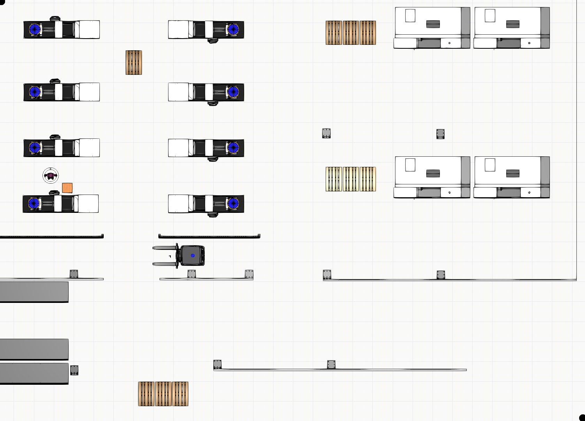
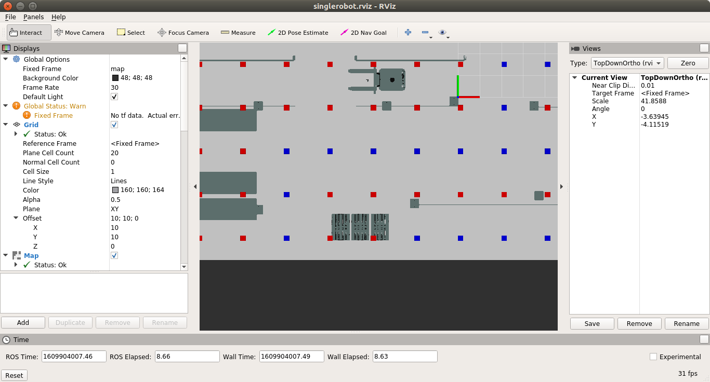
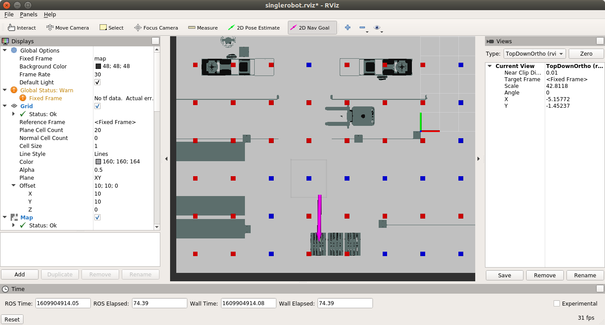
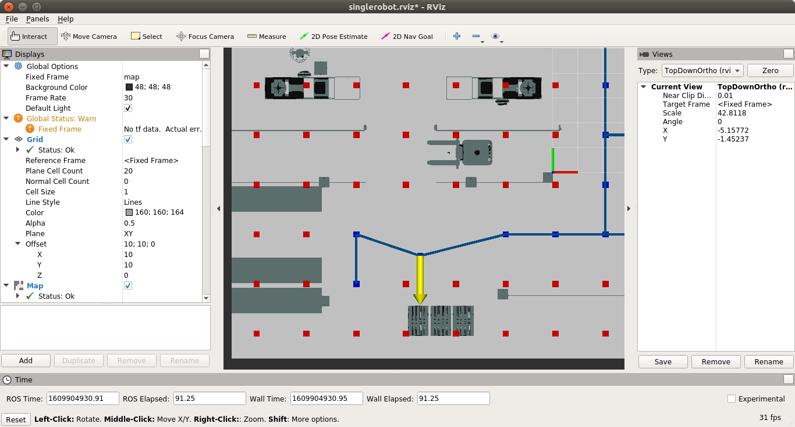
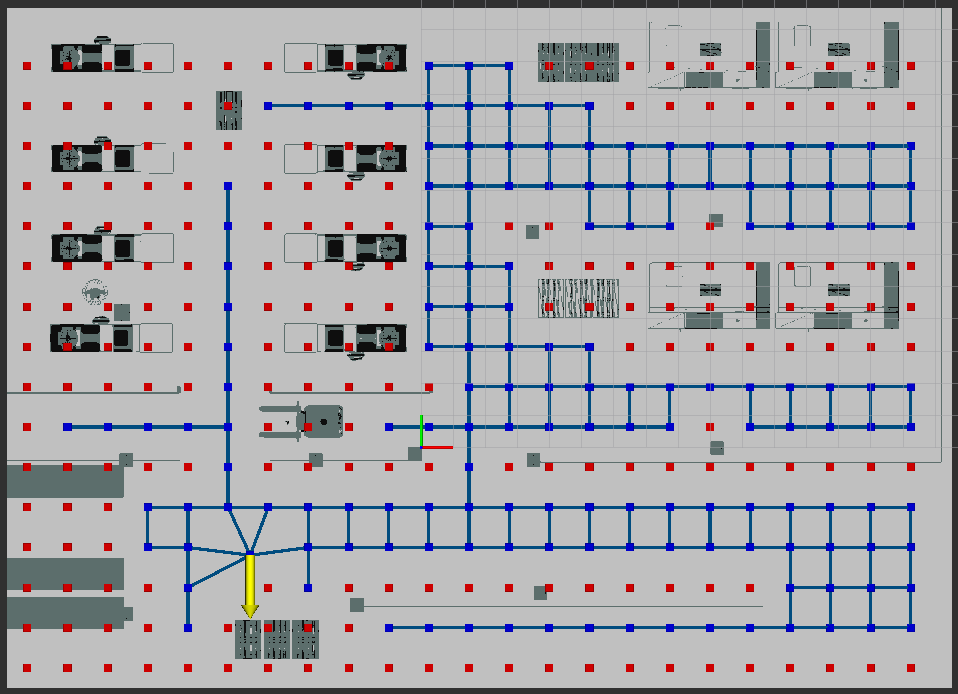
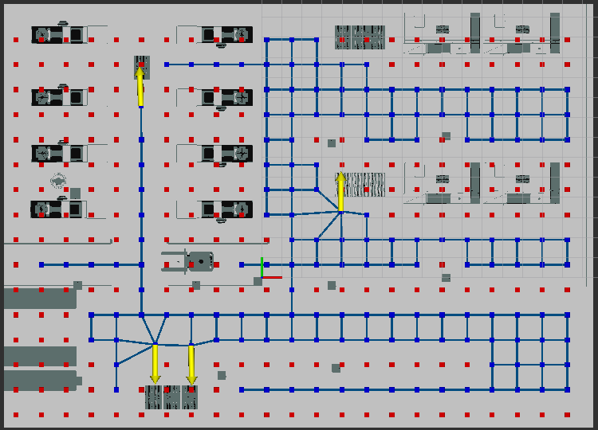
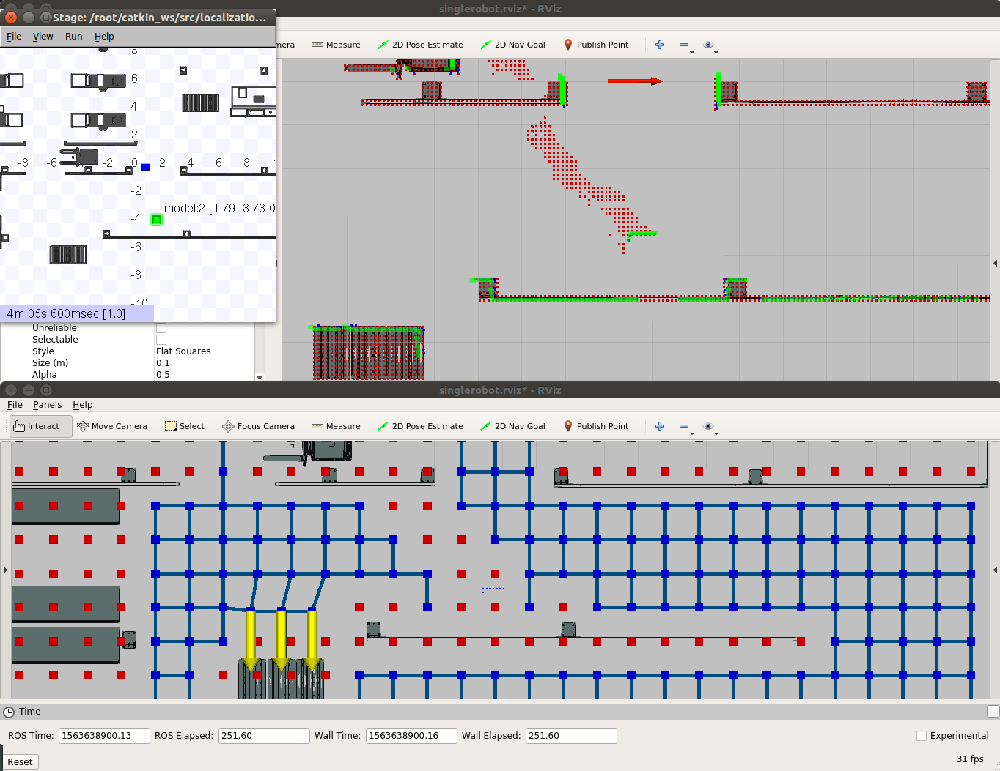
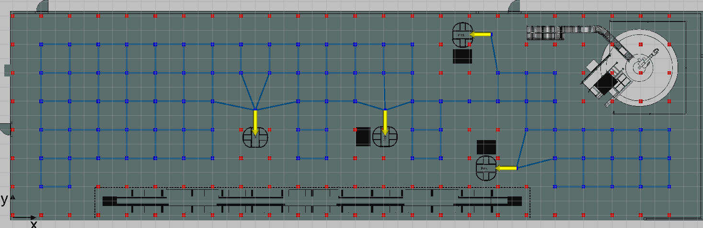

# <a name="CentralSPInstallation">Central SP Installation</a>

There are two ways of installing the SP module. You can use the docker containers or compile it from the source.


## Install from Docker Container

There are two docker containers - the Central SP and the Local SP.
The Central SP is located at 
<https://docker.ramp.eu/?page=1#!taglist/opil/opil.sw.sp.central>

### The Central SP docker 


To install it you need to prepare a docker-compose.yml following this example:
### <a name="dockercompose">docker-compose.yml</a>

```
version: "3"
services:      
    mongo:
        image: mongo:3.6
        command: --nojournal

    ### Proxy for Context Broker ###
    ngsiproxy:
        image: fiware/ngsiproxy:latest
        ports:
            - 3000:3000

    ### Context Broker ###
    orion:
        image: fiware/orion:2.3.0
        depends_on:
            - mongo
            - ngsiproxy
        ports:
            - 1026:1026
        command:
            -dbhost mongo -corsOrigin __ALL -inReqPayloadMaxSize 2097152
#S&P
    sp:
        restart: always
        image: docker.ramp.eu/opil/opil.sw.sp.central:3.1.6
        volumes:
            #- path on the host : path inside the container
            - /tmp/.X11-unix:/tmp/.X11-unix:rw
        volumes:
            #- path on the host : path inside the container
            - /tmp/.X11-unix:/tmp/.X11-unix:rw
#comment the line below if you want to create annotations from scratch
            - ./annotations.ini:/annotations.ini:ro
#the file must exist on the host computer in the local folder otherwise it creates an empty folder with that name
            - ./annotations.ini:/root/.ros/annotationsRviz.ini:rw
            - ./floorplan.yaml:/map.yaml:ro
            - ./floorplan.png:/map.png:ro
            - ./topology.launch:/topology.launch:ro
        environment:
            - FIWAREHOST=orion
            - HOST=sp
            - DISPLAY=$DISPLAY
        ports: 
            - "39002:39002"
```
In this example is assumed that all services are on the same host computer (localhost). If the Orion is started on another computer, then the environment variable of sp needs to have changed FIWAREHOST to the IP address of that computer. Furthermore, HOST needs to be changed to the IP address of the host computer running the Central SP.

When using the Central SP on big floorplans the parameter ***inReqPayloadMaxSize*** can be set to increase the maximal allowed size of any outgoing request messages. Setting it to 2097152 Bytes (2MB) should be enough for an average map with 30% occupied space with dimensions 65 m x 35 m and the resolution of the topology **cell_size** = 1 m. This setup requires 1327391 Bytes, while, by decreasing the **cell_size** to 0.5, requires 6687765 Bytes (approximately 4 times more). A similar increase rate happens if the map's width and height are doubled in size, for example, 130 m x 70 m, with the **cell_size** = 1 m will require 6682759 Bytes (also 4 times more).


First, set up the display for viewing the RViz visualization and Stage:
```
xhost local:root
```
This needs to be called only once.
Then, start all the services from the folder where you put your docker-compose.yml file by typing:
```
sudo docker-compose up
```
To check if everything is working properly follow the guide [Starting from Docker - Central SP.](#fromdocker)


## Install from Scratch 

To install Firos v2:

```git clone -b v0.2.0 --recursive https://github.com/iml130/firos.git```


Install ROS packages:

```sudo apt-get install ros-$ROS_DISTRO-navigation```

```sudo apt-get install ros-$ROS_DISTRO-gmapping```

```sudo apt-get install ros-$ROS_DISTRO-teleop-twist-keyboard```

Supported $ROS_DISTRO are melodic and kinetic.

Install from SourceCode:

* put all ROS packages of Sensing and Perception to the src folder of your catkin workspace or create a new one by typing catkin_init_workspace in the src folder. Then compile it with catkin_make in one folder up.
```
cd ..
catkin_make
```
To check if everything is working properly follow the guide [Starting from Scratch.](#fromscratch)

# SP Server Start Guide

<!--Before starting the Central SP module follow the [Install guide](#CentralSPInstallation).-->


In the following, two different start options will be described, based on the installation process from the docker containers or scratch.


## <a name="fromdocker">Starting from Docker - Central SP</a>

Remove all files from volumes section to see a default behavior of sp service in [docker-compose.yml](#dockercompose) file as follows:
```
    sp:
        restart: always
        image: docker.ramp.eu/opil/opil.sw.sp.central:3.1.6
        volumes:
            #- path on the host : path inside the container
            - /tmp/.X11-unix:/tmp/.X11-unix:rw
        environment:
            - FIWAREHOST=orion
            - HOST=sp
            - DISPLAY=$DISPLAY
        ports: 
            - "39002:39002"
        depends_on:
            - orion
```

Then, open a terminal and navigate into the folder with your docker-compose.yml file and type:
```
xhost local:root
sudo docker-compose up
```

This docker container starts the creation of a topology graph from the given map file and with included annotations from the annotation file. As a default, no map is loaded and the following message will appear in the terminal:
```
sp_1     | please insert a floorplan.png and floorplan.yaml file to begin!
sp_1     | in your docker-compose.yml put under volumes:
sp_1     |             - ./floorplan.yaml:/map.yaml:ro
sp_1     |             - ./floorplan.png:/map.png:ro
opilserver_sp_1 exited with code 0
```

### <a name="prepmap">Setting the map</a>

Two files need to be prepared and put under **volumes** in [docker-compose.yml](#dockercompose): 

*	`floorplan.yaml`
*	`floorplan.png` 

Right now in this docker container, only PNG file is supported. Export your floorplan layout to PNG. 
Here is an example of `floorplan.png`:



Then, you need to set up parameters for transforming the PNG file into a map with the origin and dimensions in meters. This needs to be prepared in the `floorplan.yaml`. Here is an example:
```
#floorplan.yaml
image: map.png
resolution: 0.0196
origin: [-12.8854, -7.4888, 0.0] #HMI pixel origin is 657, 382, while meters are calculated as 12.8854=0.0196*657, 7.4888=0.0196*382
negate: 0
occupied_thresh: 0.65
free_thresh: 0.196
```
where

* the image name is `map.png` by which your `floorplan.png` is overwritten on the docker side
* **resolution** defines the size of the pixel of the png file in meters. To calculate the resolution, you need to know the width of the image in meters. Then, simply divide the width in meters with the width in the number of pixels. 
* **negate** can inverse the free-occupied values if set to 1
* **occupied_thresh** and **free_thresh** define the thresholds that tell which brightness level should be considered as occupied and free, respectively. 
* **origin** is the (x,y,z) vector in meters describing the lower-left corner. With (0,0,0) the origin will be in the lower-left corner. If the origin is somewhere inside the map, the origin coordinates will always have a negative sign, since they represent the coordinates of the lower-left corner.

The files `floorplan.yaml` and `floorplan.png` need to be in the folder where you put your docker-compose.yml. Additionally, put empty textual `annotations.ini` file in the same folder since this is the output file of the running SP container. Add the following lines in **volumes** section in the docker-compose.yml:
```
        volumes:
            #- path on the host : path inside the container
            - /tmp/.X11-unix:/tmp/.X11-unix:rw
#the file must exist otherwise it creates empty folder with that name
            - ./annotations.ini:/root/.ros/annotationsRviz.ini:rw
            - ./floorplan.yaml:/map.yaml:ro
            - ./floorplan.png:/map.png:ro
```
where on the left side from `:` is the file in your folder on the host computer, while on the right side from `:` is the file inside the SP docker container. Do not change the names on the right side of `:` ever!
Start the SP docker container by typing:
```
sudo docker-compose up
```
This is the result:
 
 

We can see the red and blue squares representing the occupancy gridmap with regularly placed occupied and free cells, respectively. Each cell is a square of edge size equals 2m, where blue and red marks note the center of the squared cells. If the obstacle is located inside the gird cell this cell is marked as occupied. The origin is presented with red (x-axis) and green line (y-axis). Reading the output from the terminal we can see the number of vertices and edges is 0 for the topology graph:
```
sp_1         | annotations[]
sp_1         | 
sp_1         | number of vertices: 0
sp_1         | number of edges: 0
sp_1         | [ WARN] [1609903998.943443025]: No annotations yet! Add new annotation by pressing the 2D Nav Goal button in RViz and select the position and hold to select the orientation of the goal!
```

To have a topology graph we need to have at least one annotation in the free space, which is used as the goal position for the Task Planner. Annotations can be added through RViz. To zoom in/out the RViz window use mouse scroll, to translate the view press the shift key and mouse button at the same time and drag in any direction. Pres the **2D Nav Goal** button and select the position and hold to select the orientation of the annotation. Release to apply.

The selection of annotations looks as follows:


where you need to select the point inside the free cell. For reference, one cell is marked grey where the annotation is selected. All blue and red squares note only centers of the grid cells. If you select somewhere inside the occupied cell the annotation will not be stored and the output is similar to this:
```
sp_1         | [ WARN] [1609904877.599453701]: Annotation is occupied!!! Deleting occupied annotation... Change the coordinates or exit and edit manually annotations.ini file or decrease the cell size. Here are the details:
```

After releasing the mouse button the topology is calculated and the result is as follows:



The output is our first annotation which is also saved into the annotations.ini file on the host computer:
```
sp_1         | number of vertices: 36
sp_1         | number of edges: 37
sp_1         | New selected annotation:
sp_1         | 
sp_1         | x: -5.32123
sp_1         | y: -5.35605
sp_1         | theta: -90
sp_1         | distance: 2
sp_1         | name: location_0
sp_1         | uuid: 89e75776-cb28-5de4-be65-85b42cd79dc0
```
The calculated topology is now visible with lines representing edges connecting vertices. Vertices are by default at the centers of the free cells, except for the annotation vertex, where it can be moved anywhere within its squared grid cell. Now, more red squares are marked occupied although there is no obstacle inside, but can not be reached from the annotation coordinates according to transitions through topology graph edges.

On in your local folder check the `annotations.ini` file which should have the same data as printed in the terminal:

```
[location_0]
point_x = -5.32123
point_y = -5.35605
theta = -90
distance = 2
```
where the coordinates **point_x**, **point_y** are at the head of the yellow arrow, **theta** is the orientation of the arrow in degrees, and **distance** is the length of the arrow, or the distance from the topology vertex to the desired place (loading, unloading, etc.).
You should see the entities in, e.g. firefox, at the address <http://localhost:1026/v2/entities>. There should be a topic `/map/graph` which is the input topic to the Task Planner and HMI, and the topic `/map/annotations` used by the HMI.

We can stop the docker and modify the volumes section to have the same as in [docker-compose.yml](#dockercompose) to include the newly created `annotations.ini` file as input for the docker so that we can continue with the same annotation later:
```
#comment the line below if you want to create annotations from scratch
            - ./annotations.ini:/annotations.ini:ro
```


### Setting the topology cell_size

It can be seen that in this example for the default cell size equals 2m the topology vertices are too rare and we are missing some of them in narrow passages since they are marked as occupied. In the following, we will change the size of the grid cell so that we do not miss topology nodes in the passages between the racks. However, the cell size should be set according to the robot's footprint which can be drawn inside the cell without intersecting the cell edges. In this example map, the passage is 2.5 m wide, which means the size of the cell size should be half of it to include the worst case of the alignment of passages with the grid.
To change the size of the grid cell for calculating the topology, prepare the `topology.launch` file as follows:

### <a name="topologylaunch">topology.launch</a>
```
<launch>
<node name="map_server" pkg="map_server" type="map_server" args="$(find maptogridmap)/launch/map.yaml" respawn="false" >
<param name="frame_id" value="/map" />
</node>
<node name="rviz" pkg="rviz" type="rviz" args="-d $(find maptogridmap)/singlerobot.rviz" /> 
<node name="map2gm" pkg="maptogridmap" type="map2gm" required="true" output="screen">
        <param name="cell_size" type="double" value="1.25" />
        <param name="annotation_file" textfile="$(find maptogridmap)/launch/annotations.ini" />
</node>
    <!-- Run FIROS -->
    <node name="firos" pkg="firos" type="core.py" />
</launch>
```
where the **cell_size** is set to 1.25 m, while the default value, when `topology.launch` file is not used, is 2.0 m. 
To use the created topology.launch put it next to the docker-compose.yml file and include it under the volumes section as used in the first [docker-compose.yml](#dockercompose).

This is the result for changing the parameter **cell_size** to 1.25 m:



The output in the terminal is now:
```
sp_1         | All annotations from the annotations.ini file are valid! You can add more annotations by pressing the 2D Nav Goal button in RViz and select the position and hold to select the orientation of the goal!
```
We can continue to select annotations as desired. 

### <a name="prepannt">Setting the annotations</a>

Let's select three more annotations as shown in this picture:



The newly created `annotations.ini` file now looks like this:
```
[location_0]
point_x = -5.32123
point_y = -5.35605
theta = -90
distance = 2

[location_1]
point_x = -3.48547
point_y = -5.40986
theta = -88.6361
distance = 2

[location_2]
point_x = -6.1071
point_y = 10.5638
theta = 92.0454
distance = 2

[location_3]
point_x = 3.94872
point_y = 5.30657
theta = 90
distance = 2
```

We can change it to have different annotation's names, for example by changing the name inside the `[]` brackets:

```
[W1]
point_x = -5.32123
point_y = -5.35605
theta = -90
distance = 2

[W2]
point_x = -3.48547
point_y = -5.40986
theta = -88.6361
distance = 2

[W3]
point_x = -6.1071
point_y = 10.5638
theta = 92.0454
distance = 2

[MoldingPallet]
point_x = 3.94872
point_y = 5.30657
theta = 90
distance = 2
```
where

* **W1**, **W2**, **W3**, **MoldingPallet** are the annotation labels that must be put inside `[]` and should consist only of a combination of letters, numbers, and _ (underscore)
* **point_x**, **point_y** are coordinates of the annotation in meters
* **theta** and **distance** determine where the topology vertex should be so that Task Planner can use these coordinates as the goal distanced for a defined **distance** (in meters) from the annotation and oriented towards the annotation so that AGV has heading **theta** (in degrees) with respect to the positive x-axis. 

We can change any parameter but the most important is to calculate the right position for the topology vertex, where an AGV will be placed in front of the annotation by setting the right distance, and orientation from the annotation coordinates. In the following we will see 6 invalid situations in case of which annotations will be modified or deleted automatically:

* the annotation must not be in the occupied grid cell
* the annotation must not be out of map borders
* any two annotations must not be distanced closer than **cell_size**
* any two annotations must not be placed into the same grid cell
* annotations must not have an illegal character in their name
* any two annotations must not have the same name


If we change the distance of **W3** to 1 this annotation will produce a topology vertex inside the occupied cell. As a result, that annotation will be deleted with the print of the occupied annotation:

```
sp_1         | x: -6.1071
sp_1         | y: 10.5638
sp_1         | theta: 92.0454
sp_1         | distance: 1
sp_1         | name: W3
sp_1         | uuid: c825ba97-2dc3-5f57-b23e-9cdc041d23bf
sp_1         | 
sp_1         | [ WARN] [1609914366.115720685]: Annotation is occupied!!! Deleting occupied annotation... Add new annotation by pressing the 2D Nav Goal button in RViz or exit and edit manually annotations.ini file or decrease the cell size. Here are the details:
sp_1         | The vertex of the annotation in the topology graph is at the occupied position (-6.071409,9.564437) for the cell_size = 1.250000 m.
```

If we choose the new annotation (or have it written in the annotations.ini file) out of the map borders the produced indices of topology vertex will have negative sign. As a result, that annotation will be deleted with the print of the invalid annotation:
```
sp_1         | x: -5.4862
sp_1         | y: -9.40014
sp_1         | theta: 0
sp_1         | distance: 2
sp_1         | name: location_4
sp_1         | uuid: 50f07029-8249-54f1-adc0-90a04a734563
sp_1         | 
sp_1         | [ WARN] [1610166233.325708317]: Annotation is out of map borders!!! Deleting invalid annotation... Change the coordinates or exit and edit manually annotations.ini file or decrease the cell size. Here are the details:
sp_1         | The vertex of the annotation in the topology graph is out of map borders with negative indices (4,-2)
```

For the Task Planner it is important that topology vertices are always distanced greater or equal to **cell_size**. If we move annotations **W1** and **W2** closer by changing the x coordinates to -5 and -3.9, respectively the annotation further in the list (**W2**) will be deleted and the new one can be added as is explained in this message:

```
sp_1         | [ WARN] [1609914691.798372432]: Annotations are too close!!! Deleting this annotation... Change the coordinates of the annotation or decrease the cell size. Here are the details:
sp_1         | The annotation W1 is too close to the annotation W2
sp_1         | x: -5
sp_1         | y: -5.35605
sp_1         | theta: -90
sp_1         | distance: 2
sp_1         | name: W1
sp_1         | uuid: 2ce6ce99-b600-5301-828d-8e1568ddf775
sp_1         | 
sp_1         | x: -3.9
sp_1         | y: -5.40986
sp_1         | theta: -88.6361
sp_1         | distance: 2
sp_1         | name: W2
sp_1         | uuid: 8aea17b9-be10-532c-885d-56a1c0bef332
sp_1         | 
sp_1         | The annotation W1 has the topology vertex at (-5, -3.35605 ), which is distanced for 1.0538(less than the cell_size = 1.25) from the topology vertex at (-3.9476, -3.41043 ) of the annotation W2
sp_1         | spanning tree size 0 neighbour tree size 160
sp_1         | number of vertices: 157
sp_1         | number of edges: 224
sp_1         | [ WARN] [1609914691.800894567]: Read the output carefully since some annotations from the file were deleted. Add new annotation by pressing the 2D Nav Goal button in RViz and select the position and hold to select the orientation of the goal!
```

If we change coordinates of **W1** and **W2** such that they are distanced more than the cell size but fall into the same grid cell, for example diagonally placed, then the annotation further in the list (**W2**) is deleted and the print message is as follows:
```
sp_1         | [ WARN] [1609915266.383094167]: Annotations fall into the same grid cell!!! Deleting this annotation... Change the coordinates of the annotation or decrease the cell size. Here are the details:
sp_1         | The annotation W1 is too close to the annotation W2
sp_1         | x: -5.2
sp_1         | y: -5.5
sp_1         | theta: -90
sp_1         | distance: 2
sp_1         | name: W1
sp_1         | uuid: 2ce6ce99-b600-5301-828d-8e1568ddf775
sp_1         | 
sp_1         | x: -4.2
sp_1         | y: -4.5
sp_1         | theta: -88.6361
sp_1         | distance: 2
sp_1         | name: W2
sp_1         | uuid: 8aea17b9-be10-532c-885d-56a1c0bef332
sp_1         | 
sp_1         | Both annotations fall into the same topology vertex at (6, 3 )
sp_1         | spanning tree size 0 neighbour tree size 160
sp_1         | number of vertices: 156
sp_1         | number of edges: 223
sp_1         | [ WARN] [1609915266.385821097]: Read the output carefully since some annotations from the file were deleted. Add new annotation by pressing the 2D Nav Goal button in RViz and select the position and hold to select the orientation of the goal!
```

OCB can not handle some special characters as the names of entities, and since the annotation labels are used in Task Planner it is necessary to check if each label contains allowed characters which are only letters, numbers and underscore. If annotation contains a character from the list of illegal characters: <>"'=;()+-* /#$&,.!:?@[]^`{|}~ it will be deleted. For example, if we change the annotation name **W2** to **W 2** (adding a space) this annotation will be renamed to **location_** followed by the index suffix and we will see a message like this:

```
sp_1         | [ WARN] [1609915498.633442035]: Annotation name contains an illegal character. Here are the details:
sp_1         | converting the map data to gridmap: cell size 1.250000, res=0.019600, width=1500, height=1080, xorigin=-12.885400, yorigin=-7.488800, size gridmap (23,16)
sp_1         | The annotation name "W 2" contains the illegal character " ".
sp_1         | Please name annotations only with a combination of letters, numbers and _ (underscore).
sp_1         | Do not use any character from the list of illegal characters: 
sp_1         | <>"'=;()+-* /#$&,.!:?@[]^`{|}~
sp_1         | Renaming to location_1
sp_1         | header: 
sp_1         |   seq: 0
sp_1         |   stamp: 0.000000000
sp_1         |   frame_id: 
sp_1         | annotations[]
sp_1         |   annotations[0]: 
sp_1         |     x: -5.32123
sp_1         |     y: -5.35605
sp_1         |     theta: -90
sp_1         |     distance: 2
sp_1         |     name: W1
sp_1         |     uuid: 2ce6ce99-b600-5301-828d-8e1568ddf775
sp_1         |   annotations[1]: 
sp_1         |     x: -3.48547
sp_1         |     y: -5.40986
sp_1         |     theta: -88.6361
sp_1         |     distance: 2
sp_1         |     name: location_1
sp_1         |     uuid: de304190-e4ac-5022-a966-b83ef58926e8
sp_1         |   annotations[2]: 
sp_1         |     x: -6.1071
sp_1         |     y: 10.5638
sp_1         |     theta: 92.0454
sp_1         |     distance: 2
sp_1         |     name: W3
sp_1         |     uuid: c825ba97-2dc3-5f57-b23e-9cdc041d23bf
sp_1         |   annotations[3]: 
sp_1         |     x: 3.94872
sp_1         |     y: 5.30657
sp_1         |     theta: 90
sp_1         |     distance: 2
sp_1         |     name: MoldingPallet
sp_1         |     uuid: 61138907-a6b7-5ee4-b1ff-e5faa5c942a7
sp_1         | 
sp_1         | [ WARN] [1609915498.634468739]: Read the output carefully since some annotations from the file were renamed due to illegal character or duplicate naming! Add new annotation by pressing the 2D Nav Goal button in RViz and select the position and hold to select the orientation of the goal!
sp_1         | spanning tree size 0 neighbour tree size 160
sp_1         | number of vertices: 155
sp_1         | number of edges: 222
sp_1         | All annotations from the annotations.ini file are valid! You can add more annotations by pressing the 2D Nav Goal button in RViz and select the position and hold to select the orientation of the goal!
```

Duplicate names are not allowed and in that case the name will be replaced with the default name **location_** followed by the index suffix. This message will give the details about the change:
```
sp_1         | [ WARN] [1609915754.914926029]: Two annotations have the same name! Names must be unique! Here are the details:
sp_1         | converting the map data to gridmap: cell size 1.250000, res=0.019600, width=1500, height=1080, xorigin=-12.885400, yorigin=-7.488800, size gridmap (23,16)
sp_1         | The annotation 2 has the same name as the annotation 1
sp_1         | x: -5.32123
sp_1         | y: -5.35605
sp_1         | theta: -90
sp_1         | distance: 2
sp_1         | name: W1
sp_1         | uuid: 2ce6ce99-b600-5301-828d-8e1568ddf775
sp_1         | 
sp_1         | x: -5.32123
sp_1         | y: -5.35605
sp_1         | theta: -90
sp_1         | distance: 2
sp_1         | name: W1
sp_1         | uuid: 2ce6ce99-b600-5301-828d-8e1568ddf775
sp_1         | 
sp_1         | Renaming to location_1
sp_1         | header: 
sp_1         |   seq: 0
sp_1         |   stamp: 0.000000000
sp_1         |   frame_id: 
sp_1         | annotations[]
sp_1         |   annotations[0]: 
sp_1         |     x: -5.32123
sp_1         |     y: -5.35605
sp_1         |     theta: -90
sp_1         |     distance: 2
sp_1         |     name: W1
sp_1         |     uuid: 2ce6ce99-b600-5301-828d-8e1568ddf775
sp_1         |   annotations[1]: 
sp_1         |     x: -3.48547
sp_1         |     y: -5.40986
sp_1         |     theta: -88.6361
sp_1         |     distance: 2
sp_1         |     name: location_1
sp_1         |     uuid: 2ce6ce99-b600-5301-828d-8e1568ddf775
sp_1         |   annotations[2]: 
sp_1         |     x: -6.1071
sp_1         |     y: 10.5638
sp_1         |     theta: 92.0454
sp_1         |     distance: 2
sp_1         |     name: W3
sp_1         |     uuid: c825ba97-2dc3-5f57-b23e-9cdc041d23bf
sp_1         |   annotations[3]: 
sp_1         |     x: 3.94872
sp_1         |     y: 5.30657
sp_1         |     theta: 90
sp_1         |     distance: 2
sp_1         |     name: MoldingPallet
sp_1         |     uuid: 61138907-a6b7-5ee4-b1ff-e5faa5c942a7
sp_1         | 
sp_1         | [ WARN] [1609915754.916218667]: Read the output carefully since some annotations from the file were renamed due to illegal character or duplicate naming! Add new annotation by pressing the 2D Nav Goal button in RViz and select the position and hold to select the orientation of the goal!
```


## How to start the Local and Central SP docker containers together

Prepare the following docker-compose.yml to start both Central and Local SP. This example uses the same machine for Local and Central SP, but you can also start them on different machines.
This example uses the Local SP that contains the Stage simulator. Check how to prepare the Local SP [here](./Local_SP_Installation_Guide.md)

```
version: "3"
services:      
    mongo:
        image: mongo:3.6
        command: --nojournal

    ### Proxy for Context Broker ###
    ngsiproxy:
        image: fiware/ngsiproxy:latest
        ports:
            - 3000:3000

    ### Context Broker ###
    orion:
        image: fiware/orion:2.3.0
        depends_on:
            - mongo
            - ngsiproxy
        ports:
            - 1026:1026
        command:
            -dbhost mongo -corsOrigin __ALL -inReqPayloadMaxSize 2097152
#S&P
    sp:
        restart: always
        image: docker.ramp.eu/opil/opil.sw.sp.central:3.1.6
        volumes:
            #- path on the host : path inside the container
            - /tmp/.X11-unix:/tmp/.X11-unix:rw
        volumes:
            #- path on the host : path inside the container
            - /tmp/.X11-unix:/tmp/.X11-unix:rw
#comment the line below if you want to create annotations from scratch
            - ./annotations.ini:/annotations.ini:ro
#the file must exist on the host computer in the local folder otherwise it creates empty folder with that name
            - ./annotations.ini:/root/.ros/annotationsRviz.ini:rw
            - ./floorplan.yaml:/map.yaml:ro
            - ./floorplan.png:/map.png:ro
            - ./topology.launch:/topology.launch:ro
        environment:
            - FIWAREHOST=orion
            - HOST=sp
            - DISPLAY=$DISPLAY
        ports: 
            - "39002:39002"
    splocal:
        restart: always
        image: docker.ramp.eu/opil/opil.iot.sp.local:3.1.2
        volumes:
            #- path on the host : path inside the container
            - /tmp/.X11-unix:/tmp/.X11-unix:rw
            - ./floorplan.yaml:/map.yaml:ro
            - ./floorplan.png:/map.png:ro
            - ./amcl.launch:/amcl_map.launch:ro
            - ./floorplan.world:/map.world:ro
            - ./local_robot_sim.launch:/local_robot_sim.launch:ro
        environment:
            - FIWAREHOST=orion
            - HOST=splocal
            - DISPLAY=$DISPLAY
            - SIMULATION=true
        ports: 
            - "39003:39003"
```

The following figure presents the output after moving the green box in the Stage simulator:


One RViz window is from the Local SP, where you can see the AGV's pose (red arrow) and the local updates (red tiny squares). Another RViz window is from the Central SP, where you can see the updates of the topology and new obstacles presented with blue tiny squares showing only the current position of the new obstacle. Vertices at the position of a new obstacle are removed from the topology (blue squares become red, and connections are removed). All new obstacles are processed as they are received so only new ones are sent. That is the reason why in the Local SP you can see a trail of the obstacle, while in the Central SP there is no fine obstacle trail but only the topology nodes changes. The topology is recovered after 5 seconds if no obstacles are detected in that area. If annotated vertex become occupied, the annotation is not removed, as was the case with initial setting the annotations. However, adding new annotations will not be possible at the locations that are currently occupied.


## <a name="fromscratch">Starting from Scratch</a>

In this quick guide, everything will be started on the same computer where you installed ROS and this source code. For advanced configuration of starting at different computers check [Interfaces](./Central_SP_User_Guide2_interfaces.md).

* Start the map by launching the map_server package:
```
terminal 1: roslaunch maptogridmap startmapserver.launch
```


You can also prepare your simulation following [the guide for preparing the map](#prepmap) with a slight difference pointed out here.

Create or edit the following files in the specified paths:

*	`maptogridmap/launch/floorplan.yaml`
*	`maptogridmap/launch/floorplan.png`
*	`maptogridmap/launch/startmapserver.launch`
*	`maptogridmap/launch/startmaptogridmap.launch`
*	`maptogridmap/launch/annotations.ini`

where

```
#floorplan.yaml
image: floorplan.png
resolution: 0.0196
origin: [-12.7095, -7.5866, 0.0]
negate: 0
occupied_thresh: 0.65
free_thresh: 0.196
```

Note that in contrast to previously defined map files, here the **image** needs to point to the created floorplan.png. PGM files are also supported!

`startmapserver.launch` needs to have the right path to the created map files:
 
```
<launch>
<node name="map_server" pkg="map_server" type="map_server" args="$(find maptogridmap)/launch/floorplan.yaml" respawn="false" >
<param name="frame_id" value="/map" />
</node>

<node name="rviz" pkg="rviz" type="rviz" args="-d $(find maptogridmap)/singlerobot.rviz" /> 

</launch>
```

Edit the `annotation.ini` file as explained in Section [Setting the annotations.](#prepannt)

* Start the topology calculation:
```
terminal 2: roslaunch maptogridmap startmaptogridmap.launch
```
The result should be the started RViz with the map and topology with annotations as presented here:

You can check the created topology in the topic graph by typing: 
```
rostopic echo /map/graph
```
You can check the created annotations in the topic annotations by typing: 
```
rostopic echo /map/annotations
```

You can change the resolution of the global gridmap and topology (the distance between the nodes) by checking the Section [Topology](./Central_SP_User_Guide1_API.md#topology). 


To test if entities are sent to OCB, prepare the following docker-compose.yml on the machine where you want to have the OPIL server:
```
version: "3"
services:      
    mongo:
        image: mongo:3.6
        command: --nojournal

    ### Proxy for Context Broker ###
    ngsiproxy:
        image: fiware/ngsiproxy:latest
        ports:
            - 3000:3000

    ### Context Broker ###
    orion:
        image: fiware/orion:2.3.0
        depends_on:
            - mongo
            - ngsiproxy
        ports:
            - 1026:1026
        command:
            -dbhost mongo -corsOrigin __ALL -inReqPayloadMaxSize 2097152
```

To test sending topology to OCB put in firos/config all json files described in [Interfaces for Central SP](./Central_SP_User_Guide2_interfaces.md#sp).
Set the right IP addresses for your machine (endpoint), OPIL server (the context broker) in firos/config/config.json. This example uses the local configuration:
```
{
  "environment": "fof_lab",

  "fof_lab": {
    "server": {
        "port"      : 10103
    },
    "contextbroker": {
        "address"   : "127.0.0.1",
        "port"      : 1026,
        "subscription": {
          "throttling": 0,
          "subscription_length": 300,
          "subscription_refresh_delay": 0.5
        }
    },
    "endpoint": {
      "address": "127.0.0.1",
      "port": 39002
    },
    "log_level": "INFO"
  }
}
```
Run firos in a new terminal and check entities in a web browser at the address <http://OPIL_SERVER_IP:1026/v2/entities> or in Postman with `GET localhost:1026/v2/entities`.
```
terminal 5: rosrun firos core.py 
```

You can also start a single launch file which starts map_server, topology creation, and firos (this file is used in a docker container of Central SP):
```
roslaunch maptogridmap topology.launch
``` 


