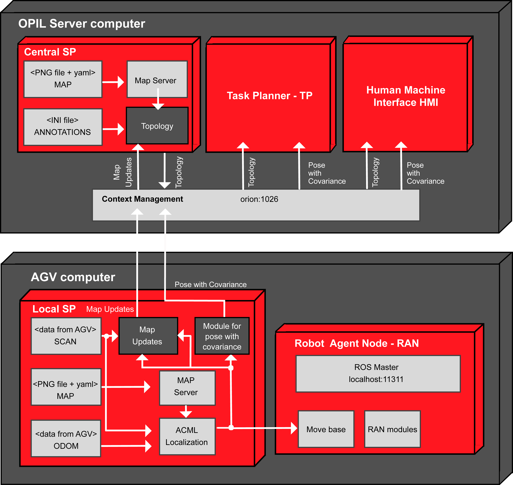

The following sections describe how other modules needs to be connected to the SP module. First, the workflow is listed with the repeated image from [SP introduction](./Central_SP_Getting_Started.md) describing it. Then, each section is dedicated to the computer running the module to which the Central SP is connected.

# Workflow
* Central SP is on the OPIL server
* Topology is calculated in the Central SP from the map file
* Topology update is calculated in the Central SP from the map updates in the Local SP
* There is no service calls implemented yet in firos so map is not transmitted through firos. Each module (Local SP on every AGV, Central SP and HMI) should have its own copy of map file (from CAD or as a SLAM result).
* Map merging is done in the Central SP from map updates of up to three Local SPs (three AGVs) into one global gridmap from which the updated topology is calculated (later it will be from more than three Local SPs, i.e., AGVs)
* HMI should have the initial map file, and ability to present map updates over the initial map 




# OPIL server computer with the Central SP

The Central SP on the OPIL server calculates the topology and merges the local map updates from the Local SP on an AGV.

## Topology calculation at the Central SP

To start the calculation of the topology, a _map_server_ needs to be started first, which takes a PNG or PGM file of the map, and then the _maptogridmap_ package, which takes annotations.ini file of the annotations coordinates:
```
terminal 1: roslaunch maptogridmap startmapserver.launch 
terminal 2: roslaunch maptogridmap startmaptogridmap.launch
```
More detailed explanations and examples can be seen in Section [Topology](./Central_SP_User_Guide1_API.md#topology).


## <a name="sp">Central SP sends the topology updates and annotations through firos by integrating received local map updates from the Local SP</a>

For this _mapupdates_ needs to be started on the Local SP. New obstacles are merged and new topology is calculated if _maptogridmap_ is running. An example can be seen in Section [Illustration of topology and map updates](./Central_SP_Getting_Started.md#topologyupdates).


For sending the topology and receiving the map updates from up to three robots through firos, robots.json and whitelist.json should look like this:
### robots.json
```
{
    "map":{
        "topics": {
            "graph": {
                "msg": "maptogridmap.msg.Graph",
                "type": "subscriber"
            },
            "annotations": {
                "msg": "maptogridmap.msg.Annotations",
                "type": "subscriber"
            }
        }
    },
    "robot_0":{
        "topics": {
            "newObstacles": {
                "msg": "mapupdates.msg.NewObstacles",
                "type": "publisher"
            }
        }
    },
    "robot_1":{
        "topics": {
            "newObstacles": {
                "msg": "mapupdates.msg.NewObstacles",
                "type": "publisher"
            }
        }
    },
    "robot_2":{
        "topics": {
            "newObstacles": {
                "msg": "mapupdates.msg.NewObstacles",
                "type": "publisher"
            }
        }
    }
}
```
### whitelist.json
```
{
    "map": {
        "subscriber": ["graph","annotations"],
        "publisher": []
    },
    "robot_0": {
        "subscriber": [],
        "publisher": ["newObstacles"]
    },
    "robot_1": {
        "subscriber": [],
        "publisher": ["newObstacles"]
    },
    "robot_2": {
        "subscriber": [],
        "publisher": ["newObstacles"]
    }
}
```
You can find the firos config files in test/config_files/Central_SP_computer.
After putting the json files to firos/config folder run firos as:
```
rosrun firos core.py
```


# OPIL server computer with the Task Planner - TP

## TP receives the topology from the Central SP through firos

For receiving the topology topics from the Central SP, the packages _maptogridmap_ needs to be in src folder because of the defined ROS messages that will be received through firos.

For receiving the topics through firos, robots.json and whitelist.json should look like this:
### robots.json
```
{
   "map":{
        "topics": {
            "graph": {
                "msg": "maptogridmap.msg.Graph",
                "type": "publisher"
            }
        }
    }
}
```
### whitelist.json
```
{
    "map": {
        "publisher": ["graph"],
        "subscriber": []
    }
}
```
Start firos and write a subscriber for the topics as suggested in Section [Writing a simple listener explaining the maplistener package](./Central_SP_User_Guide1_API.md#writelis).
You can find the firos config files in test/config_files/TP_HMI_computer.

# OPIL server computer with the Human Machine Interface - HMI

## HMI receives the topology and annotations

HMI should have a map file presented visually.

For receiving the topology and annotations from the Central SP here is how entities look in OCB (applying in Postman `GET localhost:1026/v2/entities`):

### Topology entities from the Central SP

```
{
	'graph': {
		'header': {
			'stamp': {
				'secs': 'int32',
				'nsecs': 'int32'
			},
			'frame_id': 'string',
			'seq': 'uint32'
		},
		'edges': 'maptogridmap/Edge[]', 
		'vertices': 'maptogridmap/Vertex[]'
	}, 
	'annotations': {
		'header': {
			'stamp': {
				'secs': 'int32', 
				'nsecs': 'int32'
			}, 
			'frame_id': 'string', 
			'seq': 'uint32'
		}, 
		'annotations': 'maptogridmap/Annotation[]'
	}
}
```


