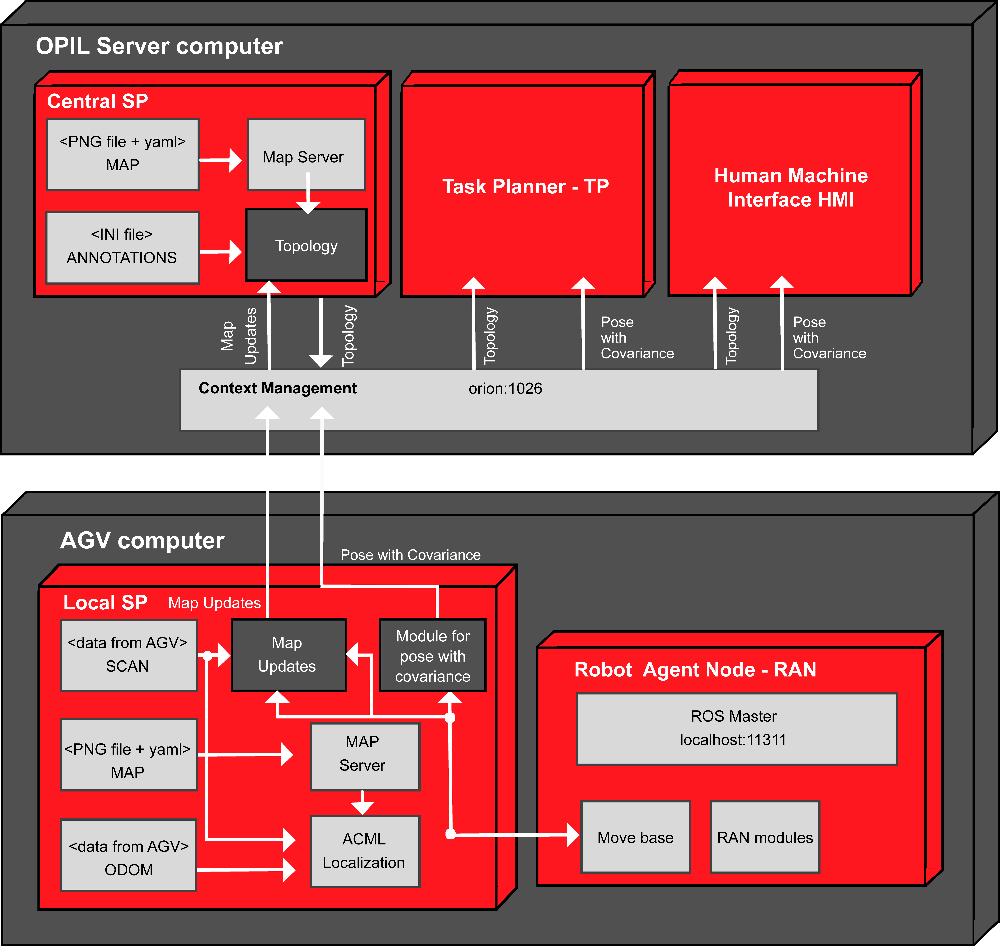
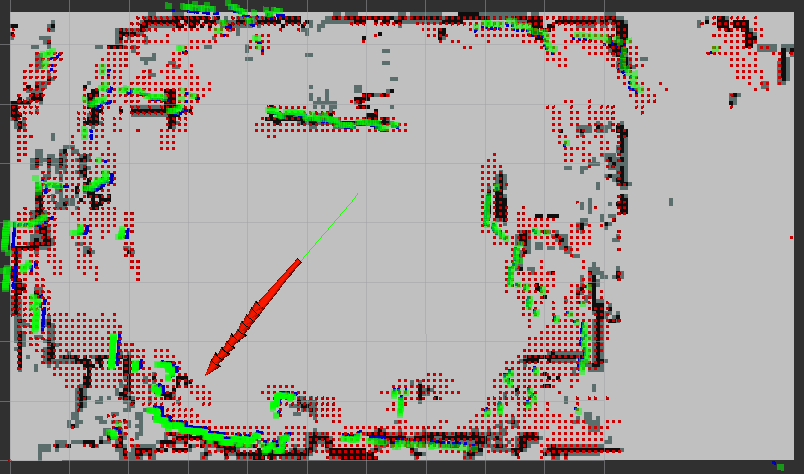

# Introduction Sensing & Perception (Local SP)

For full documentation visit L4MS <https://l4ms.org>.

<!--Link to other modules of OPIL (opil-MODULENAME.l4ms.eu):-->

<!--* [Robot Agent Node (RAN)](http://opil-ran.l4ms.eu)-->
<!--* [Human Agent Node (HAN)](http://opil-han.l4ms.eu)-->
<!--* [Sensor Agent Node (SAN)](http://opil-san.l4ms.eu) -->
<!--* [Task Planner (TP)](http://opil-tp.l4ms.eu)-->
<!--* [Human Machine Interface (HMI)](http://opil-hmi.l4ms.eu)-->
<!--* [Context Management (CM)](http://opil-cm.l4ms.eu) -->

## Overview Local SP

SP (Sensing & Perception) is a software module as part of OPIL (Open Platform for Innovation in Logistics). 
It provides the pose of the AGV inside the built map of the environment in which the AGV is navigating and updates the map with the new sensor readings.
Additionally, it can build the map with SLAM (Simultaneous Localization And Mapping) if no map is given initially. It uses the range data (laser, kinect) for map building and updating, and odometry sensors (encoders, IMU) with range data and map for localization inside the map.

## Structure SP

There are two instances of SP module: 

* The Central SP as the OPIL Server Node
* The Local SP as the OPIL IoT Node

Every AGV has it's own Local SP, that takes care of localization and mapping. It localizes the AGV inside the map, and it creates a local map of AGV's surrounding.
Every AGV sends this local map data as an update to a Central SP, which is on the OPIL server. The Local SP is connected to Robot Agent Node (RAN) through ROS Master at RAN side so that navigation inside RAN can get the pose data at high rate.  
The Central SP creates a topology map of the factory floorplan for the Task Planner (TP) and Human Machine Interface (HMI) using the local updates from AGVs and an initial map.
The following figure explains the architecture of the SP modules with the given initial map of the factory (either after a SLAM process or extracted from a CAD drawing). Orange boxes are modules developed for SP, while blue ones are the standard ROS modules. Required inputs are map file with its parameter (PNG file), file with annotations (loading, unloading areas, etc.), laser data (SCAN) and odometry data (ODOM).

The functionalities of the Local SP module are listed as follows:

## Localization

* Calculates a pose with covariance of the AGV inside the built map
* Calculates a pose with covariance of the AGV inside the incrementally built map of the SLAM process
* Sends a pose with covariance of the AGV to Task Planner, HMI, RAN

## Mapping

* Creates a map with SLAM
* Uses a map from CAD or as result of SLAM for localization
* Creates data for map updates from new laser reading of previously unoccupied areas

## <a name="mapupdates">Illustration of localization, and map updates</a>

An example of SP module functionalities in a built map used in the demo in Zagreb at the review meeting is shown in the following figure. 
Green dots are the laser readings sensed from the calculated pose (x,y,theta) marked with red arrow.
Tiny red squares (0.1 m) are the local map built from the laser readings while the robot was moving by RAN. 

## Next steps

Follow the [Install instructions](./Local_SP_Installation_Guide.md).
For more details how everything works check the [API.](./Local_SP_User_Guide1_API.md)     
        
