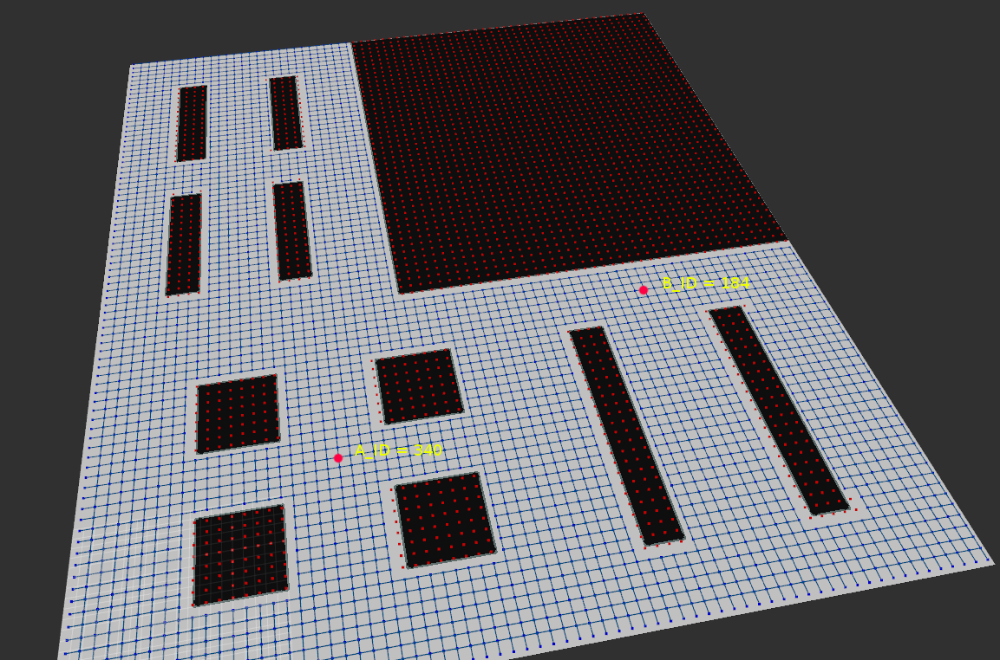

# Business Process Optimization (BPO) module

## Formal Specification
The *BPO* module is tasked with generating the optimal sequence of tasks based on the provided task specification. The *task specification (tspec)* is provided in the OPIL Task Specification Language. The *tspec* is then parsed by a parser in the Task Supervision module to generate the required input to *BPO*. The output of *BPO* is fed to the *Task Supervisor* in order to handle the task execution. As an example consider the following topology with two locations of interest (A and B). We assume that we want a worker to load items at location A to a robot and the robot to transport them to location B.



### Input Requirements 
Below is the input to the BPO to carry out the sought task. 

Small letters are reserved as follows:
`*`: Anything (can only be used in the constraints definitions and in the objectives) 

Reserved letters for positions:
`v` := Any undefined position 

Reserved letters for Robots: `r[Robot ID]`, i.e.:
```
r1, r2, …, rn
```
Reserved letters for Workers: `w[Worker ID]`, i.e.:
```
w1, w2, …, wn
```
Reserved letters for Items: `i[Item ID]`, i.e.:
```
i1, i2, …, in
```
### Definition of locations 
List of location IDs of interest (based on the topology).

 Capital letters are for identifying location IDs.
```
A 340
B 184
```

### Definition of transitions
Each `x_Transitions` statement indicates a partial state of the factory floor. 

Allowed transitions for *r1* implies that the first position in the state “word” will be `#occupied` by the location available through `r1_transitions`
```
r1_Transitions := ['AB', 'BA', 'vA', 'vB']
```
Allowed transitions for `w1`
```
w1_Transitions := ['AB', 'BA', 'vA', 'vB']
```
Allowed transitions for `i1`
```
i1_Transitions := ['Ar1', 'BA', 'r1B']
```

### States Definition 
We have now defined in this example 3-lettered words defining the state of the system. For example, if robot *r1* is at location *v*, worker *w1* is at location *A* and the item *i1* is at location *A*, then the system state is `[v][A][A]`. Constraint transitions `i1_transitions` are the possible transitions for item *i1*. In the case below it is indicated that an item can only be loaded from position A on robot *r1* if both the robot and worker are at position *A* and can only be unloaded in location *B*, if both robot and worker are at location *B*.
```
i1_constraints := [AAA : AAr1, **r1:**r1,BBr1:BBB] 
```
### Objective Definition 
We can now define the objective of the BPO. For example, transport the item *i* to location B)
```
Objective := [**B]
```

### Statement of the Output 
The output of the BPO is an optimized sequence of states to achieve the Objective.

 Below is the output received by the BPO. 
 
```
[vvA:vAA:AAA:AAr1:ABr1:BBr1:BBB]
```