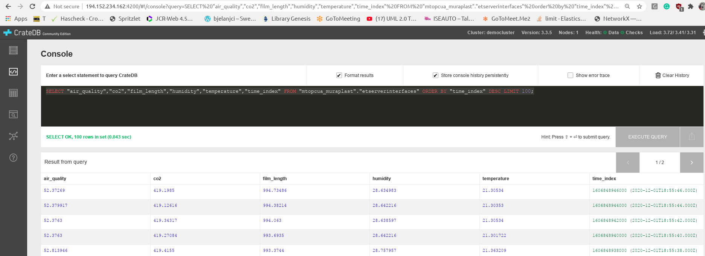
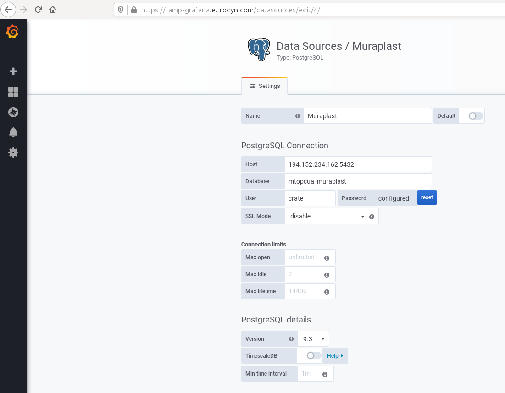
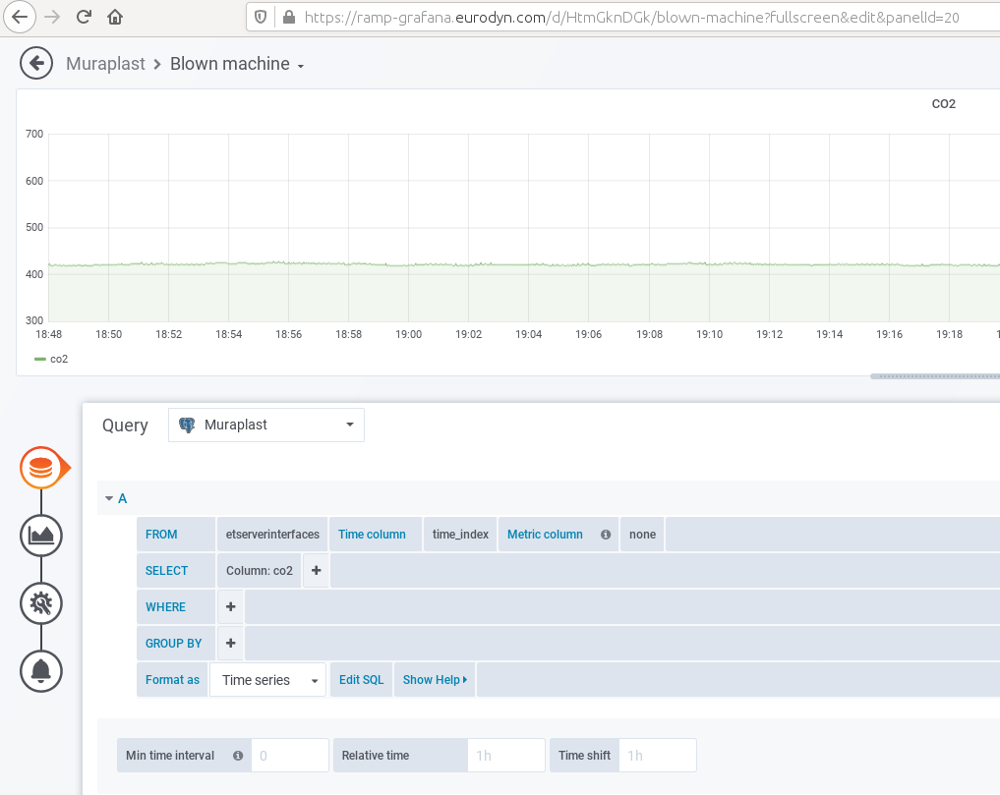
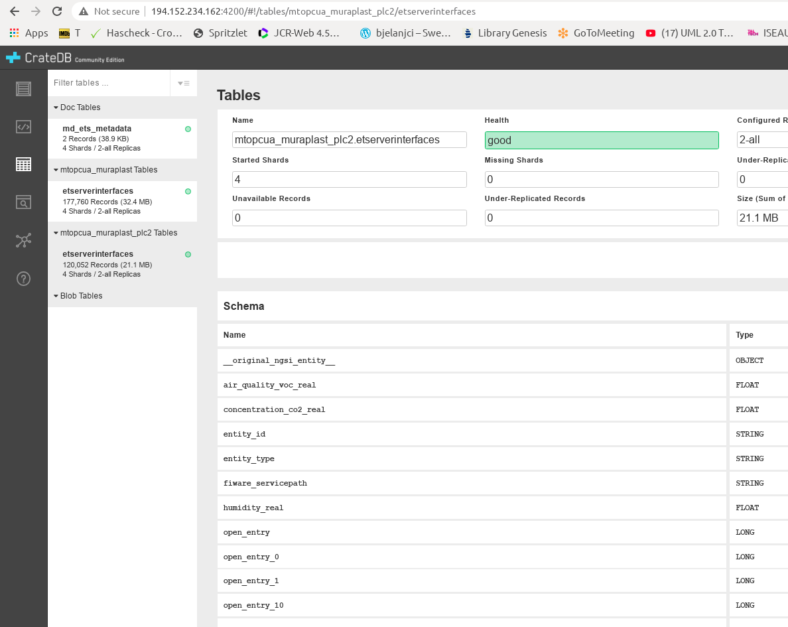
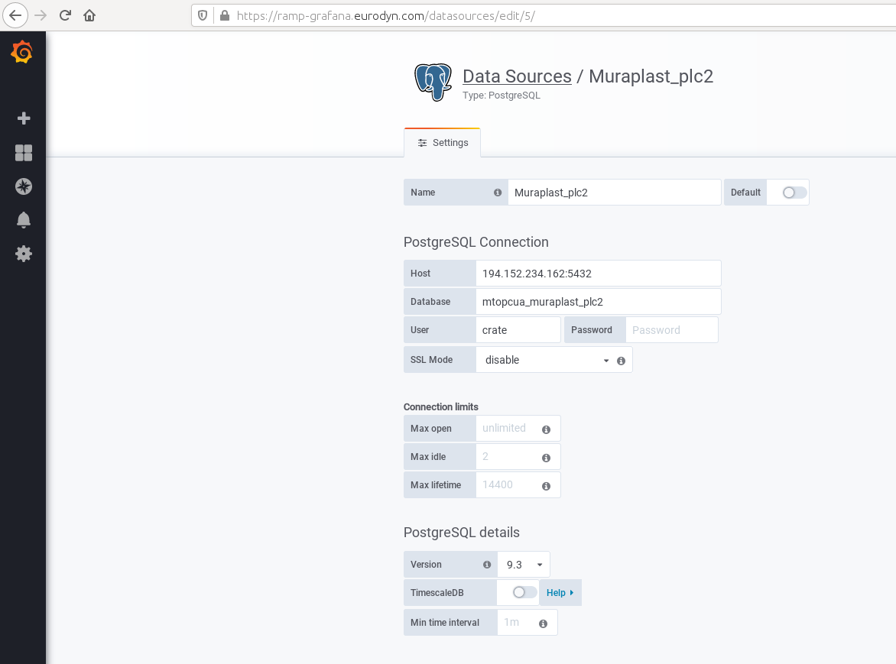
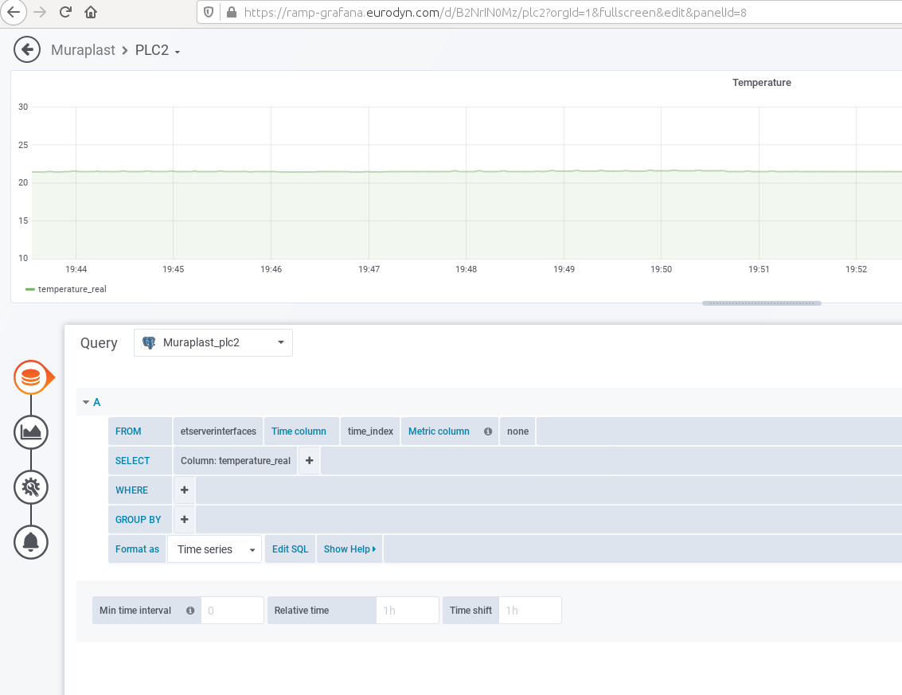

# Muraplast
Muraplast is the leading and modern producer of Polyethylene blown film in Croatia and Southeastern Europe. Muraplast needs to optimize the process of taking the products (rolls of PE film) from the production lines, weighting them, and transport from ready to warehouse area while sending the information to the local ERP. This optimization would boost productivity, reduce human error factor in weighting and reduce the manual labor needed to manipulate the products.

## Improvement in manufacturing process needed
Muraplast needs to optimize the process of taking the products (rolls of PE film) from the production lines, weighting them, and transport from ready to warehouse area while sending the information to the local ERP. This optimization would boost productivity, reduce human error factor in weighting and reduce the manual labor needed to manipulate the products (PE film in rolls and can be various dimensions).

## Description of the experiment
The table below outlines current logistic processes and the corresponding process in L4MS


Current Process | Process in L4MS          
------------|:--------------------------
PE film in rolls comes down from unwinder to a pallet.|The Advanced HMI operator initiates a predefined task for “PE roll acquisition and storage”. The task is parameterized and optimized utilizing information from the OPIL Enterprise Applications, for production lines, and storage locations. Based on the task specification, OPIL Robotic Agent AGV nodes are assigned to each production line to receive the PE film rolls that comes down from the unwinder of each production line. OPIL IoT Agent sensor nodes and OPIL Robotic Agent AGV nodes provide the necessary information for localization and mapping to the OPIL Sensing and Perception module, while the OPIL Local Execution Layer of the AGVs implements the motion planning task to move AGVs to the unwinder locations.
The shaft on which the roll is winding is removed.|OPIL Human Agent nodes are assigned the task to remove the shaft on which the roll is winding. The OPIL Local HMI Layer informs the human workers that are assigned on the task, for the exact location and nature of the task.
A forklift drives the pallet to a scale.|Once the Human worker informs the OPIL system through the The OPIL Local HMI Layer that the shaft removal task is complete and based on the task specification, the AGVs that are equipped with scale automatically transmit the roll weight to the OPIL Enterprise Applications ERP system through the Cyber-Physical Middleware Layer.
Roll is put on a scale, weighed and its weight is manually written on a label. 
The amount is copied on the paper (production work order).
The roll is taken of the scale and back to pallet. Pallet is driven by a manual fork or fork lift to a special ready to warehouse area. The weight from production work order is copied in the ERP (usually by the end of the shift).|Based on the task specification, roll loaded OPIL Robotic Agent AGV nodes are now assigned the task to navigate to specific storage location in the warehouse to unload the PE roll. Once the roll is unloaded, each OPIL Robotic Agent AGV node becomes available for its next task. OPIL IoT Agent sensor nodes and OPIL Robotic Agent AGV nodes provide the necessary information for localization and mapping to the OPIL Sensing and Perception module, while the OPIL Local Execution Layer of the AGVs implements the motion planning task. The OPIL Task Planner’s Task Supervisor module continuously supervises the task execution.  The Task is continuously monitored through the Task Monitoring and Control module of the OPIL Advanced HMI. Interaction between the OPIL Software System Layer, the OPIL Agent Nodes Layer and the Enterprise Application is achieved through the Cyber-Physical Middleware Layer.


## Main benefits of the Experiments

1. Reduce the occupational health hazard on workers involved in lifting of heavy objects in loading and unloading processes firstly in the pilot site and later in plants worldwide. The automation will remove the wrist, arm and back harm risks.

2. Faster production, more accurate, better resource allocation.

3. Shortage of labour for manual jobs among young people due to increasing trend towards higher education.

4. Interaction between human forklift operators and AGVs

5. Configurability: OPIL utilizes a variable mixture of human forklift operators and AGVs depending on the system’s running availability.

6. Dependability: Unresponsive or faulty AGVs do not influence the completion of the task as complementary resources (other AGVs or human forklift operators are automatically assigned as needed).

## Videos
ICENT Robotics team demonstrated the prototype of Automated Guided Vechicle (AGV) solution, that was tailor-made for Croatian manufacturer Muraplast to solve their intra-factory logistics problem. 

<a href="http://www.youtube.com/watch?feature=player_embedded&v=7koPrwFSvLc
" target="_blank"></a>

## Connection of PLC sensor data to OPIL through FIWARE OPC UA agent

In the second round of the pilot experiment, one of the goals was to visualize in **Grafana** in **RAMP** the current data important to Muraplast.
Two PLCs are connected to different machines at Muraplast. Each PLC has connected sensors measuring relevant parameters related to the production process. Each PLC has **OPC UA Server** and internet connection enabling the setup of **FIWARE's OPC UA Agent** to translate the data to **OCB**. By creating subscriptions and setting up **QuantumLeap** and **Crate**, it was possible to visualize the real data in **Grafana** in **RAMP**. This guide will explain how this was done.

The first part of the guide will go through setting up the first PLC with 21 sensors connected. Most sensors are related to the blowing machine to measure the position of cutting the film (15 encoders), the length of the film, and the velocity of the production line. Other sensors are attached to the wall next to the blowing machine to measure air quality, CO2, humidity, and temperature of the air.

The last part of the guide explains the extension to connect the second PLC with 37 sensors connected. The sensors are attached to the wall next to the printing machine to measure air quality, CO2, humidity and temperature of the air, and door opening.

## Guide for installing and starting FIWARE's OPC UA agent

To learn about FIWARE's OPC UA agent follow this guide:
<https://iotagent-opcua.readthedocs.io/en/latest/user_and_programmers_manual/index.html>.

This guide is tested both in Ubuntu Linux and Windows 10. In the following, the IP address of the OPC UA server is 192.168.0.18, while the IP address of the computer with the FIWARE's OPC UA agent is 192.168.0.15 in the local Muraplast's network.

First, clone the prepared configuration for connection to OPC UA Server:
```
git clone https://github.com/Engineering-Research-and-Development/iotagent-opcua
```


Change the following files:
```
iotagent-opcua/docker-compose-external-server.yml
iotagent-opcua/AGECONF/config.json
iotagent-opcua/AGECONF/config.properties 
```


**config.json** can be created by the MAPPING TOOL of the FIWARE's OPC UA agent. With this step the connection to the OPC UA server is automated. However, one could want to change the names of entities and restart the OPC UA agent without the MAPPING TOOL. Here is described the process of starting the MAPPING TOOL first, renaming entities in **config.json**, and started again OPC UA agent without the MAPPING TOOL.

To start the MAPPING TOOL delete the **config.json** from the AGECONF folder.


**config.properties** and **docker-compose-external-server.yml** need to be changed as follows:

1. add the correct IP and port of the OPC UA server, for example:
```endpoint=opc.tcp://iotplcsrv:4840```
where **iotplcsrv** is defined in **docker-compose-external-server.yml** as `"iotplcsrv:192.168.0.18"`
2. Comment the line in **config.properties** to use the MAPPING TOOL:
`#configuration=api`
3. Change header names in **config.properties** to desired (will be used as headers in subscription), for example:
```fiware-service=opcua_muraplast```, ```fiware-service-path=/demo```
4. To allow subscribing to more than 5 sensors (attributes of the same entity in this case) add the following in **config.properties**:
```
#SubscriptionsStrategy
uniqueSubscription=true
```
The example of used **config.properties** is here:
```
## SOUTHBOUND CONFIGURATION (OPC UA)
namespace-ignore=0,2,7
endpoint=opc.tcp://iotplcsrv:4840

## NORTHBOUND CONFIGURATION (ORION CONTEXT BROKER)
context-broker-host=orion
context-broker-port=1026
fiware-service=opcua_muraplast
fiware-service-path=/demo


## AGENT CONFIGURATION
server-base-root=/
server-port=4001
provider-url=http://iotage:4001

device-registration-duration=P1M
device-registry-type=memory

log-level=DEBUG

namespaceIndex=3
namespaceNumericIdentifier=1000

# MONGO-DB CONFIGURATION (required if device-registry-type=mongodb)
mongodb-host=iotmongo
mongodb-port=27017
mongodb-db=iotagent
mongodb-retries=5
mongodb-retry-time=5

## DATATYPE MAPPING OPCUA --> NGSI
OPC-datatype-Number=Number
OPC-datatype-Decimal128=Number
OPC-datatype-Double=Number
OPC-datatype-Float=Number
OPC-datatype-Real=Number
OPC-datatype-Guid=Integer
OPC-datatype-Integer=Integer
OPC-datatype-UInteger=Integer
OPC-datatype-Int32=Integer
OPC-datatype-String=Text
OPC-datatype-ByteString=Text
#END DATATYPE MAPPING OPCUA --> NGSI

## SESSION PARAMETERS
requestedPublishingInterval=10
requestedLifetimeCount=1000
requestedMaxKeepAliveCount=10
maxNotificationsPerPublish=100
publishingEnabled=true
priority=10

#SubscriptionsStrategy
uniqueSubscription=true

## MONITORING PARAMETERS
samplingInterval=1
queueSize=10000
discardOldest=false

## SERVER CERT E AUTH
securityMode=None
securityPolicy=None
userName=
password=

#securityMode=SIGNANDENCRYPT
#securityPolicy=1Basic256
#password=password1
#userName=user1

## ADMINISTRATION SERVICES
api-port=8080

## POLL COMMANDS SETTINGS
polling=false
polling-commands-timer=30000
pollingDaemonFrequency=20000
pollingExpiration=200000

## AGENT ID
agent-id=age01_
entity-id=age01_plc # used only during tests

## CONFIGURATION
#configuration=api

## CHECK TIMER POLLING DEVICES
checkTimer=2000
```

The example of used **docker-compose-external-server.yml** is here:
```
version: "3"

services:
  iotage:
    hostname: iotage
    image: iotagent4fiware/iotagent-opcua:v1.3.7
    logging:
      driver: "json-file"
      options:
        max-size: "200k"
        max-file: "10"
    networks:
      - hostnet
      - iotnet
    ports:
      - "4001:4001"
      - "4081:8080"
    extra_hosts:
      - "iotplcsrv:192.168.0.18"
    depends_on:
      - iotmongo
      - orion
    volumes:
      - ./AGECONF:/opt/iotagent-opcua/conf
    #  - ./certificates:/opt/iotagent-opcua/certificates

  iotmongo:
    hostname: iotmongo
    image: mongo:3.4
    networks:
      - iotnet
    volumes:
      - iotmongo_data:/data/db
      - iotmongo_conf:/data/configdb

  ################ OCB ################

  orion:
    hostname: orion
    image: fiware/orion:2.4.0
    logging:
      driver: "json-file"
      options:
        max-size: "200k"
        max-file: "10"
    networks:
      - hostnet
      - ocbnet
    ports:
      - "1026:1026"
    depends_on:
      - orion_mongo
    entrypoint: /usr/bin/contextBroker -fg -multiservice -ngsiv1Autocast -statCounters \
                -dbhost mongo

  orion_mongo:
    hostname: orion_mongo
    image: mongo:3.4
    networks:
      ocbnet:
        aliases:
          - mongo
    volumes:
      - orion_mongo_data:/data/db
      - orion_mongo_conf:/data/configdb
    command: --nojournal

volumes:
  iotmongo_data:
  iotmongo_conf:
  orion_mongo_data:
  orion_mongo_conf:

networks:
  hostnet:
  iotnet:
  ocbnet:
```

Since 21 sensors are coming at 10 Hz it was necessary to limit the log files of standard output to max-size "200k" to prevent the disk usage out of space. The following section prevents the large logs:
```
    logging:
      driver: "json-file"
      options:
        max-size: "200k"
        max-file: "10"
``` 

Start the connection by typing in terminal: 
```
docker-compose -f docker-compose-external-server.yml up -d
```
To check if there are data in OCB type the following curl command:
```
curl --location --request GET 'http://localhost:1026/v2/entities/' \
--header 'fiware-service: opcua_muraplast' \
--header 'fiware-servicepath: /demo' | json_pp
```
where headers need to be equal to the ones put in **config.properties**.
As a response you can have something like:
```
[
    {
        "id": "age01_PLC",
        "type": "ServerInterfaces",
        "Air_quality": {
            "type": "Number",
            "value": 63.98292923,
            "metadata": {
                "ServerTimestamp": {
                    "type": "ISO8601",
                    "value": "2020-04-16T16:42:25.068Z"
                },
                "SourceTimestamp": {
                    "type": "ISO8601",
                    "value": "2020-04-16T16:42:25.068Z"
                }
            }
        },
...etc...
```
As the result, there should be a newly created **config.json** inside the AGECONF folder. Take care that **id** and **type** and variable names do not have special characters as ` ` (blanks), or `:`.

If you want to change the **config.json**, then you can start the OPC UA agent without the MAPPING TOOL as follows:

1. Close the previous connection with `down -v` to have a clean restart:
`
docker-compose -f docker-compose-external-server.yml down -v
` 
2. Uncomment the line in **config.properties** to not to use the MAPPING TOOL:
`configuration=api`
3. Start again the OPC UA agent:
```
docker-compose -f docker-compose-external-server.yml up -d
```

## Guide for connection of FIWARE OPC UA agent with QuantumLeap and Crate

Prepare the following **docker-compose-quantumleap-cratedb.yml** file:
```
version: "3.5"
services:
  # Quantum Leap is persisting Short Term History to Crate-DB
  quantumleap:
    image: smartsdk/quantumleap:0.7.6
    logging:
      driver: "json-file"
      options:
        max-size: "200k"
        max-file: "10"
    hostname: quantumleap
    container_name: fiware-quantumleap
    ports:
      - "8668:8668"
    depends_on:
      - crate-db
    environment:
      - CRATE_HOST=crate-db

  crate-db:
    image: crate:3.3
    hostname: crate-db
    container_name: db-crate
    ports:
      # Admin UI
      - "4200:4200"
      # Transport protocol
      - "4300:4300"
      - "5432:5432"
    command: crate -Cdiscovery.type=single-node -Clicense.enterprise=false \
             -Cauth.host_based.enabled=false  -Ccluster.name=democluster \
             -Chttp.cors.enabled=true -Chttp.cors.allow-origin="*"
    volumes:
      - crate-db:/data

volumes:
  crate-db: ~
```

Start the QuantumLeap and Crate by typing in terminal:
```
docker-compose -f docker-compose-quantumleap-cratedb.yml up -d
```
To have a clean restart type:
```
docker-compose -f docker-compose-quantumleap-cratedb.yml down -v
```
To see if there are any issues or warnings type:
```
docker logs db-crate
```
If you have a warning similar to:
```
[2020-05-05T12:24:10,322][WARN ][o.e.b.BootstrapChecks    ] [Monte Civrari] max virtual memory\
 areas vm.max_map_count [65530] is too low, increase to at least [262144]
```
increase the virtual memory warning by typing in terminal:
```
sysctl -w vm.max_map_count=262144
```
To make the above setting permanent perform the following steps:

1. edit the file /etc/sysctl.conf
2. make entry vm.max_map_count=262144
3. restart

Prepare the following script **post_subscr_PLC.sh** to post subscriptions:
```
curl --location --request POST 'http://localhost:1026/v2/subscriptions/' --header \
'fiware-service: opcua_muraplast' --header 'fiware-servicepath: /demo' --header \
'Content-Type: application/json' --data-raw '{
  "description": "Notify QuantumLeap of all sensor changes",
  "subject": {
    "entities": [
      {
		"id": "age01_PLC",
        "type": "ServerInterfaces"
      }
    ],
	"condition": { "attrs": [ ] }
  },
  "notification": {
    "http": {
      "url": "http://192.168.0.15:8668/v2/notify"
    },
	"attrs": [ ],
    "metadata": ["dateCreated", "dateModified"]
  },
  "throttling": 2
}'
```
where **id** and **type** are the same as written in **config.json**, and IP address is the address of your computer.
Since 21 sensors are coming at 10 Hz it was necessary to limit the subscription to every 2 seconds by setting the parameter **throttling** to 2.

Start the script by typing in terminal:
```
bash post_subscr_PLC.sh
```
Check if data in CrateDB are visible at port 4200 on the computer where you started QuantumLeap and Crate, for example, <http://localhost:4200>, or put the external IP address of that computer.

You can query the table by pressing the query button in the Tables tab, or you can edit the query in the Console tab, for example:
```
SELECT "air_quality","co2","film_length","humidity","temperature","time_index" FROM \
 "mtopcua_muraplast"."etserverinterfaces" order by "time_index" desc LIMIT 100;
```
The page with CrateDB and query result should be similar to this picture:



Notice the name of the table from the query, which is **mtopcua_muraplast**, and also **etserverinterfaces** important for the following guide.

## Guide for connection of QuantumLeap and Crate to Grafana in RAMP

Useful link when connecting Grafana to QuantumLeap and Crate can be found here: <https://quantumleap.readthedocs.io/en/latest/admin/grafana/>. 

First, add the postgressSQL datasource. You must put the name of the table to the one visible in CrateDB. Put the external IP address of the computer with QuantumLeap and put port 5432. This port needs to be open to outside connections. The example input for the previously described database is here:
```
Name: Muraplast
Host: 194.152.234.162:5432
Database: mtopcua_muraplast
User: crate
SSL Mode: disable
```
This data can be read from this screenshot:


Now, a new dashboard can be created, for example, the Blown machine. Click on Add pannel to add a time series data. Select the new database in the Query dropdown menu. We named it Muraplast when adding datasource, and it should be selected here. This screenshot shows the creation of a time series graph:

Notice **etserverinterfaces** in FROM field, and **time_index** in Time column, and **co2** in SELECT Column, which is an attribute of the entity and was visible in CrateDB query. There should appear a time series right after the correct entry.

## Adding additional connection: PLC2 - OPC UA agent - QuantumLeap - Crate - Grafana

The second PLC with the OPC UA server has its IP address in the local Muraplast's network, which is 192.168.0.19 (the first one is 192.168.0.18). There are 4 sensors mounted next to the Printing machine measuring the air quality (VOC), CO2, temperature, and humidity, and there are 33 binary data measurements attached to the door, which gives in total 37 attribute values for OCB. On the same computer with IP address 192.168.0.15 we set up another FIWARE's OPC UA agent as follows:


1. Copy the iotagent-opcua folder (which was cloned at the beginning of this guide) and rename it to a different name, for example, iotagent-opcuaPLC2.
2. Stop the first OPC UA agent and start second OPC UA agent with the MAPPING TOOL to get the new **config.json** file of the second OPC UA server as explained earlier. 
3. Stop the second OPC UA agent and modify the created **config.json** as needed.
4. Start the first OPC UA agent. 
5. Start the second OPC UA agent without the MAPPING TOOL. The second OPC UA agent needs to have removed **orion**, **mongo**, **orion_mongo**, and **iotmongo** since they are running in the first OPC UA agent. Additionally, some ports need to be changed since 4001 and 4081 were taken by the first OPC UA agent.
This is the changed **docker-compose-external-server.yml**:

```
version: "3"

services:
  iotage:
    hostname: iotage
    image: iotagent4fiware/iotagent-opcua:v1.3.7
    logging:
      driver: "json-file"
      options:
        max-size: "200k"
        max-file: "10"
    networks:
      - hostnet
      - iotnet
    ports:
      - "4002:4001"
      - "4082:8080"
    extra_hosts:
      - "iotplc2srv:192.168.0.19"
    volumes:
      - ./AGECONF:/opt/iotagent-opcua/conf
    #  - ./certificates:/opt/iotagent-opcua/certificates


networks:
  hostnet:
  iotnet:
```
This is the changed **config.properties** with correct IP address for orion, and iotmongo, and changed port of OPC UA agent:
```
## SOUTHBOUND CONFIGURATION (OPC UA)
namespace-ignore=0,2,7
endpoint=opc.tcp://iotplc2srv:4840

## NORTHBOUND CONFIGURATION (ORION CONTEXT BROKER)
context-broker-host=192.168.0.15
context-broker-port=1026
fiware-service=opcua_muraplast_plc2
fiware-service-path=/demo


## AGENT CONFIGURATION
server-base-root=/
server-port=4002
provider-url=http://iotage:4002

device-registration-duration=P1M
device-registry-type=memory

log-level=DEBUG

namespaceIndex=3
namespaceNumericIdentifier=1000

# MONGO-DB CONFIGURATION (required if device-registry-type=mongodb)
mongodb-host=192.168.0.15
mongodb-port=27017
mongodb-db=iotagent
mongodb-retries=5
mongodb-retry-time=5

## DATATYPE MAPPING OPCUA --> NGSI
OPC-datatype-Number=Number
OPC-datatype-Decimal128=Number
OPC-datatype-Double=Number
OPC-datatype-Float=Number
OPC-datatype-Real=Number
OPC-datatype-Guid=Integer
OPC-datatype-Integer=Integer
OPC-datatype-UInteger=Integer
OPC-datatype-Int32=Integer
OPC-datatype-String=Text
OPC-datatype-ByteString=Text
#END DATATYPE MAPPING OPCUA --> NGSI

## SESSION PARAMETERS
requestedPublishingInterval=10
requestedLifetimeCount=1000
requestedMaxKeepAliveCount=10
maxNotificationsPerPublish=100
publishingEnabled=true
priority=10

#SubscriptionsStrategy
uniqueSubscription=true

## MONITORING PARAMETERS
samplingInterval=1
queueSize=10000
discardOldest=false

## SERVER CERT E AUTH
securityMode=None
securityPolicy=None
userName=
password=

#securityMode=SIGNANDENCRYPT
#securityPolicy=1Basic256
#password=password1
#userName=user1

## ADMINISTRATION SERVICES
api-port=8080

## POLL COMMANDS SETTINGS
polling=false
polling-commands-timer=30000
pollingDaemonFrequency=20000
pollingExpiration=200000

## AGENT ID
agent-id=age01_
entity-id=age01_plc2 # used only during tests

## CONFIGURATION
configuration=api

## CHECK TIMER POLLING DEVICES
checkTimer=2000
```

This is the modified part of **config.json** with the correct IP addresses for orion and iotmongo and changed port of the OPC UA agent.
```
...
  "contextBroker" : {
    "host" : "192.168.0.15",
    "port" : 1026
  },
  "server" : {
    "port" : 4002,
    "baseRoot" : "/"
  },
  "deviceRegistry" : {
    "type" : "memory"
  },
  "mongodb" : {
    "host" : "192.168.0.15",
    "port" : "27017",
    "db" : "iotagent",
    "retries" : 5,
    "retryTime" : 5
  },
...
```
Now the entities of the second OPC UA server can be retrieved with the following curl command:
```
curl --location --request GET 'http://localhost:1026/v2/entities/' \
--header 'fiware-service: opcua_muraplast_plc2' \
--header 'fiware-servicepath: /demo' | json_pp
```
where headers are for the second OPC UA changed in **config.properties** to **opcua_muraplast_plc2**.
The part of the response of the second PLC with OPC UA server is here:
```
[
    {
		"id" : "age01_plc2",
		"type" : "ServerInterfaces",
		"Temperature_real" : {
		 "metadata" : {
			"SourceTimestamp" : {
			   "type" : "ISO8601",
			   "value" : "2020-12-02T08:18:30.152Z"
			},
			"ServerTimestamp" : {
			   "type" : "ISO8601",
			   "value" : "2020-12-02T08:18:30.152Z"
			}
		 },
		 "type" : "Number",
		 "value" : 20.276330948
		},
...etc...
```
Assuming that the QuantumLeap and Crate are still running for the first OPC UA agent, it is only necessary to create additional subscription for QuantumLeap, for example create **post_subscr_PLC2.sh**:
```
curl --location --request POST 'http://localhost:1026/v2/subscriptions/' --header \
'fiware-service: opcua_muraplast_plc2' --header 'fiware-servicepath: /demo' --header \
'Content-Type: application/json' --data-raw '{
  "description": "Notify QuantumLeap of all sensor changes",
  "subject": {
    "entities": [
      {
        "id": "age01_plc2",
        "type": "ServerInterfaces"
      }
    ],
        "condition": { "attrs": [ ] }
  },
  "notification": {
    "http": {
      "url": "http://192.168.0.15:8668/v2/notify"
    },
        "attrs": [ ],
    "metadata": ["dateCreated", "dateModified"]
  },
  "throttling": 3
}'
```
Execute the script by:
```
bash post_subscr_PLC2.sh
```
Check if the new table in CrateDB is visible at port 4200 on the computer where you started QuantumLeap and Crate, for example, <http://localhost:4200>, or put the external IP address of that computer.
This screenshot shows two tables on the CrateDB web page:




Two tables are visible, the first one is **mtopcua_muraplast**, while the second is **mtopcua_muraplast_plc2**. 
Now in Grafana at RAMP add the second postgressSQL datasource with the new table name:
```
Name: Muraplast_plc2
Host: 194.152.234.162:5432
Database: mtopcua_muraplast_plc2
User: crate
SSL Mode: disable
```
This data can be read from this screenshot:



Now, a new dashboard can be created, for example, PLC2. Click on Add pannel to add a time series data. Select the new database in the Query dropdown menu, which we named Muraplast_plc2. The result is in this screenshot:




