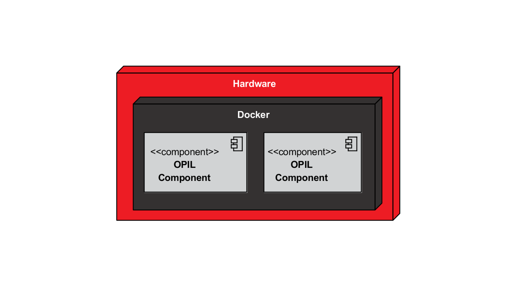
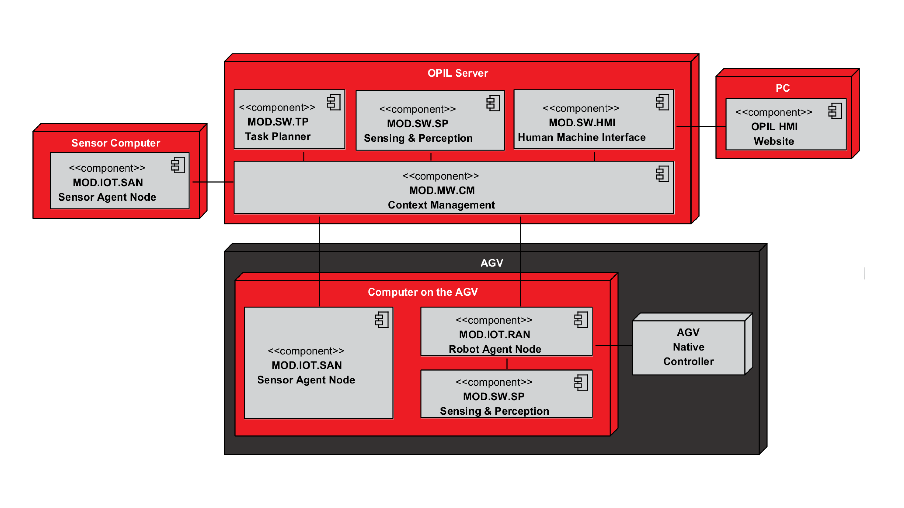

# OPIL Deployment Scheme
The purpose of this page is to give an overview of a **recommended deployment scheme** for OPIL-based systems. 
The individual modules may be deployed in other ways but generally the deployment scheme described in this page is a good approach for most use cases.
  This deployment scheme is based on two main categories of components:

* **A centralized server** to host OPIL modules that provide services connected to all other modules.
* **IoT-nodes** on the field connected to different hardware, including (but not limited to) mobile robots, AGVs, forklifts and sensors.
  
  

[TOC]

## Docker
All standard OPIL modules are deployed as [Docker](https://www.docker.com/) containers. All OPIL modules are available as Docker images via [Docker Hub](https://hub.docker.com/u/l4ms). Docker is supported by most Linux- and Windows-based operating systems.

  

### Configuration
All OPIL docker images are available fully functional ready-packages on [Docker Hub](https://hub.docker.com/u/l4ms). However, they are not pre-configured, and configuration has to be done using configuration files as **docker volumes** and  **docker environmental variables**. The specific configuration options are different for every module.

# OPIL Modules
The following diagram shows how the various OPIL modules may be deployed. Each subsystem, module and their purpose are explained in detail later on this page.
  

## OPIL Server
  

**OPIL Server** is a computer dedicated to OPIL and where the OPIL software is installed. The following is a break-down of different OPIL modules to be installed on the server.

**PC** is any computer connected to the OPIL network. The OPIL HMI can be opened with a web browser.

* **TP (Task Planner)**  
Motion task planning, resource optimization and execution monitoring for logistics operations for multiple AGVs. The system process logic is also executed in TP and defined using OPIL Task Specification Language (Link missing!). For further details, see TP documentation (Link missing!).

* **CM (Context Management)**  
Provides communication channel between OPIL modules. In most cases, communication between all modules is transmitted via the CM. This module is implemented by [**FIWARE Orion Context Broker (OCB)**](https://www.fiware.org/developers/catalogue/). For further details, see OCB documentation (Link missing!).

* **HMI (Human Machine Interface)**  
A web server that provides the user interface for the OPIL System. The HMI can be used with any computer that is connected to the OPIL network with a web browser. Users may use the HMI to visualize the state of the system. Via the HMI the user may also set-up and configure new and existing modules.  For further details, see HMI documentation (Link missing!).

* **SP (Sensing & Perception)**  
Composes a global map and stores the factory layout with the coordinates of annotations in the factory.
Sensing & Perception provides mapping of logical positions to points (x, y, theta). The global map is updated based on local updates from AGVs. For further details, see SP documentation (Link missing!).

## OPIL Sensor Computer
   

**OPIL Sensor Computer** is a computer on the field that provides hardware connection possibilities for various sensors.

* **SAN (Sensor Agent Node)**  
SAN is one of the IoT modules of OPIL. SAN is responsible for connecting sensors of different types with the Context Management and providing data from the sensors to the OPIL system. For further details, see SAN documentation (Link missing!).

* **Sensors**  
Any number of sensors of various types may be connected to SAN, the limiting factor is the connection options on the hardware. Some sensor types are natively supported by the SAN module and support for other sensor types may be implemented and attached to SAN.

## AGV
 
  
**OPIL computer on the AGV** is a computer on-board the AGV. In most cases this computer is installed by the system integrator to enable OPIL connectivity. Some OPIL modules are executed locally on this PC on the AGV to reduce the amount of data on the network and minimize the delay.

* **RAN (Robot Agent Node)**    
RAN is one of the IoT modules of OPIL. RAN receives orders from the Task Planner and sends localization updates of AGV. RAN is also responsible for the movement of the AGV based on the received motion plan and translates the commands to the hardware. For further details, see RAN documentation (Link missing!).

* **SAN (Sensor Agent Node)**  
As the alternative to the SAN described above, the SAN may be installed on the AGV to connect on-board sensors to OPIL. For further details, see SAN documentation (Link missing!).

* **SP (Sensing & Perception)**  
Sensing & Perception continuously updates the AGV's position and builds and updates a local map of the surroundings. This information is provided locally to RAN with minimal delay. Periodical map updates will be sent to OPIL network to provide updated data for the global map. For further details, see SP documentation (Link missing!).

* **AGV Native Controller**  
AGV Native Controller is a pre-existing (non-OPIL) controller of the AGV that controls the motors and motion of the AGV. RAN provides low level commands to the controller over a local connection.

