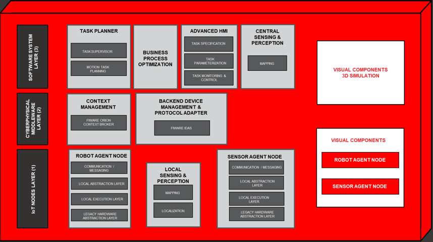

# Architecture
OPIL architectural design, as depicted by the picture below, is based on three different layers to logically separate the different functionalities offered by OPIL. In turn, each layer is made of different SW modules and sub-modules.

The table below listes the OPIL layers along with the modules of which they are made of.
 
Layer level | Layer name                 | Module Identifier  | Module name
------------|:--------------------------:|:------------------:|:----------------
1           | IoT Nodes                  | MOD.IOT.RAN        | Robot Agent Node
            |                            | MOD.IOT.HAN        | Human Agent Node
            |                            | MOD.IOT.SAN        | Sensor Agent Node
2           | Cyber Physical Middleware  | MOD.MW.CM          | Context Management
            |                            | MOD.MW.BDM         | Backend Device Management and protocol adapter
            |                            | MOD.MW.WDGT        | Advanced Widget mash-up HMI
3           | SW System                  | MOD.SW.TP          | Task Planner
            |                            | MOD.SW.AHMI        | Advanced HMI
            |                            | MOD.SW.SP          | Sensing & Perception
 
# OPIL Layers:

## Layer 1 (IoT Nodes Layer): 
Agent nodes of Layer 1 are the components of the [Architecture](#architecture) that interact with the physical world. For instance, they can interact by sensing (e.g. Sensor Agent Node) by acting (e.g. Robot Agent Nodes), or by interfacing with humans (e.g. Human Agent Nodes). The OPIL modules of which these nodes are made of, can interact with Layer 3 by exchanging messages with Layer 2 and they either directly operate on these messages or translate them to an appropriate format for internal use through their Communication/Messaging sub-modules.

### Modules:

#### MOD.IOT.RAN (Robot Agent Node)
The RAN (Robot Agent Node) allows controlling the robot and, as such, in OPIL it sits at Layer 1, namely between the Cyber Physical Middleware and the Robot Hardware. It provides two main functionalities: it manages robot navigation, based on ROS, and works as an interface between the robot hardware and the OPIL Cyber Physical Middleware, based on FIWARE Orion Context Broker. In order to accomplish the second functionality, the RAN "translates" and adapts FIWARE entities into something understandable by ROS, i.e., messages and services, and viceversa; in doing so, it accomplishes the goal set for the Communication/Messaging sub-module depicted by the OPIL [Architecture](#architecture).

#### MOD.IOT.HAN (Human Agent Node)
Human Agent Node (HAN) is the component responsible for displaying various information and data of the system for the human agents. The human agents can also give commands for the system via HAN. Currently, the human agents are capable of monitoring the robot and the sensors of the system. With HAN, the human agents can also control and give commands to RAN. HAN can be divided into background and foreground software components according to the used middleware component Wirecloud.

#### MOD.IOT.SAN (Sensor Agent Node)
The MOD.IOT.SAN (Sensor Agent Node) is responsible for connecting sensors of different types as well as the hardware they are attached to with the Cyber Physical Middleware. 
The SAN working principle is the following: every sensor that is attached to SAN sends the information using a predefined format (of entity and attributes) through HTTP REST API developed by FIWARE, and updates the state of the sensor. SAN is capable of transferring only processed sensor data, meaning that frequent raw data must always be processed first inside the Local Execution Layer before further submission.
____

## Layer 2 (Cyber Physical Middleware layer):
The intermediate Layer 2, in the OPIL [Architecture](#architecture), has a twofold role: on one hand it allows interoperability between components of the platform, and on the other hand with external ones, which can be based on multiple operating systems and network protocols.

This capability is implemented at each OPIL module level and it is identified by the red  color of the boxes.For example, IoT nodes at Layer 1 can talk to each other and with the other components of the OPIL. 
This communication is enabled by specific modules of this layer such as the MOD.MW.CM (Context Management); 
in the case of Layer 1, Communication/Messaging sub-modules are tasked with translating toward the MOD.MW.CM which has the goal of dispatching information to the other OPIL actors involved by the specific scenario.

On the other hand, this layer provides further FIWARE Generic Enablers suitable for accelerating the development of the OPIL platform.

### Modules:

#### MOD.MW.CM (Context management)
This module is implemented by [**FIWARE Orion Context Broker (OCB)**](https://www.fiware.org/developers/catalogue/) 
which is the open source reference implementation of FIWARE’s Publish/Subscribe Context Broker GE Open Specification. 
Devices and applications which are context producers can be registered so they can provide updates to context information.
Furthermore, context consumer devices/applications will be notified of updates and query producers.
FIWARE Orion Context Broker plays the role of a central hub for information exchange within OPIL based systems. 
The Orion Context Broker stores context information updated from applications, so queries are resolved based on that information. 
In order to make persistent the context status changes, OCB can be connected to other FIWARE components such as **Cygnus**.

Cygnus implements a connector for context data coming from Orion Context Broker and aimed to be stored into a specific persistent storage, such as HDFS, **Mongo DB**, MySQL and others.

#### MOD.MW.BDM (Backend Device Management and Protocol Adapter)
This module is implemented by [**FIWARE IDAS (Intelligent Data Advanced Solution)**](https://www.fiware.org/developers/catalogue/) which is the open source reference implementation of FIWARE’s Backend Device Management GE Open Specification. It enables the connection between IoT devices/gateways with FIWARE GE Orion Context Broker by translating IoT‐specific protocols into the NGSI context information protocol that is the FIWARE standard data exchange model. The translation is made by different types of Agents, one for each type of communication protocol. 
By using an IoT Agent, devices are represented in a FIWARE platform as NGSI entities in a Context Broker. This means that changes of device parameters status can retrieved or subscribed by querying or subscribing to the corresponding NGSI entity attributes at the Context Broker. Additionally, commands may be triggered to actuation devices just by updating specific command‐related attributes in their NGSI entities presentation at the Context Broker. This way, all developers interactions with devices are handled through a Context Broker, providing a homogeneous API and interface as for all other non‐IoT data in a FIWARE ecosystem.

#### MOD.MW.WDGT (Advanced Widget mash-up HMI)
This module is implemented by [**FIWARE Wirecloud**](https://www.fiware.org/developers/catalogue/) which is the open source reference implementation of the FIWARE Application Mash-up Generic Enabler. 

This tool allows end users without programming skills to easily create web applications and dashboards/cockpits 
(e.g. to visualize their data of interest or to control a domotized home or environment). 
Web application mash-ups integrate heterogeneous data, application logic, and UI components (widgets) to create new coherent and value adding composite applications. 

____

## Layer 3 (Software Systems layer): 
OPIL platform enables new specific developments built on top of the enablers provided by lower layers 2 and 1. These near future dedicated developments, which will be software applications written specifically for the logistics sector, interact with the layer 1 IoT nodes, as well as with other applications, by means of message exchange via the Cyber Physical Middleware offered by the OPIL Layer 2.

### Modules:

#### MOD.SW.TP (Task Planner)
*Task Planner (TP)* is one of the three high-level components of OPIL and it comprises of three sub-modules: 
 - **Business Process Optimization (BPO)**
 - **Motion Task Planning (MTP)** and
 - **Task Supervisor (TS)** 

**BPO** module decides and optimizes the sequence of operations to be dispatched to the different agents (robot agent, human agent). *BPO* receives a description of the sought logistic state, the available system transitions as well as the transition constraints on the logistic states from the *TS*, and it calculates the optimal task plan as the optimal required resource allocation and their schedule so that the logistic system can reach the sought logistic state with minimal resources (time or energy), fulfilling the high level task specification that was provided to the *TS*. 

**TS** module serves two major roles. The first role is to receive a specification of the sought logistic task *(task specification)* in a programming language introduced in OPIL that is appropriate for logistics operations. *TS* parses the *task specification* to generate the sought logistic state, the available system transitions on logistic states as well as the transition constraints on the logistic states that are then passed to the *BPO*. In its second role, the *TS* receives the sequence of logistic operations from the *BPO* (*task plan*) and dispatches it to the corresponding agents and monitors the execution of the sequence of operations received from *BPO*. In case of a failed execution, *TS* informs the *BPO* to provide an alternative sequence to execute the given task.

**MTP** module plans the motion tasks for the robot agents. *MTP* provides to the *BPO* operation costs in terms of time needed and travel distance for each motion operation. Considering these, *MTP* finds out the solution of the (multi-) robot motion planning problem.

The task planner components are in charge of: 

1. Deciding and optimizing the tasks to be dispatched to the different agents in the OPIL architecture by means of a Business Process Optimization functional block. 

2. Plan the motion tasks for the robot agents in the OPIL architecture by means of the Motion Task Planning. 

3. Monitor the execution of the task dispatched to the agents by means of the Task Supervisor.

#### MOD.SW.AHMI (Advanced HMI) 
HMI is a web application server with its own local database for storing data needed in this module. HMI serves a web browser user interface for the human agents to monitor and control OPIL data entities.

This OPIL node consists of three different sub-modules. 
The Task Monitoring and Control enables continuous monitoring and control of tasks. Subscription and visualisation of information available in
 OPIL, and the controllability of the operations, tasks and other actions planned by OPIL and human actors are the key functionalities. 
The Task Parameterization collects and parameterizes data collected from Enterprise Applications.
 The Task Specification receives task related information from Task Monitoring and Control, and task specific parameters from the Task Parameterization.
The Task Specification formulates a task based on the task parameters.

#### MOD.SW.SP (Sensing and Perception)
The sensing and perception components allow OPIL to provide information suitable for safe and accurate motion planning to the actors of an OPIL system, i.e., the Robot
Agent Nodes or the Motion Task Planning. The Localization functional block provides 2D pose and/or 3D pose estimates for the agents and for all the items, e.g., goods and products, in the manufacturing system. 
The Mapping functional block provides information about the structure of the manufacturing shop‐floor for the components involved in navigation.

____

# OPIL External modules:

##“Visual Component® (VC) for OPIL” integration: 
This 3D simulation SW component VC is a transparent substitute of the physical components, like the Robot, Human and Sensor Agent Node. It is depicted in white by the [Architecture](#architecture) because it is an external component, but it has orange edges as well in order to highlight its capability to be integrated with OPIL through L2 Layer. The idea behind this approach is to have within this component, modules (Robot, Human and Sensor) that are identical in their behaviour to the other components of the Layer 1 that interact with the real world. The implementation adopted into OPIL is the 3D simulator Visual Components® which helps to virtualize the intra-factory logistics automation completely. Due to the identical behaviour of the virtual agents inside Visual Components and the real physical agents, the adoption to the real world will be smooth and easy. This approach helps to reduce the planning and installation time; it will be an easy and fast process for the end-users and the integrators.

